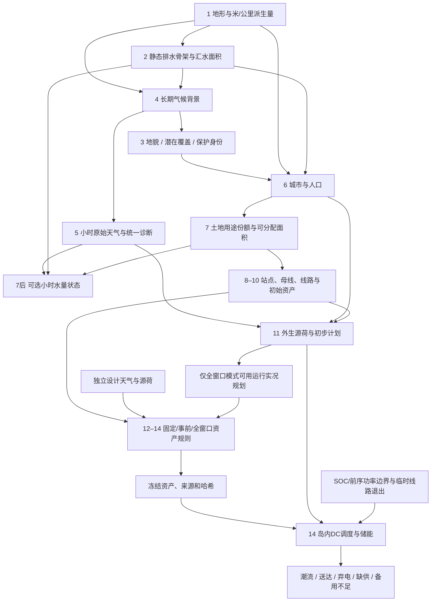

# physics_v4：机理驱动实现总结

基线为已合并文献调查的 main `3d6d532`（physics_v3）。本次按 A→G 顺序完成边界清晰的代码、配置、测试和变更说明；逐包记录见 [实现映射和验收历史](MECHANISM_IMPLEMENTATION.md)。未下载真实区域数据、拟合地区参数或更改模型训练逻辑。运行环境为 D 盘 Anaconda Python 3.12，命令通过 Git Bash 执行；所有项目修改、临时文件和生成结果均保存在当前工作区。

## 实现范围与分类

| 包/综合机理编号 | 已落实关系 | 工程简化与情景参数 | 实现与证据 |
|---|---|---|---|
| A / A1–A2 | P：面积、功率积分、水深体积换算、实体/时间轴一致 | S：当前入口仅支持1h；旧数据附录迁移 | `core/contracts.py`、[A记录](MECHANISM_IMPLEMENTATION.md) |
| B / A3–A4 | P：湿空气诊断、矢量/标量风区分、太阳夜间边界 | E：水汽饱和参数式；S：空间协方差、小时相关、日锚点 | `weather/physics.py`、`weather_generator.py`、[B](WORK_PACKAGE_B.md) |
| C / A5 | P：逐格份额、人口和项目面积账；硬边界先于评分 | S：用途、保护、密度、项目间距和预留面积；不是地区土地制度 | `land*`、`city`、`energy`、`grid`、[C](WORK_PACKAGE_C.md) |
| D / A6 | P：水库存/通量、D8路由账、湖泊几何与共同水位 | S/工程：桶容量、线性库、入渗阈值、短波PET、汇流速度 | `hydrology/dynamic_hydrology.py`、[D](WORK_PACKAGE_D.md) |
| E / A7、任务07/08 | P：共同天气采样、名牌功率边界、能量积分、温度状态传递 | E：设备曲线/Erbs/Faiman；S：设备参数、热时间常数、活动和残差 | `operation/source_load_forecast.py`、[E](WORK_PACKAGE_E.md) |
| F / A7、任务09 | P：局部KCL、SOC、容量、退出分岛与备用可行上界 | S/工程：无损DC、全窗口优化、资产模式、成本/备用要求、故障 | `operation/asset_planning.py`、`storage_dispatch.py`、[F](WORK_PACKAGE_F.md) |
| G / A8、任务10 | 可定位的机制检查、四态范围、成对反例和跨情景检查 | 测试证明实现满足给定机制，不能证明现实校准 | 验证脚本、[G](WORK_PACKAGE_G.md) |

物理常数、经验表达式和项目假设在各包中分别说明。设备额定点、粗糙度指数、PV温度系数、人口与行业占比、气候相关长度、土壤容量、火电成本、储能初态与备用配置仍是可变情景输入，不能迁移为全球或某地区的真实常数。

## 因果顺序与信息分层

气候先于静态土地；小时水量在用途确定后消费不透水份额，不反向用测试周重画土地和城市。气候与天气分为长期背景和短时原始态；RH、气压、密度和风速从声明的原始态诊断。静态排水面积不是实时流量。

静态环境、设计资产、外生源荷、规划输入、冻结结果和运行标签分别存储。`preplanned` 的设计输入具有独立配置、随机流、时钟和哈希；`fixed_assets` 不依赖测试天气选址。三种模式的运行控制器仍使用整个运行窗口，并不等同于在线预测。默认全窗口模式显式标识 oracle。旧 graph 中 Stage12 设计容量保留，Stage14电气容量和冻结资产附录为最终运行容量来源，不默默替换旧特征。

## 字段、单位和时间支撑

每个世界 `data/field_contracts.json` 以及各附录的 `*_field_schema_json` 提供完整可机器读取的来源、形状与支撑。下表汇总关键族；T 为小时区间数，H/W为空间格点，N/E/S/K为母线/线路/储能/热电实体轴。

| 字段族 | 单位 | 支撑/含义 | 下游 |
|---|---|---|---|
| elevation、坡度、坡向sin/cos、曲率 | m、无量纲、无量纲、m⁻¹ | H×W静态派生量 | 水文、气候、土地、线路 |
| `flow_accumulation` / `catchment_area_km2` | 上游格点计数 / km² | 静态汇水骨架，前者为兼容字段 | 路由与静态水文诊断 |
| 温度、比湿、参考压强、u/v | °C、kg/kg、hPa、m/s | T×H×W小时代表态 | RH/压力/密度与源荷 |
| RH、空气密度、标量风速 | %、kg/m³、m/s | 同小时原始态的诊断；日均值不重新由日均态推算 | 设备与检查 |
| GHI、降雨深度 | W/m²区间平均、mm区间累计 | T×H×W；当前无曙暮光/人工照明的太阳模式中夜间GHI=0 | PV、PET、入渗 |
| 用途份额、可分配份额、保护身份 | 1/布尔 | H×W或用途×H×W静态；评分不代表面积 | 城市与能源分配 |
| 人口密度 / 项目用地账 | persons/km² / km² | 静态；积分闭合目标人口和预留面积 | 负荷、站点容量 |
| 土壤/地下水库存 | mm整格等效水深 | (T+1)×H×W边界状态 | 蒸散、产流、基流 |
| 河道/湖泊库存、湖位/湿面积 | m³、m、m² | (T+1)×H×W边界状态 | 路由与湖泊溢流 |
| 水文内部/边界通量、流量 | m³区间累计、m³/s区间平均 | T×H×W；湖泊内部转移不重复作边界出流 | 水量守恒 |
| 请求负荷、发电可用/计划功率 | MW | T×N区间平均外生量；需求不按设计峰值裁剪 | 规划与运行 |
| 区间/窗口能源 | MWh | MW×显式h；窗口总量从本窗口积分 | 能量标签 |
| 有效环境温度驱动（负荷热记忆）、初温 | °C | T×N区间末态、N窗口前边界 | 热记忆负荷 |
| 母线注入、支路潮流、角度 | MW、MW、rad | T×N / T×E；DC区间结果 | KCL、线限 |
| 发电实际、供电、弃风光、缺供 | MW | T×N运行量；独立于储能充放电账 | 运行标签 |
| 充电、含应急的总放电、SOC | MW、MW、MWh | T×S功率，(T+1)×S库存 | 递推/互斥/边界 |
| 备用需求、提供、不足 | MW | T×N或T×S/K；累计MW·h不是发电MWh | 服务可行性 |
| 线路服务状态、岛编号 | 布尔、ID | T×E / T×N动态拓扑 | 每岛求解 |

同seed复现基于既有模块名派生RNG；新增设计流使用独立派生registry。改变硬土地预算、天气生成规则或曲线会改变旧版本数值，但不要求改变无关模块的随机流。缓存必须有相应语义标记、设计输入与资产哈希；读取旧数据的接口保留，新阶段恢复拒绝缺少必要契约的旧缓存。

## 守恒、反例与结果

最终完整生成器回归 **521项通过（47.43s）**；可选 `tests/test_forecasting_model.py` 因缺少 `torch_geometric` 未执行。两个世界数据集0.10.0的48个24+6h窗口、校验和、SOC、前序功率及外生能量通过。成对实验为18PASS、0FAIL、3UNSUPPORTED。精简原始证据见 [validation_results.json](validation_results.json)，六世界矩阵及复现命令见 [G交付](WORK_PACKAGE_G.md)。

| 最终默认168h世界 | seed42 | seed123 |
|---|---:|---:|
| 支持范围内PASS / FAIL | 334 / 0 | 309 / 0 |
| UNSUPPORTED / NOT_RUN | 4 / 0 | 4 / 2 |
| 区域面积km² | 4096 | 4096 |
| 人口积分persons | 2635759.437 | 2730994.830 |
| 请求负荷MWh | 412740.824898 | 448438.537531 |
| 风 / PV可用容量因子 | 0.385178 / 0.220765 | 0.355351 / 0.265747 |
| 最大KCL残差MW | 1.0573e-11 | 9.8908e-12 |
| 最大SOC递推残差MWh | 7.8160e-14 | 4.5475e-13 |
| 整窗水量账残差绝对值m³ | 2.3842e-7 | 1.1921e-7 |
| 缺供 / 风光弃电MWh | 0 / 0 | 0 / 0 |

两例抽到的天气周起点分别为第91/103日，不能当作同季节成对干预。seed123两项湖泊锚点因无适用对象标NOT_RUN；AC电压/无功、频率、备用激活网络及真实区域校准为UNSUPPORTED。默认oracle零缺供不代表模型一定能供足：真实24h固定/事前故障场景分别记录2737.678448/863.187421MWh缺供。

同64km范围改为32×32、2km网格，328项PASS、0FAIL；人口和城市会改变，但面积与各自守恒保持。关闭动态水文的独立探针如实报告22项NOT_RUN。该探针同时为24h固定资产模式，不能用其运行指标单独估计水文开关因果效应；纯开关和天气因果效应另由固定条件下的成对实验检查。

G相对F的每个世界25份NPZ、445个数组精确相同。Stage14和事前规划Stage13恢复均有实际通过记录，冻结资产和规划输入哈希不变；数据集也保留T+1状态和每个窗口的真实前边界。补充修复了缓存可证明的float32舍入、窗口应急放电重复计数、含空格路径的批量脚本，以及失败后旧产物不可验证/打包的边界。没有通过修改可视化或模型训练数据来遮掩错误。

## 当前不能支持的现实结论

- 不能声称合成地图复现任何真实地区的人口、气候、河网、设备出力或用电行为；容量因子只描述抽中的天气窗口。
- 不支持雪/冰、三维地下水、河流回水和水动力洪水淹没；PET/产流为明确的降阶模型，未耦合大气云水质量守恒。
- 不支持涡分辨风场、真实云微物理、风场尾流CFD或完整城市边界层反馈；土地覆盖仍为潜在背景与用途份额分层。
- DC不验证无功、电压、频率、瞬态稳定或完整 N-1 可靠性；岛内备用未检验激活后的网络可送达。线路容量扩展仍是固定阻抗重定级情景。
- 不支持机组完整启停逻辑、燃料/用水库存、电池老化和储能站点用地账；未实现真实市场或经济均衡。
- 缺供可以是明确报告的可行运行结果，不能把物理检查通过写成供电充裕或安全认证；允许oracle资产和全窗口调度时也不能把结果当作可部署预测能力。

## 后续优先级

1. **建议立即实现**：针对实际研究问题建立训练特征允许列表，严格选择资产模式与预测可见信息；扩展独立设计情景集合，并保持失败/未覆盖结果可追溯。本次没有私自修改训练模型或用可视化修正数据。
2. **建议后续实现**：因果滚动调度与独立预测输入、备用激活网络约束、热电最小开停机、储能土地/老化、水电和取用水、雪与融雪状态。每一项都需要新状态、方程及独立守恒账。
3. **暂不实现**：全球通用参数声称、直接移植地区拟合值、完整天气/水动力/AC动态工程仿真、以增加公式代替可验证机制。若未来需要这些能力，应明确空间分辨率、数据校准和外部验证要求。
