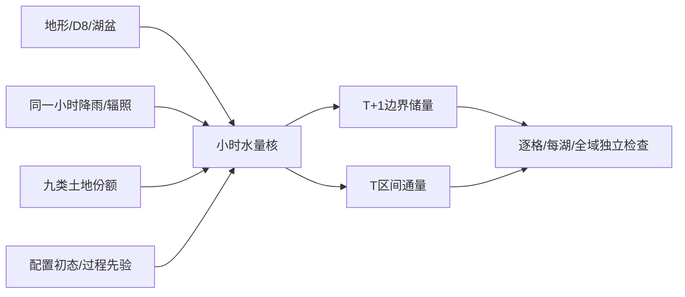

# D：可选小时水文与接口

状态：通过。C 基线为 `2969014`。本包不将短期水量反向用于城市选址。方程和工程降阶见 [WORK_PACKAGE_D_HYDROLOGY.md](WORK_PACKAGE_D_HYDROLOGY.md)。

## 1. 文件与范围

| 修改文件 | 职责 |
|---|---|
| `world_generator/hydrology/dynamic_hydrology.py`（新增） | 无随机抽样的小时桶、线性路由库和湖泊池 |
| `world_generator/core/hydrology_contracts.py`（新增） | 字段白名单、单位、时间/空间支撑 |
| `world_generator/core/config.py`、`configs/small_debug.yaml` | 默认、范围检查、嵌套配置和快照 |
| `world_generator/core/datatypes.py`、`contracts.py`、`output_layout.py` | Store、P/S注解与独立输出 |
| `world_generator/hydrology/hydrology_generator.py` | 旧汇流计数与新增物理面积 |
| `scripts/generate_static_world.py`、`world_generator/operation/stage_cache.py` | Stage7后可选生成、模式/时轴/缓存 |
| `world_generator/dataset/builder.py`、`loader.py` | 数据组0.8及T+1窗口 |
| `scripts/hydrology_validation.py`（新增）、`validate_world_physics.py` | 独立逐格、每湖、全域账与地形锚定 |
| `tests/test_dynamic_hydrology.py`、`test_hydrology_interfaces.py`、`test_hydrology_validation.py`（新增） | 解析、接口与导出篡改反例 |
| `tests/test_field_contracts.py`、`test_dataset_physics.py` | 纠正旧单位断言、新数据组契约 |
| 本文、核说明、`MECHANISM_IMPLEMENTATION.md` | 交付记录 |

表中省略目录的文件沿用同一行前面的目录。

## 2. 原因、机理与分类

对应综合研究 A6。静态 D8 方向、汇流格数和湖泊深度是地形骨架，不能冒称实际河流流量或当前蓄水。D 增加小时降水驱动的土壤、地下水、河道和湖泊状态及独立水量账。质量守恒与单位换算为 P；土壤容量、时间尺度和初态为 S；蒸散和路由明确为降阶工程近似。

字段契约分列 `generation_relation_type`、`accounting_relation_type` 和简化说明，不能把守恒受P约束等同于所有生成通量准确来自基本物理。



## 3. 配置与验证

全部新增参数位于 `hydrology_dynamic` 并进入快照。默认关闭，`small_debug.yaml` 显式启用。

| 参数 | 默认 | 范围/单位 |
|---|---:|---|
| enabled | false | 严格布尔 |
| soil_capacity_mm / groundwater_capacity_mm | 150 / 500 | 正有限mm，分别按透水/非开放水面份额缩放 |
| initial_soil_fraction / initial_groundwater_fraction | .35 / .10 | [0,1] |
| infiltration_capacity_mm_h | 20 | 非负有限mm/h |
| soil_field_capacity_fraction | .65 | [0,1] |
| soil_percolation_time_hours / baseflow_time_hours | 48 / 240 | 正有限h |
| initial_channel_storage_mm / initial_lake_storage_fraction | 0 / 0 | 非负整格等效mm / [0,1]湖容量比例 |
| routing_velocity_m_s / routing_substeps_per_hour | .5 / 1 | 正有限m/s / 整数1–60 |
| interior_sink_policy | closed_storage | closed_storage或reject |
| pet_shortwave_absorptivity / pet_latent_energy_fraction | .77 / .65 | [0,1] |
| latent_heat_vaporization_j_kg | 2.45e6 | 正有限J/kg，选定代表值 |
| budget_absolute_tolerance_m3 / budget_relative_tolerance | 1e-5 / 1e-10 | 非负有限，至少一个为正；按每格自身收支计算 |
| impervious_fraction_by_use | 下文 | 必须完整九类，每项[0,1] |

不透水系数S：water=0、wetland=0、residential=.65、commercial=.85、industrial=.8、agriculture=.05、park_green=.02、natural=.02、energy_reserve=.05。项目包络面积不是不透水面积。

## 4. 字段、单位与时间支撑

独立输出 `data/dynamic_hydrology/hourly_hydrology.npz`。时间采用天气同一小时区间；状态为 T+1 边界，通量为 T 个区间，静态量为 H×W。按字段契约区分，禁止通过首维是否等于 T 推断。关闭时元数据明确 `static_only`，不生成虚构水量。

| 组/数量 | 字段 | 单位与支撑 | 下游 |
|---|---|---|---|
| state，6 | 土壤/地下水/河道/湖泊储量、湖水位/湿面积 | 整格等效mm/mm/m³/m³/m/m²，[T+1,H,W] | 递推、验证、窗口 |
| flux，8深度 | 雨、入渗、土壤ET、下渗、地下水溢出、基流、径流、PET | mm区间累计，[T,H,W] | 水量账 |
| flux，10体积 | 开放水面ET、路由入/出、湖混合入/出、湖溢流、边界入/出、实际ET、格点残差 | m³区间累计/残差，[T,H,W] | 逐格/每湖/全域验证 |
| flux，1流率 | discharge_m3_s | m³/s区间平均，[T,H,W] | 流率分析 |
| static，10 | 不透水/透水份额、S/G容量、lake ID、closed mask、bed、spill、lake capacity、receiver | [H,W]，单位逐字段声明 | 核、空间映射、锚定 |
| budget，7 | 初储、雨、边界入、ET、边界出、末储、残差 | m³，[T]区间账 | 全域/整窗重建 |
| 时间/元数据，7 | timestamps、time_bounds_hours、state_time_hours、版本、模式、字段规格、元数据 | [T]/[T,2]/[T+1]，h | 缓存与数据集 |

共49个NPZ键；精确名字、纯单位、`time_kind`、`spatial_support` 在 `core/hydrology_contracts.py`。静态附加 `catchment_area_km2=flow_accumulation*cell_size_km²`；旧flow_accumulation仍为上游格数，纠正误标km²的契约。

逐格总账不重复扣湖溢流：它是湖→同格河道转移；每湖独立库存账必须扣湖溢流。湖床锚静态hydrology_elevation，同一8邻接湖共同spill为min(bed+water_depth)。同步路由每子步最多跨一条D8边，新来水等待下一子步。河道为概念库存，不代表经过验证的满岸容量。

## 5. 实际命令

全部命令为Git Bash语法，使用已有D:/anaconda，临时目录和Matplotlib缓存定向仓库；未安装环境依赖。

```bash
export PYTHONUTF8=1 PYTHONIOENCODING=utf-8 PYTHONDONTWRITEBYTECODE=1
export MPLCONFIGDIR="$PWD/outputs/.mplconfig"
export TEMP="$(cygpath -m "$PWD/outputs/.tmp")"
export TMP="$TEMP"
/d/anaconda/python.exe -B -m pytest tests --ignore=tests/test_forecasting_model.py -q -p no:cacheprovider --basetemp=outputs/.tmp/d-tests
/d/anaconda/python.exe -B -m pytest tests/test_hydrology_validation.py tests/test_land_validation.py tests/test_weather_validation.py -q -p no:cacheprovider --basetemp=outputs/.tmp/root-d-validator
/d/anaconda/python.exe -B scripts/generate_static_world.py --config configs/small_debug.yaml --seed 42 --no-figures --output outputs/work_package_d
/d/anaconda/python.exe -B scripts/generate_static_world.py --config configs/small_debug.yaml --seed 123 --no-figures --output outputs/work_package_d
/d/anaconda/python.exe -B scripts/validate_world_physics.py outputs/work_package_d/small_debug_seed42 outputs/work_package_d/small_debug_seed123
/d/anaconda/python.exe -B scripts/generate_static_world.py --config configs/small_debug.yaml --seed 42 --output outputs/work_package_d_resume --from-stage 14 --no-figures
```

恢复前先复制完整seed42到独立恢复目录。打包、关闭比较与重复核调用通过仓库内验收脚本调用公共API，结果记录在outputs/work_package_d的water_budget_summary.json、disabled_comparison.json、resume_comparison.json。

## 6. 结果与未覆盖项

- 全生成器 **298通过，60.64s**。最后补湖泊篡改反例后，水文/土地/天气独立验证器 **36通过，0.59s**，水文导出反例16项；不冒称又执行了全部301项。水文核解析18项。可选预测模型测试因缺少torch_geometric未运行。
- 完整seed42/123最终 **255/232项通过**，检查数随湖泊数变化。解析例含零雨、同步路由、线性衰减、容量、边界、D8环、空/浅湖、高程偏移和无水不能蒸发。
- 篡改例含隐蔽注水、假残差/假预算、流量单位、封闭出口、错receiver、缺T+1、湖溢流造假、湖泊datum整体平移及连通ID拆分；异地1e14m³库存不能掩盖另一格1m³错误。
- 数据集0.8：两世界、48个24+6h窗口、49水文键、校验和与T+1边界通过。固定缓存强迫重复核调用的49数组精确相同且不改变NumPy全局RNG。
- 开关两侧每seed157个既有上游数组均与C精确一致；关闭输出另含新增catchment诊断。阶段14恢复最终255项通过，9上游文件SHA相同。
- P/S注解以公共契约函数刷新了4份输出field_contracts.json，仅改契约元数据，记录field_contract_metadata_refresh.json；水量数值未修改。

未实现洪水淹没、三维地下水、雪冰/冻结、取用水和云水反馈，未进行真实流域标定。

## 7. 种子与水量摘要

| 168h水量，m³ | seed42 | seed123 |
|---|---:|---:|
| 初储 | 364892741.611393 | 375363642.546991 |
| 降雨 | 144767831.428246 | 68759752.474412 |
| 边界入 | 0 | 0 |
| 实际ET | 75340458.711509 | 93655488.493026 |
| 边界出 | 45129094.735441 | 95135382.434216 |
| 末储 | 389191019.592688 | 255332524.094160 |
| 最大逐格残差绝对值 | 1.2964e-9 | 1.1642e-10 |
| 整窗残差绝对值 | 2.3842e-7 | 1.1921e-7 |

两个seed选取天气周不同，不能当作同季节成对干预；守恒通过不代表真实水文精度。

## 8. 图与附加数据

本包优先交付可复核 NPZ、JSON 水量账和时间窗口读取；不要求新增图。

## 9. 兼容

旧静态API、输出数组和静态tensor通道保留；追加独立水文组，窗口保留末端状态。关闭返回None、无随机抽样、无伪造零流量文件；旧数据没有动态保证。开启必须有完整hydrology_v1及一致时轴。--no-figures、既有阶段编号与13/14恢复保留，模式/上游配置改变需重新生成。未来实况水量是研究标签或显式已知情景，不等于事前预测输入。

## 10. 后续依赖与风险

E/F 可消费显式水文结果，但 D 不将本周水量回灌静态选址，也不隐式改变能源出力。用途/项目包络不是不透水面积：若需降阶不透水系数，必须作为独立情景配置记录。

E继续共享小时天气，D不自动加入水电或冷却水约束。静态河湖占整格开放水面，干湖沿潜在湖盆接收降雨；湿面积阶梯化、河道无满岸/洪水容量保证，须在G明确标为未支持。
