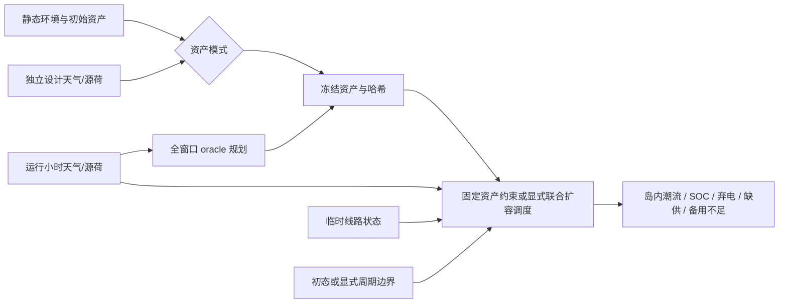

# F：资产、运行与储能信息边界

本包对应综合报告 A7、任务09和实现映射 F。关系分类：P 为功率/能量守恒、设备上界和网络连接；E 为既有线路工程模板；S 为资产设计方案、设备参数、优化成本、备用需求和故障时段。DC 等值与全窗口优化是工程简化，不能称为完整电网物理模型。

## 修改文件与原因

| 位置 | 改动及原因 | 验证 |
|---|---|---|
| `core/config.py`、`configs/small_debug.yaml` | 三种规划模式、设计情景、初态及备用参数进入快照 | 参数边界、模式不可混用 |
| `operation/asset_planning.py`、`scripts/generate_static_world.py` | 先设计/冻结资产，再用运行源荷求解；独立事前设计使用已有分模块 RNG 的派生 registry | 改测试期负荷，固定/事前资产与设计输入哈希保持不变 |
| `operation/storage_dispatch.py` | 使用 E 的外生需求/可用量；局部土地上界、故障分岛、初态/爬坡、备用与互斥 | 解析岛屿、零可用量、充电与备用冲突 |
| `operation/power_flow.py` | 时变线路状态，每岛独立参考；优化结果直接校核，禁止再比例分配缺供 | KCL、DC 角差、退出线路零流 |
| `core/datatypes.py`、`core/operation_contracts.py` | 旧数组保留，新增显式维度的运行附录 | 序列化、非法字段、T=N=S=K 反例 |
| `operation/stage_cache.py` | 检查资产、设计输入哈希、运行时间轴及版本 | 篡改拒绝、恢复路径 |
| `dataset/builder.py`、`dataset/loader.py` | 独立运行/资产分组、逐窗口初态；明确旧 graph 容量来源 | 真实打包、窗口 SOC 边界、校验和 |
| `scripts/operation_validation.py`、`scripts/validate_world_physics.py` | 重建外生账、备用、分岛、DC 与冻结资产关系 | 导出篡改反例，逐字段命名失败 |
| `tests/test_grid_operation_mechanisms.py`、`test_asset_planning_modes.py`、`test_operation_interfaces.py`、`test_operation_validation.py` | 最小机制和集成反例 | 见下面运行记录 |
| `tests/test_grid_storage_physics.py`、`tests/test_dataset_physics.py` | 旧初始能量案例显式提供前一小时功率；数据集版本对应新分组 | 原约束保留，无放宽 |

详细参数、方程、配置范围和兼容约定见 [数值核](WORK_PACKAGE_F_PHYSICS.md)、[规划控制](WORK_PACKAGE_F_PLANNING.md)、[数据接口](WORK_PACKAGE_F_INTERFACES.md)。

## 配置和信息顺序

`planning.mode` 为 `fixed_assets`、`preplanned` 或默认 `full_window_planning`。后者使用整个运行窗口选择资产，是 oracle 情景。前两者冻结资产之后才读入运行结果；它们的调度仍可看到完整运行窗口，不能称为在线预测控制。

`planning.design_days/design_start_day_of_year/design_seed/design_weather_overrides/design_source_load_overrides` 决定独立设计情景；其展开配置、派生随机种子、输入哈希与独立时间轴保留在 `data/planning/`。`fixed_storage_sites` 只适用于固定资产。`line_faults` 使用持久 branch ID 和以 h 表达的起止偏移，不改永久资产列表。

`storage.reserve_load_fraction/reserve_contingency_mw/reserve_duration_hours/reserve_response_hours/reserve_shortfall_cost/reserve_offer_cost` 控制备用服务。默认需求为零；默认备用不足成本 1000 低于负荷缺供成本 10000，以避免默认经济规则主动切负荷保备用。自定义成本是 S，不保证其他权重下仍有相同优先级。初始 `initial_thermal_mw/initial_storage_net_mw` 默认为零；非循环运行可使用显式边界，周期运行则优化首末相等的 SOC。



## 字段、单位与消费者

所有附录字段在 `operation_field_schema()` 中逐项给出维度。N、E、S、K 分别为母线、线路、储能和热电实体数；T 为小时区间数。ID 必须按数组明示顺序映射。

| 字段族 | 单位与支撑 | 来源 → 消费者 |
|---|---|---|
| `requested/served/unserved_load_mw` | MW，T×N 区间平均 | E 原始需求、F 调度 → 守恒、运行标签 |
| `generation_available/generator_dispatch/renewable_curtailment/thermal_backdown/thermal_unused_available_mw` | MW，T×N；不含储能放电 | E 可用率、F 调度 → 可用/实际/弃电区分 |
| `branch_in_service/island_id` | 布尔或 ID，T×E / T×N | 故障与连通分量 → 每岛潮流、故障标签 |
| `reserve_requirement/shortfall_mw` | MW，T×N 岛锚点记账 | S 服务需求、F 约束 → 备用不足 |
| `storage/thermal_reserve_mw` | MW，T×S / T×K，区间可用备用 | F 求解 → 功率、能量和响应约束 |
| `initial_soc_mwh`、`previous_*_mw` | MWh 边界状态；MW 前一完整区间 | 初态约定 → 首步状态与爬坡 |
| `thermal_available/dispatch_mw`、`thermal_installed_capacity/land_limit_mw` | MW，T×K 或 K 静态资产 | E 可用率、C 面积、F 资产 → 局部设备上界 |
| 原始/冻结资产快照 | MW、MWh、MVA、km、Ω，显式列语义 | 资产控制器 → 缓存、打包、独立校核 |

小时功率积分按 MW×h=MWh。备用 MW×h 是“持有服务”的累计描述，不能当作已发电能量。`soc_mwh` 为 T+1 边界状态，数据集每个窗口读取自身起点的 SOC 和前一区间功率。

## 守恒和基础验证

独立验收重建：逐母线 KCL；每个活动岛净注入为零；原始需求=送达+缺供；风光可用量=实际发电+弃电；热电可用量=实际发电+未用可用量；SOC 递推；逐热电土地容量；退出线路零潮流；DC 角差关系。备用同时受热电余量/响应爬坡，或储能逆变器余量、放电后可用 SOC、效率、持续时间和充电互斥限制。备用不足在本岛记账，不能从另一岛借用。

测试命令采用 Git Bash，Python 为 `/d/anaconda/python.exe`。生成和临时文件均位于仓库 `outputs/`：

```bash
python -B -m pytest tests --ignore=tests/test_forecasting_model.py -q -p no:cacheprovider
python -B scripts/generate_static_world.py --config configs/small_debug.yaml --seed 42 --output outputs/work_package_f --no-figures
python -B scripts/generate_static_world.py --config configs/small_debug.yaml --seed 123 --output outputs/work_package_f --no-figures
python -B scripts/validate_world_physics.py outputs/work_package_f/small_debug_seed42 outputs/work_package_f/small_debug_seed123
```

最终完整生成器测试 **459 项通过（46.03 s）**。尝试收集模型测试时明确缺少 `torch_geometric`，日志保留；没有声称模型测试通过。数值核+旧储能+独立导出反例 41 项通过；规划与边界定向 32 项通过。最终两个世界数据集 0.10.0、48 个 24+6 h 窗口、校验和、SOC 与前一区间功率检查全部通过。

| 情景 | 时长 h | 检查数 | 缺供 MWh | 风光弃电 MWh | 备用不足 MW·h | 最大同时岛数 |
|---|---:|---:|---:|---:|---:|---:|
| seed42 默认 oracle | 168 | 334 | 0 | 0 | 0 | 1 |
| seed123 默认 oracle | 168 | 311 | 0 | 0 | 0 | 1 |
| seed42 fixed + 5%备用 + 线路0退出2h | 24 | 335 | 2737.678448 | 0 | 1410.010546 | 1 |
| seed42 preplanned + 5%备用 + 线路0退出2h | 24 | 334 | 863.187421 | 63.525475 | 23.195645 | 2 |

默认两周热电未使用可用量为 160256.731122 / 92459.578592 MWh；它不等于弃风光。默认零缺供只是这两个 oracle 算例的结果。固定与事前情景的容量、初态和设计流程不同，上表不是受控的策略性能排名。固定资产冗余线路在退出后仍连通；事前情景确实分岛，解析测试另外定位缺供母线。

实际恢复：oracle seed42 的 Stage14 副本通过335项；`outputs/F_preplanned_resume/f_preplanned_seed42` 从 Stage13 恢复通过334项，三个独立设计输入、初始资产、边界文件的哈希以及冻结资产内容哈希均不变。冻结哈希 `7bc6a437df0536349289a32f80dde453c72c9fa458ecbc0042e7690e569d682e`，储能站点 ID `[0,1,2]`。初次恢复发现缓存220.5274658203125 MW与土地上界220.5274611711502 MW的float32舍入差；仅对精确匹配且不超过半ULP的历史值还原原界，真正超界拒绝。运行可用率缩放采用float64，未放宽核约束。

真实产物与日志分别位于 `outputs/work_package_f/`、`outputs/work_package_f_planning_fix/`、`outputs/work_package_f_resume/` 和 `outputs/F_preplanned_resume/`。中途配置错误与精度失败日志保留。最终完整双seed、数据集及上述恢复均为实际执行结果。

## 兼容性、边界和下一包

旧 Stage14 的发电/负荷字段包含储能放电/充电，新附录另存纯物理发电与外生负荷。旧 graph 容量数值不静默更改，元数据区分 Stage12 设计容量和 Stage14 最终容量。数据集版本升至 0.10。旧 Store 可读；主入口恢复必须具备 F 资产与输入哈希，以免混用旧缓存。新增独立设计随机流不改变已有模块的随机数消耗；F 调度约束会改变运行结果。

本包不支持 AC 无功/电压约束、频率动态、完整 N-1 认证、备用激活后的网络可送达、机组启停最小开停时间、电池老化或储能用地账。线路扩展仍为固定阻抗的容量重定级 S；热电扩展只能使用 C 已预留的土地上界。记录缺供的可行结果不等于供电充裕。

G 将在本包门禁通过后统一 PASS / FAIL / UNSUPPORTED / NOT_RUN、最大残差位置及成对干预报告。不得把这些守恒结果写成真实区域校准或工程安全认证。
