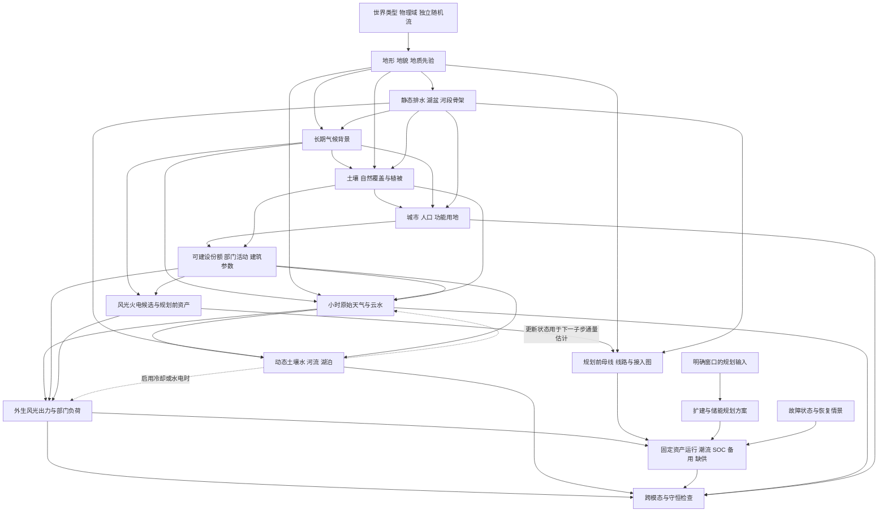

# SimGenr 多模态机理调查综合报告

## 1. 研究结论与使用边界

SimGenr 应保持一条可追溯的关系链：**地形与静态排水确定长期环境边界，气候给出背景分布，天气给出短期状态，土地与人口给出活动位置，天气和活动共同形成外生源荷，资产和电网约束将源荷转换为潮流、储能及缺供结果。** 改进重点是明确每个量由谁生成、什么约束必须成立、什么信息在当时可用；不是让所有模态彼此添加更多经验系数。

本报告综合[十份专题调查](README.md)，代码审计基线为 `d064633`（physics_v3）。**本次交付为研究文档和可实施方案，没有把后文建议的新状态、配置或函数写入生成器。** 现有功能与建议功能在表中分别标记；没有下载、清洗或拟合真实区域数据。文献中的观测与实验只支持机制、量级和适用范围，不充当本项目地区参数。

全文使用三类关系：**P＝物理关系，E＝经验规律，S＝场景先验**。工程简化另标，不因写成解析公式就升级成物理定律。例如，质量守恒为P，河宽—流量幂律为E，指定河流参考宽度与暴雨发生频率为S；D8单流向与线性水库是相应关系的工程近似。

优先处理五组问题：

1. **物理量与评分混用：** 土地适宜度不等于可用面积，地貌不等于覆盖，保护身份不等于地表材料。
2. **原始量与诊断量重复生成：** 温度、湿度、气压、风和辐射有共同可行域；不能把每个日均都独立抽取后要求所有小时关系成立。
3. **静态骨架与动态状态混用：** 汇水面积不是流量，潜在湖盆不是满水湖泊，HAND易感性不是事件淹没深度。
4. **物理尺度与数组尺度混用：** 地形已有km参数，但天气平滑、位移和部分空间评分仍依赖格数或当前图归一化。
5. **源荷实况、规划信息与运行输出混用：** 新外生字段解决了储能污染的一部分问题，事后扩建图和未来实况仍不能自动进入在线预测输入。

## 2. 多模态因果关系总图

虚线只在相应过程启用时存在。动态水热反馈用旧状态估计通量、在同一子步双方记账，或采用明确的收敛迭代；不在同一小时内任意循环调用函数。若进行土地—长期水量适应，应使用独立气候预热阶段，不能将测试周天气反向用于城市与资产选址。

**文献支持的关系：** 地形排水、地形抬升、地表水热、风光能量转换、电网和SOC守恒分别见任务02–09的原始来源。**工程简化：** 上图的模块归属、两遍生成和可选反馈。**场景先验：** 区域类型、技术配置、概率、政策与规划窗口。

## 3. 各阶段输入、输出与依赖顺序

### 3.1 当前实现与建议的两遍生成

当前真实执行序列为 `[1,2,4,3,5,6,7,8,9,10,11,12,13,14]`，见[生成入口](../../scripts/generate_static_world.py)。现阶段天气先于城市执行并不表示城市受测试周天气驱动；代码依赖与流程图时间位置应分别解释。

建议将生成分成**长期设计遍**和**短期运行遍**。长期设计遍先完成地形、水体类别、气候、自然覆盖、城市用途及规划前资产；短期运行遍再积分天气、动态水量、外生源荷与运行。这样新增不透水面积、建筑热惯性或城市地表热参数时，不需要让天气读取尚未生成的城市。

| 逻辑阶段 | 输入 | 输出及单位 | 依赖/时间尺度 | 当前状态与建议 |
|---|---|---|---|---|
| 0 元数据契约 | 域、坐标、日历、版本、种子 | 单位/区间/谱系/边界 | 全阶段基础 | 配置与种子已有；补字段支撑和信息边界 |
| 1 地形 | 世界坐标、地貌及地质先验 | z m、坡度1、曲率m⁻¹、多尺度起伏 | 静态；地貌演化为独立长时段 | 物理波长与最小名义尺度约束已有，非严格带限；明确几何生成非侵蚀模拟 |
| 2 静态水文 | z、边界、洼地政策 | D8、汇水面积km²、河段、湖盆及溢流高程m | 地形之后；静态 | 已有骨架；分潜在湖盆与实际水面 |
| 4 气候 | 纬度、z、水体类别、天气型先验 | 长期均值/振幅、协方差、季节相位 | 周期背景，不读测试周 | 基础已有；区分海洋/大湖/小河及物理长度 |
| 3 自然土地 | 地形、气候、土壤先验、长期水分 | cover_fraction、土壤参数、z0 m、保护掩码 | 年至多年，固定基线 | 植被指数已有；拆覆盖/地貌/保护 |
| 6 城市人口 | 长期适居条件、政策/可达性先验 | 人口persons/km²、城市中心与层次 | 静态设计遍 | 人口守恒已有；不向测试周适应 |
| 7 功能用地 | 城市、覆盖、可建设约束 | 用途份额、不透水率、部门/建筑参数 | 社会背景长期，活动日周 | 用途评分已有；不可当作份额直接积分 |
| 8 电源与负荷站点 | 长期资源、面积、人口、技术目录 | 占地km²、设备数、MW/MWdc、服务区映射 | 长期设计，保留候选方案 | 面积预算部分已有；分风机/光伏布局与多目标 |
| 9–10 电网资产 | 站点、走廊、设备模板 | 节点ID，线路R/X/B、kV/MVA、路径 | 规划前固定 | 单电压DC等值已有；变压器/多电压另设模式 |
| 5a 原始天气 | 气候、地形、覆盖、边界来流 | T、q、p0、u/v、云水/雨水状态 | 子步积分，小时输出 | 日→小时模式已有；推荐新增hourly-first路径 |
| 5b 动态水文 | 5a雨/蒸散驱动、2骨架、3/7土壤用地 | 土壤水mm、河流m³/s、湖库容m³ | 子步/小时，含初态 | **未实现**；新增水量账，不替换静态骨架 |
| 11 外生源荷 | 5a天气、5b可选水源、设备与活动 | 请求负荷、可用出力MW、可选Mvar | 小时及热记忆 | 已有风光负荷；未来细分部门和资源限额 |
| 12–13 规划分支 | 明确规划窗口、资产候选、预算 | 改建方案、储能MW/MWh | 独立规划期 | 已用整周实况；保留oracle并新增事前模式 |
| 14 固定资产运行 | 资产版本、源荷、故障、初始SOC | 潮流MW、状态MWh、ENS/弃电MWh | 小时、按需子时段 | DC/SOC已有；备用/故障需要新接口 |
| 导出与验证 | 所有层及映射 | 实况/规划/预测/运行视图、逐项残差 | 生成完成后及阶段边界 | 0.6.0已有部分谱系；增加未支持标志 |

原Stage编号可继续作为兼容目录ID；新增5a/5b只是逻辑名称，实际实现应使用依赖DAG或明确阶段键，不必把所有缓存重命名。必须同时更新缓存输入哈希；仅改变说明文字而复用旧的语义缓存是不安全的。

### 3.2 反馈与冲突的处理规则

1. **长期土地—水分反馈：** 先用气候先验和土壤参数初始化，运行独立预热，更新长期水分/植被；达到明确容差或有限迭代上限后冻结。预热长度和收敛阈值是S，水量账是P。
2. **短期水热反馈：** 子步开始用上步土壤水/地表状态计算并冻结本步交换通量，将同一蒸发水量在同一积分区间从陆面扣除、加入大气；两侧热量也使用同一通量约定。云雨、辐射和地表更新后的状态用于下一子步的通量估计。若实现选择延迟入账，必须保存交换缓冲库存并计入总水量；若改用隐式耦合，必须报告未收敛。
3. **地形雨只能计一次：** 若日雨预算已含气候地形增强，小时模块只分配该预算；若小时云水模型负责地形凝结，则长期雨场作为目标统计而非每步再乘一次地形增益。
4. **日小时模式二选一：** `hourly-first`从原始状态积分并聚合；`daily-conditioned`对声明的独立预算做条件采样并检验可行域。不得无条件对全部诊断量各自锁定日均。
5. **规划—运行闭环：** 允许整周已知的oracle规划作为研究情景；预测实验则从独立设计期规划资产，并在测试时冻结，禁止用测试期短缺驱动即时扩建。

## 4. 跨模态影响矩阵

行是原因，列是直接受影响模态；`—`表示本方案不设直接耦合，间接路径仍可能存在。`*`表示只在滞后/长期预热或可选模块启用时存在。多字母表示该接口中含不同类别的关系，必须在具体公式中分项，不能把它们相加成为一条“通用定律”。

| 原因↓ / 结果→ | 地形T | 静态水文H | 气候C | 土地L | 城市活动U | 天气W | 动态水文D | 源荷X | 电网G | 运行O |
|---|---|---|---|---|---|---|---|---|---|---|
| 地形T | — | P/E | P/E/S | E | E/S | P/E | P/E | — | E/S | — |
| 静态水文H | E* | — | E/S | E | E/S | E* | P | — | E/S | — |
| 气候C | E* | E* | — | E | E/S | E/S | E* | E/S | — | — |
| 土地L | E* | E* | E* | — | E/S | P/E* | P/E | E/S | E/S | — |
| 城市活动U | — | — | — | S | — | P/E* | P/E | E/S | E/S | — |
| 天气W | — | — | — | E* | E* | — | P/E | P/E | — | E* |
| 动态水文D | — | — | — | E* | — | P/E* | — | P/E* | — | E/S* |
| 源荷X | — | — | — | — | — | — | — | — | S* | P |
| 电网G | — | — | — | — | — | — | — | — | — | P |
| 运行O | — | — | — | — | — | — | — | S* | S* | — |

例：天气→电网运行的E*是温度/风对动态线路热限或天气故障的影响，**不是当前已实现**。运行→源荷的S*只用于另行定义的需求响应控制，原始请求负荷仍保留；运行→图的S*只存在于下一规划轮次。

## 5. 需要新增或拆分的状态变量

| 变量/字段族（建议名） | 单位与时间支撑 | 唯一负责模块 | 下游消费者 | 最小必要性 |
|---|---|---|---|---|
| `cell_area_km2, time_bounds, calendar, coordinate_frame` | km²、h或明确UTC | 元数据 | 所有积分与映射 | 必需，消除尺度歧义 |
| `landform_class, geology_proxy` | 类别，静态 | 地形 | 土壤/成本 | 地貌应拆；地质先验可后续 |
| `cover_fraction, land_use_fraction, protected_mask` | 无量纲，静态 | 土地/城市用途 | 面积、人口、能源、水文 | 必需，评分和份额分开 |
| `build_suitability, usable_area_fraction` | 排序分数 / 无量纲面积份额[0,1] | 土地 | 源荷站点 | 必需；份额乘cell_area才得到km² |
| `aerodynamic_roughness_m, displacement_height_m` | m，长期覆盖状态 | 土地 | 近地/轮毂风 | 增强风廓线时必需 |
| `ocean_mask, waterbody_class, area_km2, fetch_km` | 类别、km²、km | 静态水文/边界 | 气候与天气 | 区分小河与海洋影响 |
| `soil_capacity_mm, infiltration_mm_h, impervious_fraction` | 整格等效mm、mm/h、1 | 土壤/用途 | 动态水文 | 开启水量模型必需 |
| `soil_water_mm, groundwater_mm` | 时步边界mm | 动态水文 | 蒸散、基流、干旱 | 最小水量状态 |
| `river_storage_m3, discharge_m3_s` | 边界库容 / 区间平均流率 | 河段路由 | 洪水代理/水源 | 路由时不可只存步末流量 |
| `lake_volume_m3, lake_level_m, wet_fraction` | 边界状态 | 湖泊 | 蒸发、溢流、土地水面 | 不能由湖盆掩码默认满水 |
| `temperature_c, specific_humidity_kgkg, sea_level_pressure_pa, wind_u/v_mps` | 声明高度/时刻或区间支撑 | 天气原始态 | 统一诊断内核 | q/p0为新增；其余统一归属 |
| `wind_scalar_mean_mps, wind_vector_mean_u/v_mps` | 日统计 | 小时→日聚合 | 缓存、分析、条件天气 | 必需拆分，不能强设三者等式 |
| `cloud_water_kgm2, rain_water_kgm2, cloud_id, cloud_lifetime_h` | 柱量、对象谱系、h | 云模块 | 雨量/辐照 | 云过程启用时新增；对象不拥有第二套水量 |
| `cloud_advection_u/v_mps` | 云层/有效平流风 | 天气 | 云形态更新 | 不直接拿10m风作为云层风 |
| `evaporation_mm_step, surface_heat_flux_wm2` | 区间通量 | 地表水热 | 同一步双方入账，下一步更新通量估计 | 反馈开启才必需，不凭空加水/热 |
| `sector_demand_mw, effective_temperature_c` | 小时、边界记忆 | 负荷 | 聚合、解释、干预 | 避免把用地评分当部门电量占比 |
| `asset_bus_weights, population_service_weights` | 权重及业务ID | 接入/服务区映射 | 源荷/数据导出 | 保证分配守恒和重排不变 |
| `available/ scheduled/ delivered_power_mw` | 区间平均MW | 资源 / 调度 / 运行 | 数据与弃电账 | 保持独立口径 |
| `asset_snapshot_id, in_service, contingency_id` | 版本/布尔，时变图 | 资产/故障 | 潮流、备用 | 支持局部故障与独立规划 |
| `reserve_up/down_mw, sustain_hours` | MW、h | 调度 | 故障后可交付验证 | 同时约束功率、能量和网络 |
| `issue_time, available_at, lead_hours, plan_window` | 明确的时间轴 | 数据谱系 | 预测/规划视图 | 避免事后信息变成事前输入 |

不要求一次新增全部字段。原则是**启用一种过程，必须同时新增其最少状态、边界通量和验证账本**。例如只有一个“干旱强度”评分却没有土壤水状态，不能输出定量基流和冷却水短缺。

## 6. 需要新增的公式与规则

| 关系 | 文献支持的部分 | 推荐工程简化 | 场景先验/参数 | 单位检查与专题 |
|---|---|---|---|---|
| 地形派生量 | 高程偏导与坡面几何P | 物理格距、固定km窗口、边界halo | 地貌族、波长和振幅S | z m / x m →坡度1；[任务02](task_02_terrain_and_scale.md) T1/T2 |
| 土地面积账 | 面积守恒P；覆盖/用途联系E | 独立类别轴与分数混合 | 政策、权重、类别概率S | $A_{use}=\sum_i A_if_i$ km²；[任务06](task_06_vegetation_landuse_city.md) |
| 根区与基流 | 水量连续P、渗漏/退水E | 有界桶、慢储层与解析退水 | 土壤容量/时间常数S | 所有步深mm，1mm·1km²=1000m³；[任务03](task_03_hydrology_and_runoff.md) H4/H8/H9 |
| 河湖路由 | 流量—库容连续P，水力几何E | 线性河段、库容—水位曲线 | 入流边界、河段时间、出口系数S | m³/s×s=m³；[任务03](task_03_hydrology_and_runoff.md) H3/H7/H9 |
| 温湿压诊断 | 静力、湿空气状态关系P | 统一T/q/p0→RH/p/ρ诊断 | 参考p0扰动、分层温度S | Pa/(J kg⁻¹K⁻¹·K)=kg/m³；[任务04](task_04_climate_and_orography.md) R1/R4 |
| 日风统计 | 三角不等式P | 标量和矢量统计分别存储 | 条件采样策略S | 矢量均值的模≤模的均值，单位均m/s；任务04 §5.6 |
| 云团演化 | 平流与水相转换P/E | 连续云水场+诊断对象谱系；子步更新 | 天气型、扰动、简化寿命S | 平流m/s×s→m，云水kg/m²；[任务05](task_05_cloud_rainfall_radiation.md) |
| 云雨辐射一致性 | 云凝结/降雨/辐射关系P/E | hourly-first；条件模式先查预算可行域 | 透射与微物理简化系数S | 雨深mm、GHI W/m²、辐照能Wh/m²；任务05 |
| 风机/光伏转换 | 能流和电功率P、尾流/散射/温升E | 设备曲线、阵列面辐射与热模型 | 机型、布局、设备损失S | 风功率ρAv³为W；散热项温升K；[任务07](task_07_energy_resources.md) 1/3–7 |
| 部门负荷 | 活动规律与温敏性E，建筑热量P | 部门日历曲线+一阶热记忆+相关残差 | 部门份额、设备/行为参数S | 温敏系数K⁻¹；RC时间常数h；[任务08](task_08_load_and_source_load_correlation.md) |
| 电网/储能运行 | KCL、相角、能量连续P | 单电压DC或另设AC验证模式；MILP互斥 | 成本、限供优先、备用策略S | MW×h=MWh；[任务09](task_09_grid_operation_and_storage.md) |
| 故障与备用 | 故障后网络和能量约束P | 稳定ID的`in_service`，分岛重算，固定事前资产 | 故障率、持续期、恢复策略S | MW备用还需h的SOC支撑；任务09 |
| 机制核验 | 守恒/几何P；经验规律的条件检验E | 单独残差、解析反例、成对与区组实验 | 容差、样本数、试验幅度S | 容差有同单位，概率指标声明样本期；[任务10](task_10_validation_protocol.md) |

这里的公式索引意在减少重复实现：共享太阳几何、温湿压诊断、面积积分、时间积分和业务ID映射应各有一个权威入口；测试保留独立解析算例，不能只再次调用生成器函数。

## 7. 现有实现中重复、冲突与缺失的关系

以下均以当前代码为依据，重要结论区分“发现的接口限制”与“尚未建模”。研究建议尚未变更运行行为。

| 编号 | 代码位置/现状 | 机理问题 | 建议与可检查标准 |
|---|---|---|---|
| F01 | [小时天气](../../world_generator/weather/weather_generator.py)：日风速校验为hypot(日u,日v)，一天方向固定 | 合法转向的日统计被排除；物理统计量定义过窄 | 拆标量/矢量均值；接受半天+5、半天−5 m/s反例 |
| F02 | 同文件RH已按小时T的饱和压倒数权重耦合并保持日均，但pressure另加零均值扰动，云/GHI分别匹配预算 | 局部耦合不等于完整水汽状态；每个边际可行不保证联合可行，诊断均值不能任意指定 | 原始态唯一归属；共同诊断p/RH/ρ；预算模式与残差显式记录 |
| F03 | [气候](../../world_generator/climate/climate_generator.py)用`distance_to_water`构造海洋性减幅等 | 小河与海洋/大湖的热容量、fetch被混同 | 水体类别、面积与fetch；小河不默认造成全区海洋性 |
| F04 | [土地](../../world_generator/land/land_generator.py)中地貌、水体、湿地、保护混为覆盖枚举 | 互斥类别与可重叠身份混合；森林/草地等未完整表达 | 分landform/cover/protection，面积份额闭合 |
| F05 | [用途](../../world_generator/land_use/land_use_generator.py)为多张独立评分；[站点](../../world_generator/energy/energy_candidate_generator.py)以buildability参与面积 | [0,1]评分不能自动当可分配份额；现有几何面积账仍有语义限制 | 独立`usable_area_fraction`与服务分配，保留原score用于排序 |
| F06 | [水文](../../world_generator/hydrology/hydrology_generator.py)静态河湖与HAND代理 | 缺土壤/河湖水量、边界来水与干湿季状态 | 增加动态层；静态评分命名susceptibility，无事件深度时标不支持 |
| F07 | 天气`*_smoothing_steps`、`synoptic_shift_cells_per_day`；气候部分按图归一化 | 改分辨率/图幅会改相关距离和扰动幅度 | 以km、m/s、h配置，固定世界坐标场与边界来流 |
| F08 | [配置](../../world_generator/core/config.py)保留cloud_system/count/radius/motion等旧字段，活动小时路径未调用这些对象 | 参数名称可能暗示不存在的云团生命周期 | 标deprecated或implemented=false；新云模块需要真实消费字段的测试 |
| F09 | [源荷](../../world_generator/operation/source_load_forecast.py)风/光转换已有，尾流和热电水源未建模 | 能源资源的相互影响与复杂地形局部条件缺失 | 按模式声明理想供给；尾流/冷却单独可选并避免重复损失 |
| F10 | [电气构建](../../world_generator/grid/electrical_builder.py)用0.62×候选负荷作基础负荷 | 是场景均峰比，不是人口能耗定律；部门份额也有多个来源 | 命名和配置化均峰比，部门容量/电量/土地份额分别说明 |
| F11 | [Stage12线路更新](../../world_generator/operation/grid_update_loop.py)与[Stage14调度](../../world_generator/operation/storage_dispatch.py)使用不同扩建语义 | 前者等值并联影响阻抗，后者固定阻抗增额定值；均可作为简化但不能混名 | `upgrade_kind`明确选择；测试重复操作及单回/整走廊故障 |
| F12 | Stage14有界扩建与循环SOC，全窗口已知 | 会掩盖固定资产极端短缺；循环初态不等于实际事件前SOC | oracle/事前规划/固定资产三种模式，故障时保留初态连续 |
| F13 | [加载器](../../world_generator/dataset/loader.py)提供未来实况；最终图来自整周规划 | 外生字段正确也不能保证信息无泄漏 | issue_time与plan_window审计；按世界及设计/测试期分开 |
| F14 | [物理检查](../../scripts/validate_world_physics.py)包括TOA上界、日9通道匹配等 | 其中一些是选定简化模式约束，而非所有真实条件下的硬物理法则 | 每条检查附model_scope；新模型改变时同步调整旧断言 |
| F15 | 无完整机组启停/故障/备用、AC电压和损耗求解 | 稳态DC可行不能推出完整N-1、频率或电压安全 | 先加固定资产断线/备用约束；AC对照后续；动态安全暂不实现 |
| F16 | [地形 `_world_fbm`](../../world_generator/terrain/terrain_generator.py)按保留octave振幅和重新归一化 | 改分辨率截断高频后，保留的长波振幅也可能改变；同分辨率拼接不证明跨分辨率一致 | 使用固定完整谱归一化或潜在细场保守滤波；比较共同长波幅度 |
| F17 | [城市人口核](../../world_generator/city/city_generator.py)逐城归一化，但`city_id_map`取最大贡献并另设背景阈值 | 总人口及来源核可守恒，按硬标签积分却不保证等于该城人口 | 保存城市贡献/服务区权重，分清显示标签与行政人口分配 |

### 7.1 不能通过叠加公式解决的冲突

日风速问题是明确反例：若半天吹东风5 m/s、半天吹西风5 m/s，日均矢量为0但日均标量为5 m/s。继续增加风速随机噪声不能解决接口将二者强制相等的问题。

类似地，指定零云量而又要求仅靠云衰减把晴空日辐照降到十分之一，不能通过权重调节同时满足两套硬预算。应先修改变量归属和条件生成的可行域，再谈云团形态。完整反例和量纲见任务04/05/10。

## 8. 分阶段修改建议及文献对应

“立即”指建议作为下一轮开发的最小完整工作包，**不是本次文档已完成实现**。每包都含输入、输出和验收；推荐先完成A组，B组依次启用。

| 工作包 | 优先级 | 建议配置/生成函数 | 预期输出与验收 | 对应参考资料 |
|---|---|---|---|---|
| A1 字段契约与时间尺度 | 建议立即实现 | `FieldContract`、`validate_temporal_support`、`time_bounds` | 雨深/雨强、状态/流率、ID和1h→0.5h能量测试 | CF v1.12；任务01 [10] |
| A2 土地三轴与面积 | 建议立即实现 | `cover_fraction`、`land_use_fraction`、`protected_mask`、`allocate_land_area` | 分数闭合、禁建不能被评分抵消、人口面积守恒 | WorldCover/JRC、任务06来源与任务01 [4,5] |
| A3 天气原始/诊断与风统计 | 建议立即实现 | `WeatherPrimitiveState`、`diagnose_weather_state`、`daily_budget_mode` | 接受日风转向反例，温湿压诊断闭合，不可能预算报错 | Stull/FAO-56；任务04 R1/R2/R4；任务05 |
| A4 物理空间尺度 | 建议立即实现 | `*_correlation_km`、`*_memory_hours`、`boundary_mode` | 同域换格距的相关距离/平流位移一致；图外新增峰不改局部量纲 | Perlin/Horn；任务02 T1/T2；任务04 |
| A5 数据信息边界 | 建议立即实现 | `asset_snapshot_id`、`plan_window`、`make_issue_time_view` | 测试实况不改变此前输入；固定规划前图可导出 | CF、RTS-GMLC；任务01与任务09 |
| A6 最小动态水量原型 | 建议立即实现 | `HydrologyDynamicConfig`、`step_soil_bucket`、`route_volume_exact` | 同一区间、同一体积单位：初储量+降雨输入+边界入流=末储量+蒸散输出+边界出流；无数据过程明确关闭 | HEC-HMS、FAO-56；任务03 H4/H8/H9 |
| A7 固定资产断线实验 | 建议立即实现 | `in_service`、`contingency_id`、`run_fixed_asset_dispatch` | 母线级缺供、分岛KCL；断线后无即时虚拟扩建 | MATPOWER/可靠性测试系统；任务09 |
| A8 检查分层与反例 | 建议立即实现 | `scope/status/max_location`、`run_mechanism_interventions` | 区分FAIL/UNSUPPORTED/NOT_RUN；失败保留原始残差 | Oberkampf/Chen/NIST；任务10 [1–3] |
| B1 长期水量与湖泊 | 建议后续实现 | `spinup_hydrology`、`lake_hypsometry`、`soil_initialization_source` | 预热/测试隔离，湖水位—面积—体积单调，干湖不凭空满水 | USACE/FAO-56；任务03 H7/H8 |
| B2 演化云与水热耦合 | 建议后续实现 | `advect_cloud_state`、`cloud_lineage`、水热滞后子步 | 物理平流、合并分裂质量不重复、日小时模式可行 | Smith–Barstad、ECMWF及云研究；任务04/05 |
| B3 地貌/土壤/覆盖增强 | 建议后续实现 | `landform_family`、`geology_proxy`、分数覆盖决策 | 高原不自动等于陡山；材料先验影响渗透与建设成本 | NRCS、Landlab、生态资料；任务02/06 |
| B4 风机微布局与热电资源 | 建议后续实现 | `turbine_layout`、`wake_model`、`cooling_constraint` | 上下游风向反转尾流方向改变；冷却水热量账闭合 | Jensen/Bastankhah/van Vliet；任务07 [3,4,9] |
| B5 部门建筑与行为 | 建议后续实现 | `sector_energy_share`、`thermal_state`、活动日历 | 各部门再聚合守恒；热记忆因果、相关协方差合法 | 部门负荷及建筑热模型来源；任务08 |
| B6 可交付备用与AC对照 | 建议后续实现 | `reserve_sustain_hours`、设备启停状态、`network_model` | SOC支撑/网络可交付，DC与AC限界比较，不互换可行性 | MATPOWER/PGLib/PyPSA/NERC；任务09/10 |
| B7 场景族与分辨率验证 | 建议后续实现 | `scenario_registry`、成对种子/区组设计 | 干热、暴雨、低资源和故障传递链与多世界统计 | IPCC/NIST；任务10 [3,4] |
| C1 全三维大气/地貌演化 | 暂不实现 | 不以小模块名称宣称提供该功能 | 明确二维粗网格与缺初边值的限制 | 任务02/04/05 |
| C2 精细水动力/地质灾害 | 暂不实现 | 不输出工程洪水重现期、滑坡概率 | 输入和分辨率不足时输出unsupported | 任务02/03 |
| C3 全电磁暂态/真实可靠性认证 | 暂不实现 | 不由DC推断频率稳定、保护动作和合规 | 动态模型/标准体系另立项目 | 任务09/10 |
| C4 真实区域校准/模型排名 | 暂不实现 | 本调查不下载拟合数据、不评神经网络 | 不把经验先验写成实证参数或预测成绩 | 本研究边界 |

实施时不得只完成一包的“生成”而遗漏其“账本”。例如A6可暂不反馈大气湿度，但需明确蒸散是离开当前水文系统的边界通量；B2启用双向反馈后，才将该通量计入大气水分。

## 9. 机理一致性测试方案

### 9.1 验证层次和指标

| 层次 | 主要检查 | 数值/统计口径 | 结果可说明什么 |
|---|---|---|---|
| 契约与可行域 | 单位、空间支撑、区间、ID、日预算及信息边界 | 精确逻辑+声明容差 | 输入和接口合法 |
| 基本恒等式 | 人口/面积/水量/能量、太阳边界、逐岛KCL | 同单位绝对/相对残差；位置 | 选定关系的计算自洽 |
| 模型约束 | DC、D8、固定日预算、循环SOC、辐射上界 | 附model_scope，不能全球通用 | 当前简化模型被正确执行 |
| 机制干预 | 转向风、PV温升、温敏负荷、干湿初态、断线 | 同种子成对、限定适用区间 | 改动能沿因果链传播 |
| 统计情景 | 雨/云持续性、谱和相关长度、联合尾部、容量因子 | 按世界/季节分层，不设普适合格线 | 生成样本符合声明先验的程度 |
| 外部现实 | 独立区域数据与实际运行对照 | 本次不执行 | 未获得此层证据，不能宣称区域代表性 |

### 9.2 最小反例与尺度实验

- **解析算例：** 斜平面导数、1 mm×1 km²水体积、无流入储层退水、两母线DC、恒功率SOC和单联络线孤岛。单位与预期结果可手算，不依赖生成器重复自身公式。
- **合法/非法输入：** 接受半日正负风的合法日统计；拒绝云/辐射预算矛盾、无容量却正功率、单位缺失及非零源荷母线丢失；在当前不含曙暮光等贡献的模式下，拒绝极夜区间的正太阳GHI目标。
- **空间尺度：** 固定64×64 km区域试0.5/1/2/4 km；保守聚合比较总量，共同低频波段比较地形与天气；不把分辨率变化与区域扩展混成一个实验。
- **随机样本：** 先4个冒烟种子，再按地形/季节/资产余度分层扩展到16–32个；数字为试验预算先验，不表示罕见事件概率收敛。每个基线与干预共享可配对的随机流。
- **极端事件：** 干旱必须有前期水状态；暴雨必须有历时/移动和产汇流；低风低光须定义白昼筛选；高温负荷须有热记忆；故障必须固定事前资产并重新分岛求解。

### 9.3 结果与失败分类

每条检查输出值、单位、容差、最大位置、先决条件、模型范围与来源。采用 `PASS/FAIL/UNSUPPORTED/NOT_RUN` 四态，另记录求解状态和场景短缺：**允许缺供的情景出现ENS不自动等于物理FAIL**，但缺供账不守恒就是FAIL；缺动态水文时“洪水检查未支持”不能自动当PASS。

此前121项测试与三份各70项场景检查属于已有实现的证据。它们尚不覆盖新增云团、水量、备用、故障及本文全部反例；本次提出的协议不能借用旧数字冒充已执行。详细公式、数值容差建议、失败案例及文献见[任务10](task_10_validation_protocol.md)。

## 10. 当前不能表达的现实过程

| 现实过程 | 当前缺少的状态/尺度 | 可接受的降阶 | 不能得出的结论 |
|---|---|---|---|
| 构造、岩性侵蚀与沉积演化 | 地质历史、物性、长时段输沙 | 静态地貌族与材料先验 | 地形来自真实地质演化 |
| 地下水、城市排水、回水和堤防 | 三维含水层、管渠和精细水位 | 根区/慢储层、河段库容 | 工程淹没深度、百年洪水或供水保障 |
| 三维大气与地形湍流 | 垂直动量、稳定度、微物理 | 天气型、诊断抬升、有效云平流 | 高分辨率NWP、风机载荷或山谷逐点预报 |
| 云边三维辐射 | 光子侧向输运和云几何 | 声明为1D的辐射模式或可选扰动 | 局地GHI普遍受水平TOA投影限制 |
| 生态演替与土地政策 | 物种竞争、扰动、治理与产权 | 分数覆盖与长期适宜度 | 真实保护地形成或未来城市扩张预测 |
| 家庭/工业细粒度行为 | 设备、建筑、通勤、生产计划 | 部门活动和热状态群体模型 | 某地居民真实行为或经济因果效应 |
| 复杂场内尾流和组件遮挡 | 微地形、稳定度、单体布局 | 可选工程尾流/阵列模型 | 完整场址发电担保 |
| 热电燃料、水温及运输中断 | 物流、水量水温与技术目录 | 声明的减额/资源约束场景 | 现实燃料/冷却供应可靠性 |
| 电压无功、损耗、暂态与保护 | 完整AC/动态设备和控制模型 | DC研究与独立AC对照 | 电压/频率稳定、保护动作或完整N-1合规 |
| 业务预报及可靠性概率 | 起报体系、误差过程、多年权重 | 显式信息集和压力情景 | 真实预测精度、年LOLE或事件重现期 |

保留这些边界有利于后续逐项增加过程：增加状态、输入和验证后再开放相应输出。没有状态支撑的过程不应靠额外随机噪声产生貌似定量的结果。

## 11. 综合证据索引

完整作者、年份、具体用途和适用边界位于各专题第11节；以下为跨模块架构使用的核心原始资料，避免只列标题而没有对应结论。

| 资料 | 支撑的具体关系/设计 | 不支撑的外推 |
|---|---|---|
| [CF v1.12，Eaton et al., 2024](https://cfconventions.org/cf-conventions/release/v1.12.0/cf-conventions.html) | 单位、时间区间、空间支撑及统计方法自描述 | NPZ自动符合CF、未来信息自动可用 |
| [Horn, 1981](https://people.csail.mit.edu/bkph/papers/Hill-Shading.pdf) | 高程偏导与坡面方向的几何关系 | 粗格坡度等于风机基础/道路微地形 |
| [Barnes et al., 2014](https://rbarnes.org/sci/2014_depressions.pdf) | Priority-Flood数字排水与洼地处理 | 所有洼地都有长期真实湖水 |
| [HEC-HMS Soil Moisture Accounting](https://www.hec.usace.army.mil/confluence/hmsdocs/hmstrm/canopy-surface-infiltration-and-runoff-volume/infiltration/soil-moisture-accounting-loss-model) | 入渗、蒸散和多储层水量分账 | 本文简化桶等于完整HEC-HMS或地区校准 |
| [Stull, Practical Meteorology，Chapter 1](https://www.eoas.ubc.ca/books/Practical_Meteorology/prmet102/Ch01-atmos-v102b.pdf) / [Chapter 4](https://www.eoas.ubc.ca/books/Practical_Meteorology/prmet102/Ch04-watervapor-v102b.pdf) | 静力、湿空气和原始/诊断变量的区分 | 恒定近地面垂直温度梯度或独立RH扰动普适 |
| [Smith & Barstad, 2004](https://journals.ametsoc.org/abstract/journals/atsc/61/12/1520-0469_2004_061_1377_altoop_2.0.co_2.xml) | 地形抬升、云水转化和平流时标共同影响降雨 | 仅由坡度确定降雨或重复乘两次地形增雨 |
| [FAO-56，Allen et al., 1998](https://www.fao.org/4/x0490e/x0490e00.htm) | 太阳几何、水汽与蒸散/根区水分框架 | 所有生态系统共享作物参数或日尺度公式无条件小时化 |
| [PVWatts v5，Dobos, 2014](https://docs.nrel.gov/docs/fy14osti/62641.pdf) | 从辐照经DC/AC和损失到功率的透明转换链 | 该简化能覆盖所有设备、遮挡及局地云增强 |
| [RTS-GMLC](https://github.com/GridMod/RTS-GMLC) / [PGLib-OPF](https://github.com/power-grid-lib/pglib-opf) | 多类运行数据和标准化电气问题定义 | 测试网统计等于所有真实输配电网 |
| [IPCC AR6 WGI Chapter 11 §11.8](https://www.ipcc.ch/report/ar6/wg1/chapter/chapter-11/) | 前期、时间、空间和多变量复合事件分类 | 本项目设定幅度/频率等于真实气候风险 |
| [Oberkampf & Trucano, 2002](https://www.osti.gov/servlets/purl/793406) / [Chen et al., 1998存档](https://arxiv.org/abs/2002.12543) | 验证层次与缺少标准答案时的关系测试 | 物理检查通过就证明现实代表性 |

具体开发应从§8中的A组工作包开始，以对应专题的输入、公式和验收为边界。B组按状态依赖启用；C组保持不支持，不以未建模过程包装已有输出。
