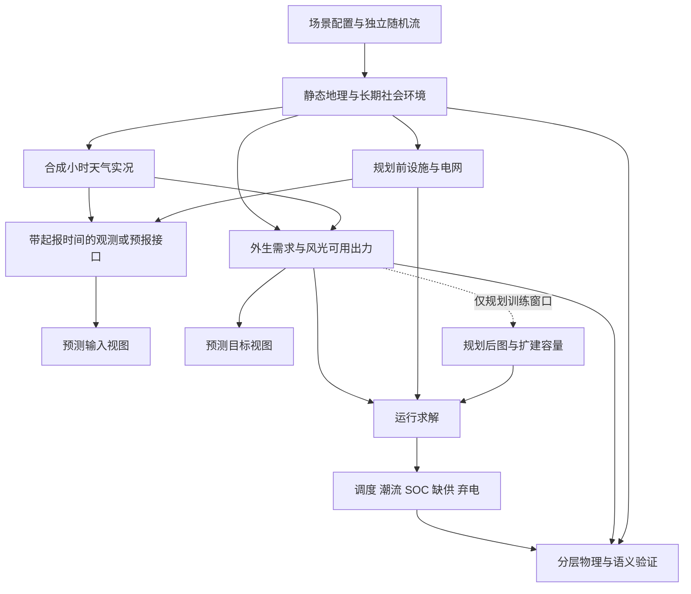

# 任务一：数据集与合成世界的定位

## 1. 调查问题

需要建立怎样的数据契约，才能让地理栅格、天气场、人口、电源、电网和运行时序指向同一个世界？本主题调查公开产品的模态边界，以及合成实况、规划输入、预测输入和运行结果的区别。这里使用真实数据产品的**定义与结构**支持设计，不下载其数据、不拟合参数，也不宣称拼接后可重建真实电网。

代码基线为合并 physics_v3 的 `d064633`；已有格式见 [DATA_DESCRIPTION](../../datasets/DATA_DESCRIPTION.md) 和 [builder](../../world_generator/dataset/builder.py)。本报告提出的新增字段与函数均为建议，当前 schema 仍是 `0.6.0`。

## 2. 关键结论

- **【物理关系】跨模态一致性首先要求同一空间支撑、时间区间、业务实体和守恒账本。** 两个数组形状相同，不能证明其网格面积、风速高度、功率口径或预测可用时间相同。人口、雨量体积和能量的聚合规则必须保留单位。
- **【经验规律】公开产品通常在本专业内完整，而非覆盖全部因果链。** 全球再分析可提供大气与陆面状态，土地产品提供覆盖或人口，电力产品提供特定地区的源荷或标准化网络。这是下表所调查产品的覆盖差异，不是“世界上不存在完整数据”的穷尽性证明。[1–9]
- **【场景先验】SimGenr 适合定位为“可追溯的条件合成世界族”。** 同一静态世界可配多个天气 realization、设施方案和故障分支；其概率是生成器给定的概率，不自动等于真实事件频率。
- **【物理关系】可用出力、实际调度和供电量不能相互代替。** 缺供改变已供电量而不改变原始用户需求；弃电改变实际发电而不改变弃电前可用资源。储能是能量转移设备，充电不可混作人口产生的外生需求。
- **【场景先验】预测实验应声明信息集。** 未来合成天气可作为机制研究中的已知条件，但只有另外构造起报时间、提前量与可用性后，才能把输入称为起报时可用的预测信息。CF 的时间区间和参考时刻约定可帮助消除歧义；本项目的分层与权限掩码是工程设计，并非 CF 强制的电网架构。[10]

## 3. 模态关联图



虚线是设计允许的规划依赖；如果规划窗口包括预测测试期，`GP` 不能无条件进入该预测实验的输入。生成先后顺序与实验信息可用顺序需要分别记录。

| 输入变量 | 输出变量 | 影响方向 | 空间尺度 | 时间尺度 | 关系类型 | 推荐实现 | 参考来源 |
|---|---|---|---|---|---|---|---|
| 高程、格距、投影 | 坡度、排水方向 | 几何导数；非简单正负 | 格点至流域 | 静态 | 物理关系 | 保存坐标、面积与导数算法 | [1,2]、任务02/03 |
| 天气原始状态 | 风光资源、温敏负荷 | 非线性、条件依赖 | 站点/城市与天气格 | 小时至季节 | 物理关系与经验规律分项 | 明确高度、站点插值和转换模型 | [3,6,7]、任务07/08 |
| 覆盖和人口 | 活动结构、负荷容量 | 通过分配权重作用 | 子网格至城市 | 年背景、小时活动 | 经验规律；分配为场景先验 | 人口总量与部门份额分开 | [4,5] |
| 规划前图、外生源荷 | 节点/线路运行值 | 由网络约束联立决定 | 连通分量 | 小时 | 物理关系；目标函数为场景先验 | 固定资产快照后求解 | [8,9] |
| 充电、放电、效率 | 下一时刻储能量 | 带损耗的有向转移 | 设备/母线 | 时步边界 | 物理关系 | `T+1` 状态、`T` 流量 | 任务09 |
| 起报时刻、观测延迟 | 可见输入 | 过滤未来信息 | 每个字段/实体 | 每次起报 | 场景先验；逻辑硬约束 | `available_at <= issue_time` | [10]、本节工程设计 |
| 网格交叠面积 | 人口/雨体积/功率映射 | 守恒重分配 | 多分辨率 | 聚合窗口 | 物理关系 | 面积权重与业务 ID 映射 | [2,10] |
| 种子与模型版本 | 一组可复现场景 | 参数化而非现实因果 | 全世界 | 全生命周期 | 场景先验 | 保存随机流谱系与配置哈希 | 项目实现 |

## 4. 物理机制与经验规律

### 4.1 调查产品和模态缺口

下面是特定版本/产品族的代表性清单，分辨率是标称空间支撑，不能解读为所有变量的真实可分辨尺度。网页资料核对日期为 2026-09-09；不以网页抓取时间替代产品参考年。

| 产品 | 典型模态与字段 | 空间/时间支撑 | 对本项目有用的信息 | 在本任务中的缺口 |
|---|---|---|---|---|
| Copernicus DEM GLO-30 [1] | 地表高程、质量及水体掩码 | 1 arc-second 标称约30 m；静态产品 | 水平/垂直基准、质量层、DSM与裸地高程区别 | DSM含建筑/树冠；不是地下地质或精细河床 |
| HydroSHEDS v1.4 [2] | 条件化高程、D8方向、上游汇流量 | 3/15/30 arc-second等产品；静态 | 汇流格数与面积的区别、流域连通 | 汇水面积不是小时流量；不自带本次暴雨过程 |
| ERA5 / ERA5-Land [3] | 大气、海洋/陆面状态，温湿风、辐射、降水等 | ERA5约31 km小时，137模式层；Land约9 km小时 | 再分析由观测与模式组合；变量层次、累计量和诊断量应区分 | 不是特定起报时刻的独立NWP预测，也不是1 km站点实测 |
| ESA WorldCover 2020/2021 [4] | 11类土地覆盖 | 10 m；年度参考图 | 覆盖类别与制图误差、观测年明确 | 不直接给用电部门、土地所有权、法定保护约束 |
| GHS-POP R2023A [5] | 人口格网，单位人数/格 | 100 m、1 km及经纬度版本；多时期 | 人口是面积积分量，参考期/估计或投影要标记 | 常住人口不等于小时在场人口；无家庭设备/母线映射 |
| WIND Toolkit经典产品 [6] | 模式气象、风机转换出力 | 2 km、5 min、2007–2013示例产品 | 资源场与转换后功率应同时保留 | 区域和机型假设特定；不包含完整地理社会电网链 |
| NSRDB产品族 [7] | GHI、DNI、DHI及天气 | 部分产品4 km/30 min，新产品另有尺度 | 不同辐照分量和产品版本必须区分 | 并非所有地区/年份统一4 km；不等于组件温度与AC功率 |
| OPSD time_series 2020-10-06 [8] | 负荷、风光发电/容量、电价 | 国家/控制区/报价区；主表小时 | 需求、发电和空间聚合层次明确 | 该版截至2020年中，不是当前实时数据；缺内部母线线路 |
| RTS-GMLC与PGLib-OPF [9] | 标准化电源、负荷、线路、运行约束；前者含时间序列 | 测试系统/节点线路；依具体输入时步 | 前者支持生产成本/可靠性研究，后者标准化AC-OPF比较 | 测试系统不是真实区域复制；不能据其推断全球城市或天气规律 |

**【经验规律】共同缺口在连接关系而不只在“字段少”。** 数据可能不同时、空间支撑不一致、地理位置不可公开、需求已被限供截断、发电受弃电影响、设施版本不同。增加字段不能恢复这些未记录的连接；合成世界应直接保存生成时已知的映射和来源，避免之后靠名称或最近邻猜测。[1–10]

### 4.2 推荐的数据模态清单

| 层 | 必需内容 | 建议补充内容 | 主键/形状 |
|---|---|---|---|
| 静态空间 | 高程、坡度、坡向、排水、水体、土地、人口、气候背景 | 土壤参数、岩性先验、分数覆盖、海洋掩码、长期危险性 | `(world, y, x)`，类别与连续字段分开 |
| 动态环境 | 风、温度、湿度、气压、云、雨、GHI | 原始湿度/云水、土壤水、河流量、湖库容、诊断标记 | `(weather_realization, time, y, x)` |
| 资产与图 | 站点、母线、线路、容量、电压、R/X/B、路径 | 设备年龄/类型、状态、变压器、规划前后快照 | 稳定 `asset_id/bus_id/branch_id` |
| 外生源荷 | 请求负荷、风光可用功率 | 部门负荷、无功需求、机组可用状态 | `(realization, time, asset_id)` |
| 规划输入 | 允许的资产候选、成本、规划窗口、约束 | 投资方案、寿命期假设 | `(plan_id, input_version)` |
| 预测输入 | 起报时可知观测、日历、资产快照 | 提前量、预测成员、误差模型及观测延迟 | `(issue_time, lead_time, member, entity)` |
| 运行输出 | P/Q、相角、潮流、SOC、缺供、弃电 | 电压、损耗、备用、故障恢复 | `(dispatch_id, time, entity)` |
| 验证与谱系 | 版本、配置、种子、单位、残差、求解状态 | 每条约束的作用域、可用性、失败定位 | `(run_id, check_id)` |

静态图上的动态属性不等于动态图：只有线路投退、开关/故障状态或拓扑变化被记录，才可表示随时间变化的图。保留共同业务 ID，利用 `in_service[t,e]` 和版本化连接表表达，不把故障线删除后重排所有 ID。

### 4.3 术语表

| 术语 | 本项目定义 | 不应混同的概念 |
|---|---|---|
| 合成实况 `synthetic_truth` | 生成器内部选定模型的一次实现，作为该合成实验的目标值 | 真实观测、经过现实验证的真值 |
| 实现 `realization` | 在固定模型/参数下抽取随机数得到的一组状态轨迹 | 新的真实地区 |
| 情景 `scenario` | 明确指定边界、参数、资产或事件的一组条件 | 具有未经说明的发生概率的预测 |
| 再分析 `reanalysis` | 观测与模式同化构成的事后状态估计 | 起报时已知的业务预报 |
| 规划输入 | 在明确规划窗口和信息集内用于资产选择的资料 | 所有未来实况自动可用 |
| 预测输入 | 指定起报时刻可获得的特征视图 | 训练文件里能够读到的一切字段 |
| 起报/有效时刻 | 产生预报的时刻/预测对象所在时刻 | 文件写出时间 |
| 外生需求 | 未限供、未混入储能充电的用户请求功率 | 实际供电量或调度侧总请求 |
| 可用出力 | 资源与设备可用状态约束下的弃电前功率上限 | 已计划或实际交付功率 |
| 运行结果 | 给定资产、源荷、约束与策略后求出的量 | 独立的天气驱动实况 |
| 土地覆盖/用途 | 地表材料和植被/社会活动功能 | 山地等地貌或法定保护身份 |
| 适宜度/面积份额 | 排序评分/真实分配面积占格面积的比例 | 二者数值都在[0,1]不代表可互换 |
| 静态易感性 | 地理上易受危险过程影响的相对条件 | 某次事件淹没深度或带概率和暴露的风险 |
| 容量因子 | 指定窗口发电能量除以额定功率乘窗口时长 | 保证容量、容量信用或单小时出力 |
| 缺供/风光弃电 | 请求但未供的需求/指定风光等可再生资源可用但未用的发电 | 求解器失败、电网损耗、火电经济回退、备用保留或储能损失 |
| 物理核验/现实验证 | 检查选定关系是否成立/检验模型对实际用途的代表性 | 两类证据不可替代 |

## 5. 公式或可执行规则

### 5.1 空间量的保守聚合

**【物理关系】** 对细格 $i$ 到粗格 $j$，交叠面积为 $A_{ij}\,[\mathrm{km^2}]$，人口密度为 $\rho_i\,[\mathrm{persons/km^2}]$：

$$
N_j=\sum_i A_{ij}\rho_i,\qquad \rho_j=N_j/A_j,\qquad A_j=\sum_i A_{ij}.
$$

因而完整同域映射满足 $\sum_jN_j=\sum_iA_i\rho_i$。若源字段已经是人数/格，先除以原格面积再映射；不能再次乘面积。类别以面积份额或多数类聚合，多数类只用于展示，不再承担土地容量账。

雨深 $R_i\,[\mathrm{mm/interval}]$ 对应水体积 $V_j=1000\sum_i A_{ij}R_i\,[\mathrm{m^3}]$：1 km²上的1 mm为1000 m³。温度等强度量采用面积加权均值；风先分别聚合 $u,v$，另保存标量风速均值。非线性转换一般不交换顺序：$f(\overline U)\ne\overline{f(U)}$，因此不能用粗格平均风代替已知细格风机出力求和。[2,10；非线性差异为数学性质]

### 5.2 时间量的明确口径

**【物理关系】** 对区间 $t=[a_t,b_t)$，长度 $\Delta t_t=b_t-a_t\,[h]$，区间平均功率 $\bar P_t\,[MW]$ 的能量为：

$$
E=\sum_t\bar P_t\Delta t_t\quad[\mathrm{MWh}].
$$

累计雨量 $R_t[mm]$ 做区间加和，雨强 $r_t[mm/h]$ 则先乘 $\Delta t_t$。当前 `precipitation` 在1 h固定步长下这两个数值相等，但新接口必须用 `precipitation_depth_mm` 或明确 `cell_method=sum`；不能将“mm/hour”标注直接延用到15 min。GHI 为区间平均 $W/m^2$，能量用 $H=\sum_tG_t\Delta t_t[Wh/m^2]$。状态量如 SOC 以边界保存，`T`个区间对应`T+1`个状态。[10]

### 5.3 实体与信息集

**【场景先验→工程硬约束】** 令 $M_{bi}\in[0,1]$ 为站点 $i$ 到母线 $b$ 的分配权重，要求每个被接入站点 $\sum_bM_{bi}=1$。则 $P_b(t)=\sum_iM_{bi}P_i(t)\,[MW]$。单接入为0/1稀疏矩阵；新增中转母线可零注入，但缺失原站点不能自动补零。

起报时刻 $\tau$、目标有效时刻 $t$、提前量 $h=t-\tau\ge0$ 使用同一小时或UTC时间单位。预测输入集合只允许 $available\_at(x)\le\tau$ 的变量。未来日历是预先已知，未来实况雨量不是。观测模拟可写成 $y_t=H(x_t)+b_t+\epsilon_t$：$H$ 是声明的观测算子，$b_t,\epsilon_t$ 与 $y$ 同单位，误差分布为情景假设。这里**不提供**“真值加噪声必然代表业务预报”的等价关系。

### 5.4 字段契约示例

以下 YAML 是建议元数据，不是已实现配置：

```yaml
field: precipitation_depth_mm
semantic_layer: synthetic_truth
units: mm
spatial_support: cell_area_mean
time_support: interval
cell_method: sum
time_bounds_required: true
height_above_ground_m: null
source_module: hourly_weather
available_at_policy: retrospective_truth_only
missing_value_policy: mask_and_reason
relation_class: physical
```

建议 `validate_field_contract` 对时间支撑、缺失掩码与字段单位一致性作显式检查；字段改名或单位改变必须更新 schema，不能只换说明文本。

## 6. 参数范围与单位

这部分是接口尺度与枚举约束，不是地区参数拟合。没有文献支持的运行规模统一标为项目情景先验。

| 变量/配置 | 单位、允许范围或建议数量级 | 类型与来源 | 使用条件 |
|---|---|---|---|
| `cell_size_km` | (>0)；粗网格敏感性试验0.5、1、2、4 km | 正值为几何硬约束；试验点为场景先验 | 同一固定物理区域改变H/W，不能同时扩大地图 |
| 经纬度、投影坐标 | 纬度[-90,90]°；投影坐标km或m | 几何；[1,10] | 合成局部平面须说明未映射到真实经纬度 |
| `timestep_hours` | (>0)；当前1 h，后续0.25/0.5/1 h | 当前代码；其他为情景先验 | 所有率、累计量、SOC同时换步长 |
| `time_bounds` | 严格递增、无重叠的区间边界 | 接口硬约束；[10] | 允许缺测时保留缺失区间，不压缩时间轴 |
| 高程/坡度 | m；坡度无量纲且≥0 | 几何 | 平面坡向为缺省/掩码，不能解释为朝北 |
| `roughness` / `z0` | 当前相对地形起伏无量纲；气动粗糙度m | 不同物理定义；任务02/07 | 禁止直接互用 |
| 人口密度/人数 | persons/km²；persons，均≥0 | 数量与面积定义；[5] | 小数人数是连续聚合近似，不是个体名单 |
| 覆盖份额/保护掩码 | 份额[0,1]并闭合；掩码0/1 | 场景先验、集合约束；[4] | 保护可以与森林重叠，不参加覆盖份额求和 |
| 风/温度/气压 | m/s；°C或K；Pa或hPa | [3]、单位契约 | 10 m风、云层风和轮毂风分开；1hPa=100Pa |
| GHI/累计辐照 | W/m²；Wh/m² | [7,10] | 区间平均与能量不可混用 |
| 节点P/Q/线路额定值 | MW、Mvar、MVA | [9] | DC以MW近似MVA限制是模型假设，不能推广到AC |
| 储能能量/功率 | MWh、MW；均≥0 | 能量定义；任务09 | 额定时长E/P单位h，不是效率 |
| 规划窗口/验证窗口 | 当前示例168 h；季节和多年窗口由实验配置 | 场景先验 | 一周统计不能命名“年容量因子”或年LOLE |

## 7. 对 SimGenr 生成阶段的影响

| 阶段 | 当前实现 | 调查建议 |
|---|---|---|
| 1–4 地形/水文/土地/气候 | 22连续、7类别静态导出；地貌和保护混在`land_cover` | 拆分语义，逐字段补时间/面积支撑及版本 |
| 5 天气 | 日天气与168h天气；TCHW、9通道 | 区间边界、独立原始/诊断字段；日标量风与向量风区别见任务04 |
| 6–8 城市/用地/源荷站点 | 人口密度守恒；站点聚合与权重 | 保留人口/土地到部门负荷、资产到母线的稀疏映射 |
| 9–10 母线/线路 | 业务ID与几何；单电压等值 | 保存规划前图、设施版本、可用时刻；节点坐标增加有单位版本 |
| 11 外生源荷 | 原始请求负荷和可用发电已保存 | 分技术可用功率、部门需求、原始资产主键；不可逆推调度前资源 |
| 12–14 规划与运行 | 图/扩建知道整周；储能和潮流可导出 | 规划输入、资产决策与运行输出分别分层，标信息边界 |
| 数据打包/加载 | 0.6.0增加外生数组；未来天气仍为实况 | 增加字段契约和预测视图；禁止默认将最终图视作事前已知 |

## 8. 推荐的简化实现

**【工程简化】** 保留现有NPZ以避免一次改写所有模型；新增manifest描述，不必为资料完整性马上引入分布式数据库。用 `world_id`、`weather_id`、`plan_id`、`scenario_id` 表达一对多关系，允许多个运行实验引用同一份静态文件。

建议逻辑分层为 `static_environment/`、`environment_realizations/`、`assets/`、`exogenous/`、`planning/`、`forecast_views/`、`operations/`、`checks/`。每一层显式标记 `present/unsupported/not_generated`，缺少无功求解时不以全零数组暗示已验证电压。完整导出和小型训练视图共享映射，不重复生成物理量。

推荐执行顺序：验证字段定义 → 构造共享空间/时间轴 → 生成静态环境与规划前资产 → 生成天气/外生源荷 → 形成允许的规划输入 → 求解运行 → 按信息集导出任务视图 → 运行跨层检查。将 forecast 功能缺失标为 `not_available`，而不是自动把未来实况重命名为 forecast。

建议函数及验收案例：

| 建议接口 | 可执行验收 |
|---|---|
| `conservative_remap_density` | 同域细粗网格总人口一致；人数/格误当密度的输入被拒绝 |
| `build_asset_bus_mapping` | 重新排列母线后功率账不变；删掉非零站点连接时报错 |
| `validate_temporal_support` | 把1h改成0.5h，恒定功率总能量不变；雨深不重复乘时长 |
| `make_issue_time_view` | 修改起报以后的实况，不改变此前观测输入；合法的日历仍可见 |
| `validate_layer_lineage` | 测试周参与扩建的图不能通过“事前资产”检查 |

## 9. 硬约束、软约束和情景假设

- **硬约束：** 单位、坐标与区间一致；ID唯一和映射完整；面积/能量/人口账闭合；同一聚合维度及同一支撑下不声明互相矛盾的“累计”与“均值”。不同维度可分别声明，例如雨深为`area: mean, time: sum`；预测输入不越过指定信息集。
- **软约束：** 不同尺度的纹理与自相关、源荷相关性、土地份额分布、节点度等。用机制和情景条件比较，不能为“更像真实”强行设全国通用阈值。
- **情景假设：** 地区类型、网格规模、部门结构、技术渗透率、观测延迟、预报误差与规划策略。写入配置和随机种子，单独改变其中一项做成对试验。

三类不得互换：同一组伪造常数也可能严格守恒；统计上常见的模式也可能在某些合法情景中不成立。

## 10. 局限性

调查的产品清单具有代表性但不穷尽。不同产品可能另有高分辨率或局部补充，本文缺口只针对所述版本和用途。重新采样不会自动创造子网格信息；地表点/格平均、遥感估计/人口分配/模式再分析也不能统一称为“观测真值”。[1–9]

完整字段链与严格守恒只能证明生成器自洽，不能证明区域代表性、预测有效性或电网安全合规。SimGenr 当前没有真实地理定位、独立气象预报链或AC电压验证；新增元数据不能补偿未建模的物理过程。每次实验都应说明采用哪套简化、哪些模态缺失以及哪些结论因此不可做。

## 11. 参考文献及每篇文献的用途

1. **ESA/Copernicus，Copernicus DEM 产品说明及 Product Handbook，GLO-30产品族。** [官方产品页](https://dataspace.copernicus.eu/explore-data/data-collections/copernicus-contributing-missions/collections-description/COP-DEM)。支持DSM包含地物、1 arc-second格距、坐标/垂直基准及质量层区别；不支持把它当裸地地质或河床真值。
2. **Lehner及HydroSHEDS团队，HydroSHEDS Technical Documentation v1.4。** [技术文档](https://data.hydrosheds.org/file/technical-documentation/HydroSHEDS_TechDoc_v1_4.pdf)，§5.4。支持汇流格数、上游面积、分辨率与经纬格面积依赖；不提供实际小时流量。
3. **ECMWF/C3S，ERA5与ERA5-Land官方产品定义。** [ERA5](https://www.ecmwf.int/en/forecasts/dataset/ecmwf-reanalysis-v5)、[ERA5-Land](https://www.ecmwf.int/en/forecasts/dataset/ecmwf-reanalysis-v5-land)。支持再分析性质、约31/9 km小时支撑与ERA5垂直层次；不支持将再分析当实时发报预测。
4. **ESA WorldCover Consortium，WorldCover 2020/2021。** [官方说明](https://esa-worldcover.org/en/about/about)。支持10 m、11类覆盖、年度产品及验证误差的存在；不支持直接提供工业/居民电力用途或保护区身份。
5. **Schiavina, Freire, Carioli & MacManus，2023，GHS-POP R2023A。** [JRC产品说明](https://human-settlement.emergency.copernicus.eu/datasets.php)、[DOI](https://doi.org/10.2905/2FF68A52-5B5B-4A22-8F40-C41DA8332CFE)。支持人数/格、多期人口及100 m/1 km支撑；不同年份包含估计/投影，不能解读为逐小时活动观测。
6. **NREL，Wind Integration National Dataset Toolkit，经典2007–2013产品。** [官方项目页](https://nrel.sitefinity.cloud/grid/wind-toolkit)。支持模式气象与机组转换功率并存、2 km/5 min资料尺度；不提供普适风机参数或完整电网结构。
7. **NREL/NLR，National Solar Radiation Database，数据API产品说明。** [官方文档](https://developer.nlr.gov/docs/solar/nsrdb/)。支持太阳资源产品版本和时空分辨率需逐产品声明，包含4 km/30 min等实例；不支持把该尺度用于全部新版产品。
8. **Open Power System Data，2020，Time series v2020-10-06。** [产品页](https://data.open-power-system-data.org/time_series/2020-10-06/)。支持小时源荷、电价及国家/控制区/报价区聚合边界；其资料期间不代表当前实时可用性。
9. **GridMod，RTS-GMLC；IEEE PES Task Force，PGLib-OPF。** [RTS-GMLC官方仓库](https://github.com/GridMod/RTS-GMLC)、[PGLib-OPF官方仓库](https://github.com/power-grid-lib/pglib-opf)。分别支持生产成本测试系统的多类时序输入和标准AC-OPF网络/约束表示；两者都不能充当全球真实网络规律的统计证明。
10. **Eaton et al.，2024，NetCDF Climate and Forecast Metadata Conventions v1.12。** [固定版本文档](https://cfconventions.org/cf-conventions/release/v1.12.0/cf-conventions.html)，§3.1、4.4、7.1–7.4。支持单位、日历、区间边界与聚合方法的自描述；本文NPZ层次、信息权限和ID映射是由此原则延伸的项目设计，不宣称NPZ已通过CF认证。

## 12. 实施优先级

| 优先级 | 建议 | 可检查产物 |
|---|---|---|
| 建议立即实现 | 字段支撑/单位契约，雨深与雨强、风标量/向量、覆盖/地貌/保护拆分 | manifest及拒绝歧义输入的测试 |
| 建议立即实现 | 保存规划前图、起报信息边界与站点母线谱系 | 不泄漏测试周的预测视图与映射检查 |
| 建议后续实现 | 动态图状态、独立预报/观测模拟、保守多分辨率导出 | 版本化资产状态与跨网格守恒报告 |
| 暂不实现 | 全量真实数据融合、生产级区域数据库、自动“真实程度”总分 | 此任务不下载数据、不拟合、不用总分替代边界声明 |
