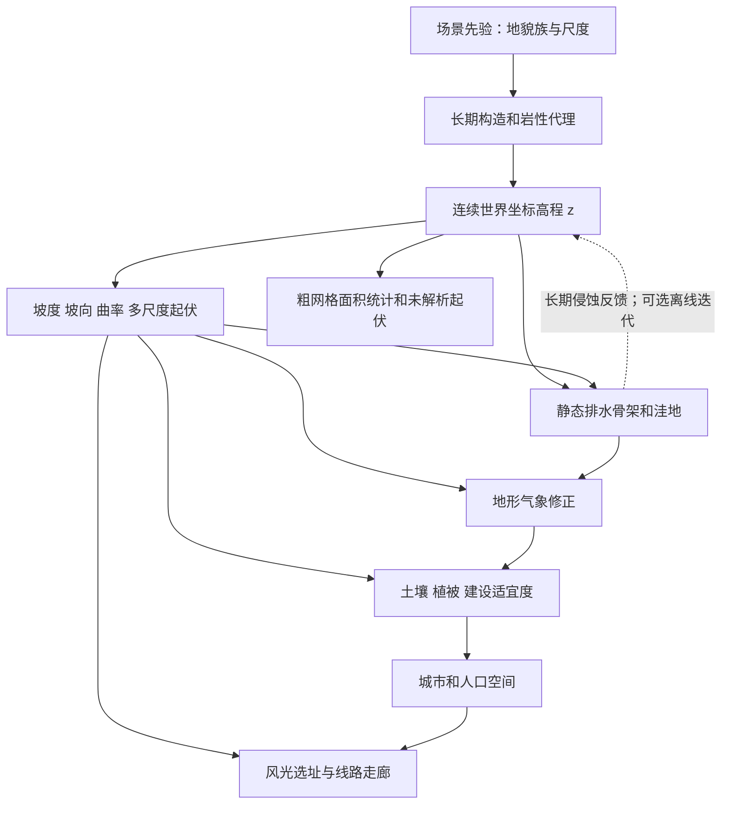

# 任务二：地形、地质与空间尺度

## 1. 调查问题

本主题研究高程场如何形成可区分的山地、丘陵、平原、盆地、峡谷和高原，如何派生量纲正确的地形量，以及这些量怎样约束水文、气候、土地、城市、电源和线路。目标空间为约 0.5—5 km 网格、几十至数百公里的合成区域；地形在小时级运行中固定。这里的尺度是**建议的工程使用范围**，不是地貌学普适分类边界。

下文把文献支持的关系标为【物理关系】或【经验规律】，人为控制样本多样性的选择标为【场景先验】。本文件是研究与实施建议，不改变生成器；“现有”指本次研究基线中的代码，“建议”指尚待实现的接口或检查。文献中的实测地形只用于支持机理，不导入、拟合或复制某地区参数。

## 2. 关键结论

1. 【物理关系】坡度是高程对水平距离的导数，曲率涉及二阶导数；高程使用 m 而像元尺寸使用 km 时必须显式换算。改变分辨率不能继续把相邻像元差直接称为坡度。[T2]
2. 【经验规律】真实地形具有多尺度组织，但分形或梯度噪声只提供几何纹理。噪声中的“侵蚀场”不自动具备侵蚀、沉积或输沙守恒；河谷结构需要排水网络及地貌过程约束。[T1][T4]
3. 【经验规律】平原与高原可以同样平坦，高原与山地可以同样高。地貌应由局部起伏、相对位置、连通形态和邻域尺度共同描述，不能仅以绝对海拔分类。[T6]
4. 【物理关系】降水沿地表排泄受到坡面与分水岭的约束；但数字填洼是路由预处理，不能证明洼地在现实中已被水填满，也不能替代地下排水或湖泊蓄水过程。[T3][T5]
5. 【场景先验】合成世界可显式生成岩性区、相对可蚀性和土层厚度等慢变量；在没有构造史与材料资料时，不应输出具有真实地质年代、矿藏或滑坡概率含义的标签。
6. 【物理关系】跨图幅连续性需要统一坐标、统一高程基准及相同的场函数；【工程简化】固定世界坐标的哈希噪声比逐图幅归一化更适合拼接，但河网还需要图幅外的上游边界信息。

## 3. 模态关联图

| 输入变量 | 输出变量 | 影响方向 | 空间尺度 | 时间尺度 | 关系类型 | 推荐实现 | 参考来源 |
|---|---|---|---|---|---|---|---|
| 高程 m、坐标 m | 坡度 m/m、坡向、曲率 m⁻¹ | 导数确定局部几何 | 至少 2—4 格的有效尺度 | 静态 | 物理关系 | 米制差分；边界单独处理 | T2 |
| 汇水面积 m²、坡度 | 沟谷下切 m/yr | 一般增大可增强下切；阈值与材料依赖 | 河段至流域 | 长期地貌时间 | 经验规律 | 可选 stream-power 离线预处理 | T4 |
| 岩性与土层代理 | 可蚀性、入渗先验 | 较坚硬不等于一定低渗透 | 岩体区、土壤响应单元 | 多年及以上 | 场景先验 | 联合抽样材料属性，不用单一“岩石分” | T6、任务03 |
| 地形梯度、水平风 | 抬升速度 m/s | 风吹向上坡时为正 | 已解析山体 | 小时至天气过程 | 物理关系的一阶近似 | 与统一坐标风向求点积 | 任务04 |
| 坡向、太阳方向 | 坡面入射辐照 W/m² | 受法向量与太阳夹角约束 | 坡面；粗网格取分布 | 小时、季节 | 物理关系 | 法向量投影，避免把整格当一块陡坡 | T2、任务07 |
| 起伏、坡度、水体 | 施工成本、可建设比例 | 一般增加成本或减少可用面积 | 地块至走廊 | 长期规划 | 经验规律及场景先验 | 硬排除加软成本，费用另行标定 | 任务06、09 |
| 图幅原点、像元尺寸、随机种子 | 拼接与分辨率一致性 | 坐标相同则潜在场相同 | 图幅及区域 | 每次生成 | 场景先验下的数值约束 | 全局坐标噪声、halo、保守重采样 | T1、T3 |

## 4. 物理机制与经验规律

### 4.1 地貌族不能只靠高低阈值

【经验规律】NRCS 地貌描述体系区分景观、地貌单元与坡位。对 SimGenr 更有用的降阶表示是“几何族 + 尺度 + 位置”，并保留连续量。[T6] 下列形态规则是**工程生成建议**：

| 地貌族 | 可辨认几何特征 | 建议生成控制 | 易混淆之处 |
|---|---|---|---|
| 山地 | 大邻域起伏高；山脊与谷地相连 | 长波抬升场叠加定向脊线、排水切割 | 高程高不必然陡峭 |
| 丘陵 | 中尺度起伏、重复圆顶或短脊 | 中波能量增加，限制局部梯度尾部 | 不应随地图最大山峰改变分类 |
| 平原 | 大区域低起伏，小坡度连续 | 低振幅长波底面加少量浅排水沟 | 非零区域倾斜仍可形成平原 |
| 盆地 | 相对周边低，可闭合或有出口 | 碗状长波势场、显式出口或内流标签 | “低海拔”并不能确认盆地 |
| 峡谷 | 狭长低地，两侧坡差大 | 以河谷轴为骨架形成亚网格横断面 | 1 km 格无法解析数十米宽峡谷 |
| 高原 | 高基准面、内部低起伏、边缘陡变 | 平台抬升与边缘过渡，再发育排水 | 不能全部归成山地 |

不把表中的形态模板解释为地质形成原因。同一个平面形态可以来自不同侵蚀、构造或沉积历史；模型只需要让下游收到一致的几何边界。

### 4.2 地貌演化的反馈发生在长期

【物理关系】地表抬升、侵蚀与沉积改变高程；流动水的重力势能及输运路径受地形约束。【经验规律】以汇水面积替代长期流量、以坡度幂律替代复杂下切过程，是地貌模型的常见闭合方式，指数和可蚀性不具有全球固定值。[T4]

【工程简化】采用两种清楚区分的模式：`geometric` 模式直接生成满足形态检查的静态地形；`landscape_spinup` 模式在小时仿真前进行有限次排水—侵蚀迭代。后一模式必须使用长期径流代理和显式时间单位，不能拿待预测的一周降雨反复侵蚀地形，再把所得地形作为同一周的预测输入。

### 4.3 地质因素的合理降阶

【场景先验】当前可显式表示 3—6 个相关岩性区，为各区抽取可蚀性倍率、等效渗透性和根区厚度。其空间相关长度采用 km 配置；同一岩性内部允许变异。裂隙岩体可能透水，黏土风化层可能隔水，因此不能把“坚硬度”同时当作所有水文性质。

地层倾角、断层活动、喀斯特地下通道、深层含水层和地震破裂目前降为“特殊场景标签 + 参数范围 + 禁止解释项”。例如 `endorheic` 与 `karst` 场景应拒绝“所有像元均沿地表排到地图边缘”的强假设；暂不声称模拟地下流向。

## 5. 公式或可执行规则

### 5.1 世界坐标与多尺度场的采样约束

【工程简化，基于 T1 的连续噪声思想】设像元中心

$$
x_j=x_0+(j+1/2)\Delta x,\quad y_i=y_0+(i+1/2)\Delta y,
$$

其中 $x,y,x_0,y_0,\Delta x,\Delta y$ 均为 m；$i,j$ 为无量纲索引。定义

$$
z(x,y)=z_b(x,y)+\sum_{k=0}^{K}a_kN_k(x/\lambda_k,y/\lambda_k),
\quad\lambda_k=\lambda_0 2^{-k},\quad a_k=a_0 2^{-kH}.
$$

$z,z_b,a_k,a_0$ 单位 m；$z_b$ 是慢变底面，$N_k$ 是零均值无量纲场；$\lambda_k$ 为 m；$H$ 和 $K$ 无量纲，分别控制能量随尺度衰减和有效层数。$H$ 是本项目可调的几何先验，不能因使用该式就宣称输出为真实地形的严格分形。只保留 $\lambda_k\ge2\max(\Delta x,\Delta y)$ 是最低名义尺度限制；梯度噪声本身并非严格带限正弦，仍需低通/面积积分防混叠。用于可信导数时建议保留至少 4 格波长，并检验 4 格与 8 格低通结果的稳定性。

### 5.2 导数、坡向与粗糙度

【物理关系】在统一的东向 $x$、北向 $y$ 坐标下，令 $p=\partial z/\partial x$、$q=\partial z/\partial y$，两者均为 m/m。坡度 $s=\sqrt{p^2+q^2}$，坡角 $\beta=\arctan s$ 为 rad，角度输出为 $180\beta/\pi$。下降方向为 $(-p,-q)$。若存地理方位角（从北顺时针），则

$$
\alpha=\operatorname{atan2}(-p,-q)\pmod {2\pi}.
$$

【工程简化】平地 $s<\varepsilon_s$ 的坡向应标为无效，另存 `aspect_valid`；不要赋一个看似有地理意义的北向。若图像行号向南增加，必须先对 $q$ 换号。现有代码的 `atan2(-grad_y,-grad_x)` 是栅格轴角度约定，不能在未转换时被其他模块当作地理方位角。[T2]

【物理关系】拉普拉斯代理曲率 $\kappa=\partial^2z/\partial x^2+\partial^2z/\partial y^2$，单位 m⁻¹；它不等同于严格的平面曲率或剖面曲率。【工程简化】半径 $r$ m 的邻域局部起伏 $R_r=\max z-\min z$ 为 m，粗糙度代理 $R_r/(2r)$ 无量纲。另建议保存 $\sigma_{z,r}$（m）以表示未解析起伏。二者都依赖邻域尺度，不能仅存字段名而不存 `support_radius_m`。

### 5.3 可选长期演化

【物理关系与经验闭合分开】高程收支可写为

$$
\partial_tz=U+\nabla\cdot(D\nabla z)-E+J,\qquad
E=\max(K_eA^m s^n-E_c,0).
$$

$t$ 取 yr；$U,E,J,E_c$ 为 m/yr，分别是抬升、下切、沉积和下切阈值；$D$ 为 m²/yr 的坡面输运系数；$A$ 为 m² 汇水面积；$m,n$ 无量纲；$K_e$ 为 m$^{1-2m}$/yr。该量纲随 $m$ 改变，因此跨参数组比较最好使用无量纲 $A/A_*$，并把可蚀性系数统一为 m/yr。[T4]

**工程边界：**若省略 $J$，模型只是一种下切整形，输出元数据必须记为“不守恒沉积物的形态松弛”；若声称地表物质守恒，应加入沉积通量与域外输沙账本。显式二维扩散的时间步应满足 $D\Delta t(1/\Delta x^2+1/\Delta y^2)\le1/2$；隐式下切也需要时间步收敛检查，不能因数值稳定就认定瞬态准确。

### 5.4 分辨率与边界

【工程简化】先定义连续潜在场，再对粗像元取面积平均：$\bar z_C=A_C^{-1}\int_Cz\,dA$。$A_C$ 为 m²；$\bar z_C$ 为 m。汇水和坡度不能仅靠平均已有派生量获得，应在目标网格重建拓扑并重新求导，保留粗细网格之间面积汇总映射。

图幅有三种必须显式选择的边界：区域裁剪（有外部流入）、完整流域（分水岭无流入、出口可流出）、内流盆地（允许内部湖泊蓄水）。随机地形可用同一世界种子保持拼接，局部导数使用至少覆盖算子半径的 halo；整个上游集水区可能远超 halo，因此水文边界需要额外接口。[T3][T5]

## 6. 参数范围与单位

| 参数 | 数量级或范围 | 性质、来源与适用性 |
|---|---|---|
| 像元边长 | 建议 0.5—5 km | 场景先验：当前电网区域的粗网格范围；不是 DEM 精度标准 |
| 当前长波/脊线/细节波长 | 192/36/18 km | 当前 `TerrainConfig` 默认值；仅项目先验 |
| 当前低地基准、起伏尺度 | 100—800 m；均值 2500 m、标准差 500 m | 当前配置，不能称为全球典型地貌 |
| 新建议地貌族起伏 | 平原 5—100 m；丘陵 50—500 m；山地 300—3000 m | 场景先验，在 5—50 km 邻域内选择；不是 T6 的正式分类阈值，必须随测量支撑尺度记录 |
| 分形衰减 $H$ | 建议 0.3—0.9 | 场景先验探索范围；T1 支持噪声构造，不支持该范围是真实地形分布 |
| 坡度 $s$ | 非负，无固定物理上限；常规场景可筛查 $s>1$ 的粗格 | 单位 m/m；$s=1$ 对应 45° 是几何关系，是否排除是场景选择 |
| stream-power 指数 | 可先固定 $m=0.5,n=1$ 作数值基准 | T4 的常见模型形式/示例；不是材料定律，参数扫描需要重新解释 $K_e$ 单位 |
| 可蚀性/扩散系数 | 不给无资料的全球常数 | 使用相对参考倍率 0.25—4（场景先验）；绝对地貌年数不作为输出结论 |
| 岩性块尺度 | 建议 5—50 km | 场景先验；小于像元的材料差异存比例或方差 |

## 7. 对 SimGenr 生成阶段的影响

| 位置与现有实现 | 核查结论 | 研究建议 |
|---|---|---|
| 阶段1，[terrain_generator.py](../../world_generator/terrain/terrain_generator.py) | `multiscale_v2` 使用世界坐标、哈希噪声和物理波长；已有域扭曲与脊线；命名 `erosion` 的场仍是噪声 | 标注几何整形语义；增加地貌族和未解析起伏，不宣称已做侵蚀 |
| 同文件 `_world_fbm` | 会按可解析波长截断层数，并用保留层的振幅和归一化；部分主波长也受像元尺寸下限影响 | 同分辨率拼接与跨分辨率一致性分开检验；固定潜在场归一化，再做目标格面积平均，避免细化时连长波振幅一起变化 |
| 阶段1，[derivatives.py](../../world_generator/terrain/derivatives.py) | 已按米制尺寸求梯度、粗糙度与拉普拉斯；粗糙度窗口固定 3×3，随分辨率改变物理尺度 | 保留现有量并新增固定 km 支撑尺度；坡向元数据显式记录坐标约定 |
| 阶段2，[hydrology_generator.py](../../world_generator/hydrology/hydrology_generator.py) | 有 Priority-Flood/D8；边缘均作为填洼种子 | 增加边界类型、外部入流和内流盆地模式 |
| 阶段3土地、阶段4气候、阶段6城市 | 下游已读取坡度等，但部分窗口、阈值仍是图幅内归一化或像元单位 | 改进建议需同步进行，不仅替换高程生成函数 |
| 阶段8—9电源与电网 | 用地形成本约束布局 | 明确线路距离是水平走廊长度还是地表长度；塔位风险不能由粗格坡度直接断言 |

本主题建议顺序为“长期地貌先验 → 地形 → 静态水文骨架 → 气候 → 土地/城市”；可选侵蚀反馈仅在静态预处理内迭代。短期天气不回写地形。

## 8. 推荐的简化实现

第一步保留当前可复现地形，新增一份尺度契约：`coordinate_convention`、`elevation_datum`、`cell_support`、`roughness_radius_km`、`terrain_generation_semantics`。统一面积、水平距离、地表距离的名称。这一步比增加更多噪声层更能减少跨模态误用。

第二步将地貌类型作为潜变量控制长波底面、定向脊线和局部起伏，但分类仍由派生量核验。图幅裁剪不能重新 min-max 拉伸高程。若需“至少一座山”之类视觉条件，应拒绝抽样并记录原因，而不是悄悄改变已有世界坐标场。

第三步用目标网格下的坡度分布、流域面积分布、脊谷连通性和地貌族可分辨性共同筛查样本。可视图像只是补充；等高线平滑不能替代拓扑有效。只有确需长期地貌动力学时再加入可选侵蚀模块。

## 9. 硬约束、软约束和情景假设

**硬约束：**网格尺寸正、高程有限、单位一致、导数在解析斜平面上正确；同坐标同潜在场；每个派生量有尺度与符号约定；排水图无非法索引和未声明的环。坡向在平地不参与定向效应。

**软约束：**坡度尾部、邻域起伏、山脊方向、排水密度在指定地貌族内合理；细化网格后大尺度结构近似保持。这些不能要求不同随机种子逐像元相同。

**场景假设：**地貌族比例、抬升参考量、岩性先验、边界类型、海陆是否存在、最大起伏及禁建坡度。所有参数必须写入 manifest；不能因为某图“看起来不够复杂”而无记录地增大起伏。

## 10. 局限性

1 km 格的单个高程无法解析山谷横断面、堤坝、道路切坡、悬崖及风机局地加速。建议存亚网格起伏、坡面朝向直方图和河道宽度，不伪造精细确定地图。地形相同不意味着土壤、地下水或地质灾害相同；地貌模板不是构造历史重建。

网格细化会改变离散排水方向，故河网像元级重合不是唯一质量标准。应比较相同出口的汇水面积、主河长度与流域连通性。若区域边界截断上游，地图内集水面积只是下界，不能据此直接标定真实流量。

## 11. 参考文献及每篇文献的用途

- **T1** Perlin, K. (2002). *Improving Noise*. ACM TOG 21(3), 681–682. [作者论文的大学镜像](https://www.cs.cmu.edu/~jkh/462_s07/paper445.pdf)、[作者参考实现](https://cs.nyu.edu/~perlin/noise/)。支持连续噪声与改进插值的数值构造；不支持“噪声即真实地形”、本项目波长或 H 值。本文只借用方法结构。
- **T2** Horn, B. K. P. (1981). *Hill Shading and the Reflectance Map*. Proceedings of the IEEE 69(1), 14–47. [MIT 作者全文](https://people.csail.mit.edu/bkph/papers/Hill-Shading.pdf)。支持高程偏导、坡面方向与照明几何的关系；不提供粗网格坡度等于设施微地形的依据。
- **T3** Barnes, R., Lehman, C. & Mulla, D. (2014). *Priority-Flood: An Optimal Depression-Filling and Watershed-Labeling Algorithm for Digital Elevation Models*. Computers & Geosciences 62, 117–127. [作者全文](https://rbarnes.org/sci/2014_depressions.pdf)。支持填洼、平地路由和数字排水约束；不支持把填洼深度当成已有湖水或自然洼地均为误差。
- **T4** Landlab 开发团队，*StreamPowerEroder* 官方模型文档（持续更新页，未单列出版年；访问2026-09-09）。 [公式、参数和时间步说明](https://landlab.csdms.io/generated/api/landlab.components.stream_power.stream_power.html)。支持 $KA^ms^n$ 下切闭合及瞬态对时间步的敏感性；不为项目给出全球岩石可蚀性。本主题使用的是明确标注的模型文档，而非将某次仿真实验当自然定律。
- **T5** Tarboton, D. G. (1997). *A New Method for the Determination of Flow Directions and Upslope Areas in Grid Digital Elevation Models*. Water Resources Research 33(2), 309–319. [作者所在大学全文](https://hydrology.usu.edu/dtarb/96wr03137.pdf)。支持坡面流向分配、D8 方向量化问题和汇水面积计算；用于评估后续 D∞ 选项，不暗示当前已实现。
- **T6** USDA NRCS，*Geomorphic Description System*（官方在线入口，未单列页面出版年；访问2026-09-09）。 [官方入口](https://www.nrcs.usda.gov/resources/guides-and-instructions/geomorphic-description-system)。支持以景观、地貌和坡位分层描述地形；本文件的数值形态范围是项目先验，不冒充该体系规定的分类标准。

## 12. 建议立即实现、后续实现与暂不实现

以下均为**待实现建议**，函数和测试名称不是已有 API。

| 优先级 | 配置/生成函数建议 | 可执行验收测试建议 | 依据 |
|---|---|---|---|
| 立即 | `TerrainConfig.roughness_radius_km`、`aspect_convention`；`derive_multiscale_terrain_features()` | `test_plane_derivatives_in_meters`：给定 z=0.1x+0.2y，内部 slope=√0.05；`test_flat_aspect_invalid` | T2 |
| 立即 | `terrain_generation_semantics="geometric"`；为噪声 erosion 字段明确语义 | `test_no_unlabelled_erosion_claim`：无质量收支模块时不输出 sediment_conserving=true | T1、T4 |
| 立即 | `GridBoundaryConfig.mode`、潜在场世界种子 | `test_overlapping_tiles_equal`；`test_refined_grid_area_averages_converge`，不比较不同支撑尺度的逐点高程 | T1、T3 |
| 后续 | `TerrainConfig.landform_family`、`generate_geology_proxy()`、`subgrid_relief_m` | `test_plateau_separate_from_mountain`；无论图外增加高峰，原局部坡度与成本不变 | T6 |
| 后续 | `LandscapeSpinupConfig`、`relax_landscape()` | 常量高程扩散不变；封闭域沉积账本闭合；时间步减半结果收敛 | T4 |
| 暂不 | 构造演化、地震破裂、喀斯特三维流动、真实滑坡概率 | 输入缺失时明确输出 unsupported，不生成貌似定量的结果 | 分辨率与材料资料边界 |
