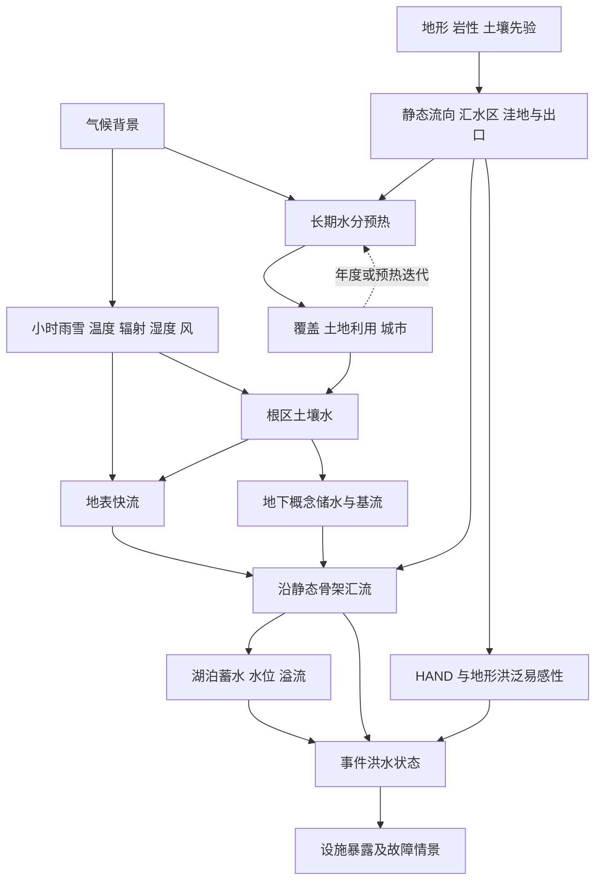

# 任务三：水文拓扑与水量过程

## 1. 调查问题

本主题区分两个经常混淆的对象：地形决定的**静态排水骨架**，以及天气驱动的**动态水量状态**。研究降雨怎样在土壤、地下储水、河流和湖泊之间分配，河道几何怎样与汇水面积、流量相关，以及怎样在约 0.5—5 km 网格、1 h 输出中实现可复现的守恒模型。

本次不下载或拟合流量、土壤或水位实测数据。文献支持的是机理、模型结构与参数量级，不能把某个河流的宽深系数迁移成全球参数。下文【物理关系】指守恒或几何约束；【经验规律】指需闭合和参数化的关系；【场景先验】指合成样本的外生选择。建议代码与测试均尚待实现。

## 2. 关键结论

1. 【物理关系】汇水面积是空间面积，不是流量；降雨 mm、流域面积 km² 与流量 m³/s 必须通过时间长度和蓄泄过程相连。**1 mm 落在 1 km² 上等于 1000 m³**。
2. 【物理关系】长期降雨总量并不全部成为径流：蒸散、储量变化、域外地下交换都需要水量账本。【经验规律】土壤渗透、前期湿度和不透水面积决定相同暴雨产生多少快流。[H4][H5]
3. 【经验规律】河宽、河深和流速常随流量呈幂律，但同一断面随时间变化与不同断面间变化的系数、指数不同。汇水面积只能在具有长期有效径流假设时作为流量代理。[H3]
4. 【物理关系】湖泊面积、水位和体积由盆地几何相连；是否有水、何时溢流由动态水量决定。Priority-Flood 的填洼面是潜在溢流面，不能直接证明湖泊常年满水。[H1][H7]
5. 【经验规律】HAND 是沿排水路径相对于河道的高差，适合地形湿润性和洪泛易感性筛查；距水距离及 HAND 不能单独给出洪水重现期或经过率定的淹没深度。[H6]
6. 【工程简化】应采用“先静态骨架，后气候与长期水分背景，再城市/覆盖，最后天气驱动小时水量”的分层。土地覆盖反馈通过预热或逐年迭代闭合，不能用测试周暴雨反向选择同一周的城市位置。

## 3. 模态关联图

| 输入变量 | 输出变量 | 影响方向 | 空间尺度 | 时间尺度 | 关系类型 | 推荐实现 | 参考来源 |
|---|---|---|---|---|---|---|---|
| 高程 m | 流向、汇水面积 km² | 地表沿下降路径排泄 | 像元至流域 | 静态 | 物理关系的数字近似 | Priority-Flood + D8；明确边界 | H1、H2 |
| 降雨 mm/步、土壤水 mm | 入渗与地表径流 mm/步 | 入渗能力或容量不足增加径流 | 响应单元/粗像元 | 分钟至小时 | 物理守恒及经验闭合 | 非负限流的根区桶 | H4、H5 |
| 辐射/温湿风、土壤水 | 蒸散 mm/步 | 大气需求高且水可用时增加 | 覆盖响应单元 | 小时至季节 | 物理与经验关系 | ET需求与供水上界分开 | H8 |
| 根区排水 mm/步 | 概念地下水与基流 | 延迟、平滑流量响应 | 子流域 | 小时至数月 | 经验规律 | 质量守恒线性水库 | H4、H9 |
| 流量 m³/s、汇水面积 | 河宽/深 m | 一般随特征流量增大 | 河段 | 事件/多年形成尺度分别定义 | 经验规律 | 带参考尺度的幂律 | H3 |
| 湖泊来水、降雨、蒸发 | 体积 m³、水位 m、面积 m² | 净入流增加蓄水与水位 | 湖盆 | 小时至多年 | 物理关系 | 水位—面积—容积曲线 | H7 |
| 河流水位、HAND、连通性 | 潜在淹没状态 | 低于水位且连通处优先受淹 | 洪泛平原/亚网格 | 小时至日 | 工程简化 | 阈值筛查与事件标签 | H6、H7 |
| 土地不透水比例、排水设施 | 快流/滞后 | 通常增加快流；设施可滞蓄 | 城市网格 | 暴雨事件 | 经验规律及场景先验 | 地表份额加可选排水库 | H4、任务06 |

## 4. 物理机制与经验规律

### 4.1 排水骨架不等于水量状态

【物理关系】在无泵站、无地下分流的表面重力排水假设下，流向指向下坡。D8 将出流集中到八邻域之一，容易产生方向量化；D∞ 可在三角坡面内分配出流，改善某些坡面分散，但并不自动解决洼地、水库或地表—地下交换。[H1][H2]

**工程简化：**当前规模继续用 D8 是可接受的，优先保证没有环、出口明确、汇水面积按真实格面积累积。自然封闭盆地应显式成为存储节点；若把所有洼地填平并强制通到边界，必须标记为外流区域场景。地图是任意裁剪时，边界的外部入流不能被当作零。

### 4.2 产流受强度、饱和与前期水分控制

【经验规律】强降雨超过瞬时入渗能力可形成超渗产流；土壤可用孔隙储量不足时形成蓄满产流。即使累计雨量相同，集中一小时与分散一天也可能产生不同洪峰。土壤颗粒、结构、限制层、地下水位和城市压实共同影响渗透，不能把森林、草地、城市各赋一个不变的径流系数就解释所有暴雨。[H4][H5]

【工程简化】第一版不必求解 Richards 方程。一个根区储水、一个慢储水和一个河段储水已可表达前期湿润、快速径流与基流滞后。冠层截留、地表洼蓄和雨雪分相可后续增加；省略时要说明强降雨开始时的截留与小雨蒸发会失真。

### 4.3 河道几何与湖泊季节性

【经验规律】河道长期几何受特征流量、河床坡度、泥沙和岸坡材料共同作用。静态河宽应以某个长期参考流量对应的几何为基础，小时水深才随流量变化。[H3] 干旱季仍保留“河道存在”这一几何字段，但 `wet_channel_fraction` 可以接近零，避免把河网掩膜解释为全年稳定水面。

【物理关系】湖泊水位下降会改变面积，蒸发量因此也改变。季节湖不应强制保持初始掩膜全部有水。若高程分辨率粗、无法重建浅湖岸线，采用合成的单调面积—水位曲线是合理降阶，但曲线的容量是场景先验，不能假装由粗格 DEM 精确测得。[H7]

### 4.4 洪水易感性、事件危险度与资产风险

【经验规律】HAND 和距离用于筛选低洼近河区域；同等降雨下，土壤前期湿润、上游汇流和湖泊腾空容量会改变事件水位。[H6] 本项目应至少区分 `flood_susceptibility`（静态无量纲代理）、`flood_depth_proxy_m`（简化事件结果）和 `asset_outage_probability`（给定脆弱性先验后才有的概率）。城市或变电站位于易感区并不意味着某一时刻必然故障；不能把 HAND 值直接当故障率。

## 5. 公式或可执行规则

### 5.1 汇水面积与单位桥接

【物理关系】对无环排水图，节点 $i$ 的汇水面积为

$$
A_i=a_i+\sum_{j\to i}w_{ji}A_j,
$$

$a_i,A_i$ 单位 km²；$w_{ji}\in[0,1]$ 为从 $j$ 分到 $i$ 的比例，同一节点有效出边之和为 1，D8 仅有一条权重为 1 的边。除声明的湖泊、出口或外部交换外，不允许水量消失。

若净径流深 $r_i$ 单位 mm/步，时间步 $\Delta t_h$ 单位 h，则生成体积和平均流量为

$$
\Delta V_i=1000a_ir_i\quad[\mathrm{m^3}],\qquad
q_i=\frac{1000a_ir_i}{3600\Delta t_h}\quad[\mathrm{m^3/s}].
$$

这里的 1000 来自 mm→m 与 km²→m²，而 3600 是 h→s。不能再次乘累积汇水面积：每格降雨先乘本格面积，沿图累加后已经包含上游水量。

### 5.2 适合第一版的小时守恒桶

**文献支持：**多层储水和限流结构可表达降水、入渗、蒸散、地下补给。[H4][H8][H9] **工程简化：**以下是为 SimGenr 提出的低阶离散算子，并非声称逐式复刻 HEC-HMS。

设 $P\ge0$ 为本步降水深 mm；$S,G$ 为步初根区、慢储水的**整格等效水深** mm；$f_{imp}\in[0,1]$ 为不透水面积比例；$S_{max}$ 与 $S_{fc}$ 为整格根区最大储量与排水阈值 mm，满足 $0\le S_{fc}\le S_{max}$。$f_{max}$ 为透水部分最大等效入渗率 mm/h，$k_p$ 为整格深层渗漏上限 mm/h，$e_p$ 为整格潜在蒸散需求 mm/h。依次计算

$$
I=\min((1-f_{imp})P,(1-f_{imp})f_{max}\Delta t_h,S_{max}-S),\quad R=P-I,
$$
$$
E=\min(e_p\Delta t_h,S+I),\quad
D=\min(k_p\Delta t_h,\max(S+I-E-S_{fc},0)),
$$
$$
S'=S+I-E-D,\quad B=(G+D)(1-e^{-\Delta t_h/\tau_g}),\quad G'=G+D-B.
$$

$I,R,E,D,B$ 均为 mm/步，分别为入渗、快流、实际蒸散、深层补给与基流；$\tau_g>0$ 为 h。初始状态满足 $0\le S\le S_{max},G\ge0$，因此上述算子非负并满足

$$
P-E-R-B=(S'-S)+(G'-G).
$$

需要区分 **场景先验** 的初始储量与 **物理关系** 的收支。`S_max` 不应把根区可利用水 TAW 与从干土到饱和的总孔隙储量混为一谈：若以萎蔫点为零位，入渗、排水阈值与冻结水项都要使用同一基准。全不透水格应设根区容量为零；存在开放水体时用独立水面份额计算降雨蒸发，不能同时计入陆地桶。

此顺序假定步内降雨先入渗再蒸发、排水；不是唯一物理解。强暴雨场景应以 5—15 min 子步（项目先验）积分，再聚合成 1 h 输出，比较时间步敏感性。冠层截留若加入，应先更新其容量账本，不能只扣掉一段“截留损失”却不记录水去哪里。

### 5.3 河段汇流

【经验闭合】线性水库满足 $dV/dt=J-Q$、$Q=V/\tau_r$。$V$ 为河段储量 m³，$J,Q$ 为 m³/s，$t,\tau_r$ 为 s。步内恒定入流的解析更新为

$$
V'=Ve^{-\Delta t_s/\tau_r}+J\tau_r(1-e^{-\Delta t_s/\tau_r}),\qquad
\bar Q=\frac{V+J\Delta t_s-V'}{\Delta t_s}.
$$

$\Delta t_s=3600\Delta t_h$。平均出流 $\bar Q$ 必须用于体积汇总，不能拿步末瞬时 $V'/\tau_r$ 代替，否则质量账本有偏差。支流在有向图上相加，每段只接收一次上游体积。河段较多时采用同步子步或有传播时延的级联，避免一次小时循环把峰值瞬时传到全域出口。[H9]

### 5.4 河宽、河深与湖泊曲线

【经验规律】建议使用有量纲参考点的幂律

$$
w=w_*(Q/Q_*)^b,\quad d=d_*(Q/Q_*)^f,\quad v=v_*(Q/Q_*)^m.
$$

$w,d,w_*,d_*$ 为 m；$v,v_*$ 为 m/s；$Q,Q_*$ 为 m³/s；$b,f,m$ 无量纲。该式用于 $Q>0,Q_*>0$ 的选定流态；零流时进入干河分支，保留静态河床几何并将出流置零，不计算可能出现负指数的 $0^b$。若采用矩形断面且严格满足 $Q=wdv$，必须同时满足 $b+f+m=1$、$w_*d_*v_*=Q_*$。不能独立随意抽取三条曲线，再期待质量与几何一致。[H3] 若只用 $w=w_*(A/A_*)^b$，则必须标注 `geometry_driver="catchment_proxy"`，承认省略了空间径流差异。

【物理关系】以床面 $z_i$（m）、像元面积 $a_i$（m²）近似湖泊在水位 $h$（m）下的体积

$$
V(h)=\sum_i a_i\max(h-z_i,0),\quad A(h)=\sum_{z_i<h}a_i.
$$

只有与湖盆连通的格才进入求和。$dV/dh=A(h)$ 在分段内成立。来水、直接降雨、蒸发和出流满足

$$
V'-V=\Delta t_s(\bar Q_{in}-\bar Q_{out}-\bar Q_{seep})+10^{-3}A_{wet}(P-E_w).
$$

$Q$ 为 m³/s；$P,E_w$ 为本步 mm；$A_{wet}$ 为一致时间积分近似下的水面 m²；地下渗漏 $Q_{seep}$ 若设零应明确。湖面显著变化时采用子步或隐式求解。出口可用 $Q_{out}=C\max(h-h_{spill},0)^{3/2}$，$C$ 单位 m$^{3/2}$/s，含出口宽度与水力系数，属于需指定的工程闭合；本项目不应默认真实堰型。[H7]

### 5.5 事件易感性与水量检查

【工程简化】可保留静态代理 $\chi=\exp(-d_w/L_w)\exp(-H/H_*)$，其中 $d_w,L_w$ 为 km、$H,H_*$ 为 m，$\chi\in[0,1]$ 无量纲。这是项目评分，不是概率。[H6] 若新增河段水位，可对沿水力连通路径满足 $H<d_{event}$ 的区域输出事件淹没代理；堤防、回水、桥涵未解析时必须明确不可用于工程洪水图。

全域质量残差建议计算为初始所有储量 + 累计降雨/边界入流 − 最终所有储量 − 蒸散/出口/声明地下流出；统一以 m³ 计算。关闭任何过程都不能改变其他账项的单位或重复计数。

## 6. 参数范围与单位

| 参数 | 数量级、范围或当前值 | 来源及适用性 |
|---|---|---|
| 当前河道起始汇水面积 | 32 km² | 当前 `HydrologyConfig` 项目先验；河道起始还受坡度、材料和降雨影响 |
| 当前参考河宽与面积指数 | 30 m @ 128 km²；指数 0.35 | 当前先验；H3 支持幂律思想，不支持这组固定系数全球通用 |
| 当前河深范围/湖泊筛选 | 0.5—12 m；湖深至少 6 m、面积 2—80 km² | 当前先验，浅湿地/大湖可能被排除，不能解释为自然分布 |
| 土壤饱和导水率 | 示例 1、10、40 μm/s = 3.6、36、144 mm/h | H5 的特定深度与地下水条件下分组界值；不是粗格入渗率可直接照搬的分布 |
| 根区可利用水量 | FAO 示例 90/170/120 mm 每米土层 | H8 的壤砂/粉土/粉黏土示例；根深与植被类型仍需给定 |
| 根区深度 | 作物例约 0.3—2 m，部分更深 | H8 表22支持农业量级；非所有森林或岩土的通用根深 |
| 建议 $\tau_g$ | 24—720 h | 项目先验扫描，支持小时—月尺度慢响应；H9 不提供本项目无需率定的固定值 |
| 建议河段 $\tau_r$ | 0.25—24 h，或依据河段长/有效波速设置 | 项目先验；选取后做传播与时间步检查 |
| 初始土壤湿度比例 | 0.2/0.5/0.9 的干/常态/湿情景 | 项目先验，或由独立气候预热获得；不得利用测试期全序列初始化 |
| 当前 HAND 衰减高差/距水尺度 | 5 m/配置默认 4 km | 代码中的评分参数；不是洪水回归期或危险度概率 |

## 7. 对 SimGenr 生成阶段的影响

核查 [hydrology_generator.py](../../world_generator/hydrology/hydrology_generator.py)：`conditioned_v2` 已将物理填洼面与微小数值路由坡度分开，D8 汇流采用拓扑累积并拒绝环，河道阈值使用 km²，河宽使用 m，湖床没有重复下挖。上述改进应保留。

仍缺少的关系是小时土壤水、入渗、蒸散、径流、河段流量、湖泊动态蓄泄、雪水当量与边界交换。当前 `water_depth` 主要是静态几何深度，`flood_risk` 是 HAND/距水代理。当前选出的每个洼地湖并未通过气候水量维持性检查；干旱世界也可能保留“满湖”几何，应将潜在湖盆与湿水面分离。

建议把原阶段2细分为 `2a_static_drainage`（地形之后）与逻辑上的 `dynamic_hydrology`（小时天气和土地利用之后，设施事件与运行之前）。新增长期水分预热可位于气候之后、最终覆盖/城市之前；迭代时按年度或状态滞后更新覆盖，最后冻结静态图。不能简单把整个水文阶段移到天气后，因为气候、城市和水体距离仍需要先有长期空间边界。

## 8. 推荐的简化实现

**第一层：静态排水。** 保留当前 D8；新增 `lake_basin_id`、`spill_elevation_m`、`catchment_area_km2`、`channel_width_m`、`channel_bed_elevation_m` 与边界类型。河道在 1 km 格内宽 30 m 时，应输出水面比例或亚网格通道；不能把整格 1 km² 全当 30 m 河道的水面。

**第二层：根区—慢储水。** 用 5.2 的限流桶实现非负守恒；土壤参数按响应单元抽样后面积加权。复用天气模块的温湿风辐射生成蒸散需求；需求与实际蒸散分开，防止旱期从无水土壤持续抽水。

**第三层：河段—湖泊。** 将较长河道压缩为河段图以减少算量，流域格点只负责产流，河段图负责传播；对每个湖泊保存单调容积曲线。所有蓄泄过程共享秒制流量和 m³ 状态接口。

**第四层：事件暴露。** 先交付事件标签、局部水深代理与静态资产交叠；若后续需要线路/母线故障概率，由任务09的脆弱性情景负责，记录其先验，不从本模块冒充真实灾损概率。

## 9. 硬约束、软约束和情景假设

**硬约束：**存储与出流非负；入渗不超过降水及可用空间；蒸散不超过可用水；所有单位转换一致；节点内与全域水量闭合；湖泊体积随水位单调；排水权重和为1；禁止未记录外部水源。

**软约束：**同一地表更湿时暴雨快流通常更大；慢储水使退水较平滑；相同体积集中降雨通常形成更尖锐响应。由于入渗上限、湖泊溢流与地下水交换存在阈值，这些检验需固定其他输入并说明适用条件，不要求无条件全局单调。

**场景假设：**土层及渗透参数、初始水分、河道宽深系数、边界入流、内流/外流、湖泊渗漏与出口结构、不透水比例和设施脆弱性。物理守恒通过不意味着这些先验已经过真实流域验证。

## 10. 局限性

低阶桶无法解析优先流、地下水抬升、河湖回水、潮汐、堤防溃决、城市管网或二维漫流。平均雨强还会低估对流暴雨的亚小时峰值；强事件必须测试子步。低温场景如未加入雪水当量，不能把固态降水即时变成河流径流。

HAND 对参考河网及 DEM 分辨率敏感；其来源研究中的亚马孙验证不保证另一类地形相同阈值有效。静态积水潜势不等于概率意义上的百年一遇洪水。无校准条件下可以比较守恒、响应方向与多情景鲁棒性，不能声称真实流量预测、洪水重现期或电站冷却水可用量准确。

## 11. 参考文献及每篇文献的用途

- **H1** Barnes, R., Lehman, C. & Mulla, D. (2014). *Priority-Flood*. Computers & Geosciences 62, 117–127. [作者全文](https://rbarnes.org/sci/2014_depressions.pdf)。支持填洼、平地和排水标签的算法约束；不证明洼地有长期实际湖水。
- **H2** Tarboton, D. G. (1997). *A New Method for the Determination of Flow Directions and Upslope Areas in Grid Digital Elevation Models*. WRR 33, 309–319. [作者全文](https://hydrology.usu.edu/dtarb/96wr03137.pdf)。支持 D8 方向量化的局限及 D∞ 分流思想；不支持不考虑地形就随机连接河网。
- **H3** Leopold, L. B. & Maddock, T. Jr. (1953). *The Hydraulic Geometry of Stream Channels and Some Physiographic Implications*. USGS Professional Paper 252. [官方报告](https://pubs.usgs.gov/publication/pp252)。支持河宽、深、流速与流量幂律，及断面内与沿河差异；本文件参考化公式是工程整理，不直接移植原流域系数。
- **H4** USACE，*HEC-HMS Technical Reference Manual: Soil Moisture Accounting Loss Model*（持续更新在线手册，未单列本页出版年；访问2026-09-09）。 [官方技术文档](https://www.hec.usace.army.mil/confluence/hmsdocs/hmstrm/canopy-surface-infiltration-and-runoff-volume/infiltration/soil-moisture-accounting-loss-model)。支持多储层、入渗/径流/蒸散分账；5.2是项目降阶方案，不是完整 SMA 实现。
- **H5** USDA NRCS (2009). *National Engineering Handbook, Part 630, Chapter 7: Hydrologic Soil Groups*. [官方全文](https://directives.nrcs.usda.gov/sites/default/files2/1712930597/11905.pdf)。支持导水率、限制层深度和地下水位共同影响产流潜势；表中数值只说明材料量级，不能直接作为粗格有效入渗参数。
- **H6** Nobre, A. D. et al. (2011). *Height Above the Nearest Drainage — a Hydrologically Relevant New Terrain Model*. Journal of Hydrology 404, 13–29. [作者机构文献记录](https://research.vu.nl/en/publications/height-above-the-nearest-drainage-a-hydrologically-relevant-new-t/)、[研究机构全文](https://lerf.eco.br/img/publicacoes/2011_0811%20Height%20Above%20the%20Nearest%20Drainage%20a%20hydrologically%20relevant%20new%20terrain%20model.pdf)。支持沿排水路径相对高程与土壤水环境联系；不单独支持重现期和工程淹没深度。
- **H7** USACE，*HEC-HMS Technical Reference Manual: Reservoir Modeling Concepts and Equations*（持续更新在线手册，未单列本页出版年；访问2026-09-09）。 [官方文档](https://www.hec.usace.army.mil/confluence/hmsdocs/hmstrm/reservoir-modeling/reservoir-modeling-concepts-and-equations)。支持湖泊/水库的连续方程、储量—水位关系与水平水面路由；简化水平湖面不适用于强回水空间梯度。
- **H8** Allen, R. G., Pereira, L. S., Raes, D. & Smith, M. (1998). *Crop Evapotranspiration*, FAO Irrigation and Drainage Paper 56，章8、式82及表22。 [官方正文](https://www.fao.org/4/X0490E/x0490e0e.htm)。支持根区可利用水、根深及蒸散水分限制；作物示例不等同于天然森林或所有土壤。
- **H9** USACE，*HEC-HMS Technical Reference Manual: Linear Reservoir Model*（持续更新在线手册，未单列本页出版年；访问2026-09-09）。 [官方文档](https://www.hec.usace.army.mil/confluence/hmsdocs/hmstrm/baseflow/linear-reservoir-model)。支持质量守恒的基流储层和小时制时间常数；本项目河段解析更新与参数范围属于明确标注的工程降阶。

## 12. 建议立即实现、后续实现与暂不实现

以下配置、函数和测试名称均为待实现建议。

| 优先级 | 配置/函数建议 | 验收测试建议 | 依据 |
|---|---|---|---|
| 立即 | `flood_susceptibility` 语义；`potential_lake_mask` 与 `wet_fraction` 分离 | `test_static_flood_score_is_not_probability`；缺动态水文时不输出 event_depth | H1、H6 |
| 立即 | `HydrologyDynamicConfig`、`step_soil_bucket()`；显式 `precipitation_mm_per_step` | `test_one_mm_one_km2_is_1000_m3`；`test_bucket_budget_closes`；全不透水格根区储量为零 | H4、H5、H8 |
| 立即 | `BoundaryWaterConfig`、`route_volume_exact()` | 零入流退水不得创造水；脉冲总量=剩余储量+累计出流；裁剪边界有明确入流账项 | H9 |
| 后续 | `spinup_hydrology(climatology)`、`soil_initialization_source` | 更换测试周而保持气候与种子，静态城市/覆盖不变；预热前后预算均闭合 | H4、H8 |
| 后续 | `build_lake_hypsometry()`、`step_lake()`、`SnowState.swe_mm` | 面积/容积单调；无雨干湖不凭空满水；雪融水不得超过 SWE；10/5 min 子步收敛 | H7及质量守恒 |
| 后续 | `flood_event_proxy()` 与资产脆弱性接口 | 干燥与前期湿润对照；无水位时拒绝定量事件淹没深度输出 | H6、任务09 |
| 暂不 | 二维溃坝、潮汐回水、管网、三维地下水、真实洪水重现期 | 清楚声明 unsupported；不以额外随机噪声伪装这些过程 | 分辨率及输入不足 |
