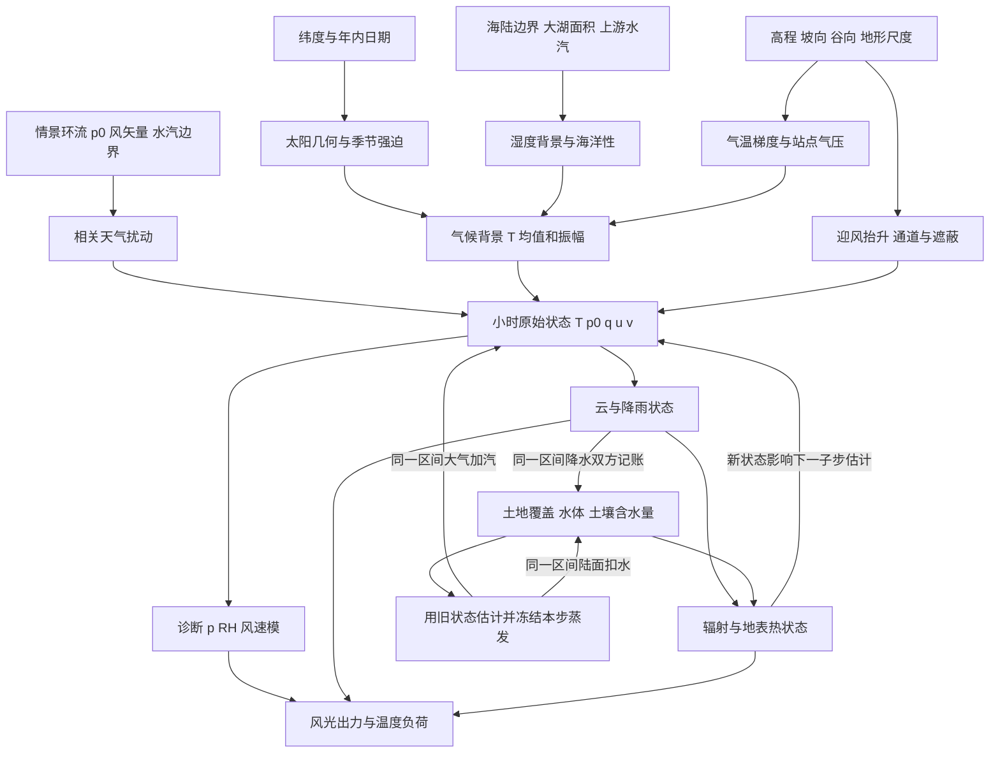

# 任务四：气候背景与地形气象

## 1. 调查问题

本主题研究纬度、高程、水体和地形形态如何约束长期气候，以及这些边界怎样与逐日、逐小时天气共同决定温度、湿度、气压和风场。目标尺度是水平网格约 0.5–10 km、区域范围数十至数百 km、输出步长 1 h 和 1 d；该范围是 **【场景先验】建议的工程适用域**，不是观测资料证明的统一有效尺度。网格之外的大尺度水汽、气压形势与盛行风必须显式作为边界输入，不能由一幅局部高程图唯一推导。

全文用 **【物理关系】** 表示几何、状态方程或守恒约束，**【经验规律】** 表示受地区、天气形势和分辨率影响的观测概括，**【场景先验】** 表示项目为了构造多样情景而选择的数值或分布。**工程简化** 单独说明，不能因公式量纲正确就被提升为现实定律。文献中的区域实例只支持机制和数量级，不作为 SimGenr 的地区标定参数。

代码核对范围为本轮研究起点 `d064633` 的 `physics_v3`：`world_generator/climate/climate_generator.py`、`world_generator/weather/physics.py`、`world_generator/weather/weather_generator.py` 和 `world_generator/core/config.py`。下文“已实现”描述这些文件的实际行为；函数名为“建议”的内容尚未实现。

## 2. 关键结论

1. **【物理关系】纬度和季节决定太阳几何；【经验规律】纬度与地面气温的关系还受海洋、环流、积雪和地表性质影响。** 不能把每张局部地图都强行画成同样强度的南北温差。当前按实际纬度计算太阳位置和纬向温度背景的方向正确，但线性纬温系数只是项目先验。[R1][R2]
2. **【物理关系】地面气压来自上方气柱重量；【经验规律】地面气温随海拔降低的梯度并非常数。** 标准大气的 6.5 K/km、干绝热约 9.8 K/km 与一组山地气象站的近地面温度梯度是三个不同概念。夜间冷池甚至可以使谷底比山坡更冷。[R1][R3]
3. **【物理关系】水汽量、温度和气压决定相对湿度。** RH 不是独立于温度的“湿润程度贴图”；水汽量近似固定时，冷却会提高 RH，达到饱和后才需要凝结处理。[R4]
4. **【物理关系】迎风坡抬升取决于风矢量与高程梯度的点积；【经验规律】降雨位置还取决于上游水汽、稳定度、云水转化和下落时间。** 不能以“迎风必暴雨、背风必无雨”为硬约束。[R5]
5. **【经验规律】热力山谷风需要日变化热力差与适当背景风；地形通道作用也受稳定度、谷向和压力梯度影响。** 坡越陡风速越大的全域单调函数不成立。小于网格的坡风应表现为条件化修正和不确定性，不能假称解析了真实山谷环流。[R3][R6]
6. **【经验规律】海洋与大湖调节温度振幅，并可触发热力环流；【场景先验】距水距离指数衰减只是降阶方法。** 河流、面积很小的湖泊和海洋不能使用完全相同的调温强度。[R6]
7. **【物理关系】小时风速模的日均一般大于日均风矢量的模。** 现有两者相等的接口约束使整天风向固定；加入山谷风必须先修改统计量语义，见第 5.6 节。
8. **【工程判断】气候背景不应重复包含已由显式小时天气产生的地形增雨。** 建议记录“原始背景降水”“地形订正量”和最终多年期望；选择一个权威输出路径，避免同一抬升机制在气候和天气阶段各乘一次。[R5][R7]

## 3. 模态关联图

图中气候是背景分布而不是强行锁定的单个合成年平均。小时内反馈使用旧的地表温度、含水量和云状态估计本步通量；“滞后”指估计所用状态，不能指水量延迟入账。同一笔蒸发在同一积分区间从陆面扣除并加入大气，同一笔落地降水在该区间从大气扣除并加入陆面；新状态只改变下一步通量估计。若刻意延迟交换，必须保存交换缓冲库存并计入初末总水量。禁止先用最终全年天气决定土地，再让同一天土地状态反向改写这份既有天气而不说明迭代。[R7]

| 输入变量 | 输出变量 | 影响方向 | 空间尺度 | 时间尺度 | 关系类型 | 推荐实现 | 参考来源 |
|---|---|---|---|---|---|---|---|
| 纬度、日期、太阳时 | 太阳高度、日长 | 几何确定，含南北半球差异 | 点至全球 | 分钟–季节 | 物理 | 统一太阳位置内核 | R2 |
| 高程、气柱虚温、海平面气压 | 站点气压 | 同气柱下高程增大气压降低 | 垂直百 m–数 km | 小时–气候 | 物理加气柱简化 | 测高方程 | R1 |
| 高程、稳定度、季节 | 近地面温度 | 通常冷却，逆温可反转 | 山坡–区域 | 夜间–季节 | 经验 | 背景梯度加冷池异常 | R3 |
| 水汽、温度、气压 | RH、露点 | 固定水汽时降温增湿 | 格点 | 小时 | 物理与饱和压经验式 | 原始 q，诊断 RH | R4 |
| 风、地形坡度、上游水汽 | 抬升和地形降雨 | 迎风增升，雨峰可向下游移 | 山脉宽度 1–100 km | 分钟–日 | 物理加经验闭合 | 有限水汽的抬升与延迟 | R5 |
| 大湖/海洋面积、距离、风向 | 温度振幅、局地风 | 热惯性常减小温差；风向依时段 | 数 km–数十 km，视系统而定 | 日–年 | 经验 | 水体类别、迎风水面长度 | R6 |
| 谷向、地表热差、背景风 | 通道风、坡风 | 矢量偏转，非普遍增速 | 亚网格坡面–数十 km谷地 | 小时 | 经验 | 矢量叠加、背景风抑制 | R3、R6 |
| 天气型、湿日状态、相关随机场 | T、q、p0、风异常 | 条件相关，无统一符号 | 数十–数百 km | 小时–数日 | 经验；系数为先验 | 分天气型相关过程 | R8、R9 |
| 云、地表热状态 | 温度日较差 | 多云常减小日较差，日夜作用不同 | 格点–区域 | 小时–日 | 经验与能量关系 | 同步记热量，新状态用于下一步通量估计 | R2、R7 |

## 4. 物理机制与经验规律

### 4.1 大尺度边界与局地气候的分工

**【物理关系】** 太阳高度约束入射方向和日长；**【经验规律】** 年平均温度和降雨取决于区域能量、水汽输送及环流。局部 DEM 没有足够信息识别季风区、地中海型冬雨区或大陆性干旱区。建议给定气候族及其参数集合，至少包含温度季节相位、湿季相位、背景水汽与环流型，允许同一地形在不同气候情景下产生不同世界。[R1][R8]

**工程简化：** 用少量季节谐波与平滑背景场表达气候，不追求从基本方程重建全球环流。气候系数的相关组合比独立抽取更重要：例如“炎热干旱”“冷湿海洋性”是可解释组合；把极低湿日概率、高年雨量与极短降雨事件随机拼接，会隐含极端小时雨强，应交给约束检查而非最后裁剪。

### 4.2 高程并不单独确定近地面气温

**【物理关系】** 绝热过程连接气块上升与温度变化；**【经验规律】** 地形表面温度梯度同时受辐射、湍流、冷空气排泄和积雪控制。地面站点之间的温度差并不等于一个气块从低处抬升到高处的温差。当前 `lapse_rate_c_per_km=5.8` 可作为温和地形背景的情景值，不能称为“真实通用大气递减率”。[R1][R3]

**工程简化：** 先以统一参考高度产生背景温度，再做一遍高程订正；夜间弱风、少云、凹地环境可添加幅度有限的冷池异常。该异常只改变近地面气温，不把整根气柱虚温同幅降低。使用地形相对位置表达冷池，避免“距河近”直接等价于“夜间更冷”。

### 4.3 距海、距水与上游水汽不能混为一个变量

**【经验规律】** 大水体有较大热惯性，海风是热力压力差与背景风共同作用的结果。实际影响还受有效水面长度、季节水温、海岸方向和山地屏障控制。教材给出的海风入陆距离具有很宽分布；它不支持所有河流两岸都有同等海洋性。[R6]

**工程简化：** `distance_to_ocean_km`、`distance_to_large_lake_km` 和现有 `distance_to_water` 分开；为水体记录面积或有效热容量。海洋边界可以是人工指定的区域外入流方向，无须下载海岸数据。小河流保留蒸发/局地湿润作用，但默认不控制整个区域年温差。

### 4.4 地形风与降雨是有方向、有记忆的过程

**【物理关系】** 对固定地表、平缓坡度及贴地气流，垂直抬升近似为水平风穿过高程梯度的速率。**【经验规律】** 云水在下落前会平流，因此地形雨最大值可能靠近山顶或移到下游。仅按本格点正坡度计算降雨会漏掉相邻像元之间的水汽和云水输送。[R5]

**工程简化：** 当前 `tanh(沿风坡度/0.1)` 是有限幅度的暴露指数，适合作为情景权重，不能用作 m/s 的真实抬升速度。若未来启用云水过程，应输入真实单位的 `orographic_lift_mps`，并保留暴露指数用于可视化或站点适宜度，避免变量含义漂移。

**【经验规律】** 昼夜坡风和沿谷风可以相互作用，但方向与垂直结构不同。Zardi 与 Whiteman 的综述还讨论了背景稳定度以及坡度改变后风速不一定增加的情况。[R3] **工程简化：** 将“沿等高线投影”“沿谷轴通道”和“沿坡面日变化”拆成三个带权矢量；权重由分辨率、背景风和云量控制，而不是用一个 `terrain_factor` 同时承担全部作用。

## 5. 公式或可执行规则

### 5.1 温度背景与季节结构

**【工程简化；系数为场景先验】**

$$
T_b(x,d)=T_{ref}(x)-\Gamma(x,m)\frac{z(x)-z_{ref}}{1000}
+\sum_{k=1}^{K} A_k(x)\cos\!\left(\frac{2\pi k(d-d_k(x))}{365}\right).
$$

`x` 是平面位置（km）；`d` 是年内日序；`m` 是月份类别；`z,z_ref` 是 m；`T_b,T_ref,A_k` 是 °C 或温差 K；`Γ` 为 K/km；`d_k` 为日；`K` 是无量纲谐波数。每项温差量纲相同。建议 `K=1–3`，在配置中标为生成复杂度选择；不要把固定 365 日周期当作闰年历法。经纬度与日期仅决定太阳几何；`T_ref` 和季节振幅仍是气候先验。[R1][R8]

水体影响可选
$$
A_1=A_{land}\{1-\eta_w F_w\exp(-D_w/L_w)\},\qquad
F_w=1-\exp(-A_w/A_*).
$$

`A_land` 为 K，`η_w∈[0,1]`；`D_w,L_w` 为 km；水体面积 `A_w,A_*` 为 km²；`F_w` 无量纲。**【场景先验】** 指数形式与所有系数不是海陆作用定律；它只是防止一条很窄的河流获得海洋级调温能力的面积门控。风向性可通过迎风水面长度替代 `D_w`，不得同时叠加多个表示相同机制的权重。

### 5.2 气压、比湿和 RH 的共同诊断

**【物理关系】** 静力与湿空气近似状态方程给出
$$
p(z)=p_0\exp[-gz/(R_d\overline T_v)],\quad
T_v\simeq T_K(1+0.61q),\quad
\rho=p/(R_d T_v).
$$

`p,p0` 必须同单位；算密度时用 Pa；`g=9.80665 m/s²`，`z` 为 m；`R_d≈287.05 J/(kg·K)`；`T_K,平均虚温 \overline T_v` 为 K；比湿 `q` 为 kg水/kg湿空气；`ρ` 为 kg/m³。指数无量纲，密度关系量纲闭合。**【工程简化】** 未知气柱结构只能用层平均温度近似；局部地面温度不是精确的整层温度。[R1]

**【物理关系加经验饱和压公式】**
$$
e=\frac{q p}{\epsilon+(1-\epsilon)q},\qquad RH=e/e_s(T),\qquad \epsilon\simeq0.622,
$$
$$
e_s(T_C)=0.6108\exp\{17.27T_C/(T_C+237.3)\}\quad\mathrm{kPa}.
$$

`e,p,e_s` 使用一致压力单位；`T_C` 为 °C；`RH` 为 0–1 比例。液态水饱和式在冻结条件下不能代表冰面饱和；应增加冰/水相位开关或声明暖云范围。若原始水汽导致 RH>1，必须把超量转成凝结水或记录饱和调整量，不能只裁掉 RH 后声称水量守恒。[R2][R4]

**推荐接口：** 每小时先确定 `T,p0,q`，计算站压和 RH；若允许调整 `p0` 来满足给定日均站压，必须检查配置允许的 `p0` 区间。任意给定 `T_h,q_h,p0_h`、站压日均和 RH 日均通常是超定条件，不能全部当作独立硬输入。

### 5.3 风向约定、抬升与尺度

**【物理关系】** 气象风向 `θ` 表示从何处吹来、从北顺时针；`V` 为 m/s，东向与北向分量为
$$
u=-V\sin\theta,\qquad v=-V\cos\theta.
$$

栅格列向东、行向南，格距 `Δ` 为 m，则
$$
w_{oro}=u\,\partial_x z+v\,\partial_y z
=u\,D_{col}z/\Delta-v\,D_{row}z/\Delta.
$$

`D` 是每个格距的高程差（m），梯度为无量纲，故 `w_oro` 为 m/s。**【工程简化】** 只对以 km 指定的平滑地形求梯度；亚格点锯齿坡度不应用来强迫整层空气。流阻塞、重力波和绕流可使贴地抬升近似失效。[R5]

**【工程简化】** 通道偏转可定义
$$
\mathbf U_{ch}=(1-a)\mathbf U_b+a(\mathbf U_b\cdot\mathbf t_v)\mathbf t_v,
\quad 0\le a\le1,
$$
其中 `U_b,U_ch` 为 m/s，`t_v` 是无量纲谷轴单位向量，`a` 是通道权重。该式是几何投影，不能证明真实风场的动量守恒，也不能得到通道喷流增速；增速若启用必须单独作为有界先验。[R3][R6]

**【场景先验】** 弱风晴天的热力分量可用
$$
\mathbf U_{th}=U_* f_v(1-c)\exp[-(V_b/V_*)^2]
\sin[2\pi(h-h_*)/24]\,\mathbf t_s.
$$

`U_*,V_b,V_*` 为 m/s；`f_v∈[0,1]` 是谷地适用掩膜；`c` 为云量；`h,h_*` 是太阳时小时；`t_s` 为向坡上单位向量。该式只有日夜翻转和背景风抑制的定性含义；它不是坡风动量方程。若 `Δ` 大于谷宽，应降低 `f_v` 而非夸大风速来补偿未解析结构。

### 5.4 气候—天气分离与可复现扰动

**【经验规律】** 随机天气生成器可先产生湿/干或天气型状态，再条件化生成温度、辐射与其他天气变量；其相关结构必须明确。[R8][R9] **【工程简化】** 原始异常向量使用
$$
\boldsymbol\xi_{t+1}=a\,\mathcal A_{\mathbf U,\Delta t}(\boldsymbol\xi_t)
+\sqrt{1-a^2}\,L\boldsymbol\epsilon_t,\qquad
a=\exp(-\Delta t/\tau).
$$

`ξ` 为标准化无量纲异常；`ε` 为单位方差空间高斯场；`LLᵀ` 为半正定相关矩阵；`τ,Δt` 单位一致；平流算子 `A` 位移为 `uΔt,vΔt`，以 m 计算再除格距。温度、风、水汽分别按 K、m/s、kg/kg 等尺度还原。**【场景先验】** `τ`、相关矩阵与空间相关长度按天气族配置，不沿用每张图的最小最大值归一化来强制同一振幅。插值平流可能改变方差，应监测而不是每步任意归一化后宣称分布未变。

### 5.5 地形降雨只出现一次

**【工程简化】** 若气候阶段先输出无地形的降水潜力 `P_bg`，小时云过程负责 `w_oro→凝结→降雨`；气候输出的最终年雨量应由该过程的期望或合成多年样本诊断。若继续使用当前“已经过地形修正的年雨量→日总量”模式，小时只分配既有水量，不能再把 `max(w_oro,0)` 乘到雨量总和上。[R5]

两种模式均允许对雨量形状作地形调整，但 `budget_mode` 必须明确：`climate_budget` 模式锁定给定日总量；`prognostic_water` 模式锁定水汽收支、把日雨量变成输出。它们不能同时要求任意指定的日雨量与原封不动的云水收支。

### 5.6 日风统计的必要不等式与反例

**【物理关系：数学定义】** 令 `U_h=(u_h,v_h)`，`s_h=||U_h||₂`，24 个等长时段有
$$
\overline s=\frac1{24}\sum_h||\mathbf U_h||_2
\ge\left\|\frac1{24}\sum_h\mathbf U_h\right\|_2
=\sqrt{\overline u^2+\overline v^2}.
$$

不等式来自三角不等式。等号除全静风外要求所有非零风矢量同向；若存在相反方向，通常严格大于。最小反例是前 12 h 向东 5 m/s、后 12 h 向西 5 m/s：每小时速度定义正确，日均 `(u,v)=(0,0)`，而日均速率为 5 m/s。当前代码对日输入要求等号，因此会拒绝这种完全有效的日统计。

**立即建议：** 日字段拆成 `wind_u_mean_mps`、`wind_v_mean_mps`、`wind_speed_mean_mps`，并可附 `wind_speed_rms_mps`。新的输入必要检查是 `speed_mean>=hypot(u_mean,v_mean)`；若同时有小时上限 `Vmax`，还需 `speed_mean<=Vmax`。必要条件不是加了任意日内方向模板后的充分条件，完整模板还须检查可行性。`hourly_first` 模式先生成风矢量再聚合；`daily_conditioned` 模式可只锁定均值矢量，把标量均速留作诊断，或通过显式受限优化同时满足可行的统计量。

## 6. 参数范围与单位

表中的“参考数量级”用于检查离谱输入；“建议扫描”均是 **【场景先验】**。不得把扫描区间写成某地区的实测可信区间。

| 参数 | 单位 | 文献支持的数量级或定义 | 建议扫描/当前值与归属 | 适用边界及来源 |
|---|---|---|---|---|
| 标准大气温度梯度 | K/km | 标准对流层 6.5 | 当前背景 5.8；建议 3–8 为先验 | 标准气柱不等于近地面经验梯度，R1 |
| 干绝热梯度 | K/km | 约 9.8，来自 g/cp | 仅作气块过程对照 | 不应用于全部地面站点，R1、R3 |
| 海平面参考压力 | hPa | 标准参考 1013.25 | 天气异常建议 ±5–30 为情景扫描 | 极端气旋另设情景，R1 |
| 比湿 q | kg/kg | 饱和上限由 T、p 决定 | 示例扫描约 0.001–0.020，最终受 qsat约束 | 不是全年/全球统一范围，R4 |
| 近地面坡风速度 | m/s | 综述的典型上坡 1–5、下坡 1–4 | 粗格点修正建议 0–3 | 原数据多为浅层坡风，不能直接当90m风速，R3 |
| 海风地面速度与入陆距离 | m/s；km | 教材范围 1–10；常见入陆 20–60 | 项目先按大水体场景设门控 | 受山障和背景风限制，小河不适用，R6 |
| 地形云水转换/降落时间 | s | Smith–Barstad示例各 1000 | 后续扫描 300–3000 为先验 | 示例非通用拟合值，且需子步长，R5 |
| 空间相关长度 | km | 无通用常数，随天气过程而变 | 建议按 5/20/80 三档情景 | 至少解析数个格点；当前平滑steps需换物理尺度 |
| 天气记忆 τ | h 或 d | 随天气型和尺度变化 | 小时 2–12 h、日尺度1–7 d为先验 | 不从单个AR系数推断真实天气寿命，R8、R9 |
| 水体调温长度 Lw | km | 机制存在但无统一指数长度 | 当前8 km；建议2–50敏感性扫描 | 距海和距河必须分开，R6 |

## 7. 对 SimGenr 生成阶段的影响

| 阶段/文件 | 当前状态 | 具体影响与缺口 |
|---|---|---|
| 阶段1–2地形与静态水文 | 已提供高程、坡度、距水距离 | 缺水体类别、谷向、多尺度地形暴露；不能从距水距离识别海洋性 |
| 实际先执行阶段4气候 | 已实现 | 纬度、高程、盛行风FROM约定、有限迎背风权重已存在；年振幅把所有水体当调节源，背景湿度/云量部分使用全图归一化 |
| 阶段3土地植被 | 已接收气候 | 气候应作为长期先验；短时土壤湿度反馈另开动态状态，不能逆向重画同年基础地形 |
| 阶段5逐日天气 | 部分实现 | 湿日Markov与Gamma雨量、温湿关联、站压已实现；每日风只给盛行矢量乘同一正因子，基本没有天气型转向 |
| 阶段5小时天气 | 部分实现 | 日量守恒已实现；固定日风向、小时压力独立扰动、云场无真实平流；不存在局地热力风 |
| 阶段6–8城市/土地利用/源荷站点 | 间接受影响 | 若加入热岛应在城市建立后作为下一时步温度修正，基础气候不能预先依赖尚不存在的城市 |
| 阶段11源荷实况 | 已用天气驱动 | 要保留10m风、站压、RH等单位；云层平流风与风机参考风不可混用 |
| 元数据与验证 | 部分实现 | 已标太阳时和365日；还需风均值定义、背景/动态状态归属、边界条件、模式与订正残差 |

`_smooth_noise`、`innovation_smoothing_steps`、`synoptic_shift_cells_per_day` 当前依赖格数。改变分辨率后，真实平滑长度和移动速度会改变。该问题应记录为尺度接口缺口，而不能靠同一个 seed 在不同分辨率得到看似相近的图来证明尺度一致。

## 8. 推荐的简化实现

1. **【工程简化】先改语义，后加过程。** 新建 `WeatherPrimitiveState`，包含 `temperature_c`、`sea_level_pressure_pa`、`specific_humidity_kgkg`、`wind_u_mps`、`wind_v_mps`；增加诊断函数 `diagnose_weather_state`，统一产生 RH、站压与风速。保存 `diagnostic_version` 和日统计字段定义。
2. **【工程简化】保留离线气候模式。** `generate_climate_background` 只输出平滑均值、振幅、相位、相关尺度和天气型概率；把按图最小最大值归一化的气候变量改成具有固定尺度的变换。跨地图边界用同一全局坐标背景场和边界种子产生 halo，裁剪输出，不以边缘复制模拟来风。
3. **【工程简化】增加物理尺度配置。** 采用 `climate_correlation_km`、`synoptic_advection_mps`、`weather_memory_hours`，替换隐含格数的平滑与位移；噪声由“世界种子、模态名、天气事件ID、时间索引”派生，输出缓存可复现。
4. **【工程简化】水体先分级。** 新增 `waterbody_class`、`waterbody_area_km2`、`ocean_fetch_km`；无海洋情景把海洋项关闭。土壤蒸发、水体蒸发由动态水文按旧状态估计，并受步初可用水量限制后冻结为本步交换量；同一区间双方记账。未实现该通量时只用显式湿度先验，不宣称陆气水量闭合。
5. **【工程简化】天气反馈采用固定顺序。** 先用旧地表/大气状态估计并冻结本步实际蒸发；从 `T,q,p0,U` 出发做输送、接收同一笔蒸发、求地形抬升与云雨；将本步降水交给土壤/河湖模块，并将冻结蒸发从其储量扣除；最后求辐射和地表热的新状态，供下一子步估计使用。每个已完成区间的蒸发和降水均须在陆面与大气成对入账，不能水文重新计算一份不同的实际蒸发。任务05第8节给出与任务03小时桶的对接方式；若使用有限次Picard迭代，记录迭代数和水热残差，未收敛要报告，不能静默接受。
6. **【工程简化】逐级验证。** 建议 `test_diurnal_wind_mean_inequality`、`test_humidity_from_specific_humidity`、`test_hydrostatic_diagnostics_hourly`、`test_orographic_lift_rotated_ramp`、`test_cloud_advection_physical_distance`、`test_coast_vs_small_river`、`test_weather_resolution_covariance`。检验应区分精确恒等式、数值容差和跨种子统计区间。

## 9. 硬约束、软约束和情景假设

**硬约束：** 单位一致，气象风向FROM约定，`speed=hypot(u,v)`，有效纬度，正绝对温度与正气压，指定相位下的饱和处理守恒；相同时间区间的风均值满足第5.6节不等式。给定温湿压原始状态后，诊断字段不得独立篡改。模型选择静力近似时，其方程残差是模型内硬检查；不能据此宣称真实对流环境处处静力平衡。

**软约束：** 同一参考气柱下温度通常随高程下降；相同水汽条件下冷时RH较高；弱背景风晴天可能发生热力转向；相同湿润来流与宽山脉情景下迎风坡雨量通常较大。它们应在控制变量的成对实验中检查，不在任意天气像元上强制单调。

**场景假设：** 气候族、季风方向、年雨量、季节相位、AR系数、水体调节长度、逆温发生概率与幅度、谷风权重。需要存入配置和数据卡，并对种子/分辨率/极端情景做敏感性扫描。没有区域校准时，参数分布是样本设计分布，不能解释成自然发生概率。

## 10. 局限性

本框架不求解完整大气动量、三维质量连续、边界层湍流和云微物理，不能推断真实山区的阵风、焚风强度、风机极端载荷、结冰或降雨重现期。固定温度梯度无法表达所有逆温；少量谐波不能描述真实季风突变；二维风场缺少垂直风切变和返流，因此“有谷风箭头”不等于闭合山谷环流。

**【工程边界】** 粗网格只应输出格点平均或明确采样高度的代表值。宽度少于约数个格点的峡谷、海岸锋面与坡风层，应通过地形方差、稳定度类别和额外不确定性降阶；不能插值出更细像素后宣称新增物理分辨率。地图跨赤道时，当前以纬度符号直接翻转季节的表达有潜在不连续，应使温度季节相位平滑过渡，并允许热带双峰或弱季节先验。

**【证据边界】** 文献支持的是机制、公式结构和具体研究条件下的数量级；本报告没有下载、清洗或拟合站点/再分析资料，也没有证明推荐参数对任何真实区域具有预测精度。日均守恒测试通过只能证明聚合一致；它不能证明小时风向、云雨因果或水热收支真实。

## 11. 参考文献及每篇文献的用途

- **[R1] Stull, R. (2017). _Practical Meteorology_, Chapter 1, Atmospheric Basics.** [UBC教材原文](https://www.eoas.ubc.ca/books/Practical_Meteorology/prmet102/Ch01-atmos-v102b.pdf)。支持静力/测高方程、湿空气密度及标准大气与实际大气的区别；标准对流层6.5 K/km是参考模型，不是本项目地区参数。用于第4.2、5.2、6节。
- **[R2] Allen, R. G., Pereira, L. S., Raes, D., Smith, M. (1998). _Crop evapotranspiration: Guidelines for computing crop water requirements_, FAO Irrigation and Drainage Paper 56, Chapter 3.** [FAO原文](https://www.fao.org/4/x0490e/x0490e07.htm)。支持太阳几何、饱和水汽压和晴空辐射的低阶近似；其中农业参考面或日尺度辐射系数不能无说明转为任意小时地表定律。用于共享物理内核。
- **[R3] Zardi, D., Whiteman, C. D. (2013). “Diurnal Mountain Wind Systems.” In _Mountain Weather Research and Forecasting_, pp.35–119. DOI: 10.1007/978-94-007-4098-3_2.** [作者所在大学公开章节](https://home.chpc.utah.edu/~whiteman/homepage/articles/ZardiWhiteman_2012.pdf)。支持坡风/谷风的热力来源、背景风与稳定度控制、浅层风速数量级；说明坡更陡不必更强。不同研究的观测仅用于范围与适用性，不移植具体山谷拟合。
- **[R4] Stull, R. (2017). _Practical Meteorology_, Chapter 4, Water Vapor.** [UBC原文](https://www.eoas.ubc.ca/books/Practical_Meteorology/prmet102/Ch04-watervapor-v102b.pdf)。支持比湿、混合比、RH与饱和的区分，气柱水量与蒸发通量概念；用于原始变量和水量接口。
- **[R5] Smith, R. B., Barstad, I. (2004). “A Linear Theory of Orographic Precipitation.” _Journal of the Atmospheric Sciences_, 61, 1377–1391.** [期刊原文](https://journals.ametsoc.org/abstract/journals/atsc/61/12/1520-0469_2004_061_1377_altoop_2.0.co_2.xml)。支持地形抬升、云水转化、平流、下落和背风蒸发共同控制地形雨，特别是山宽和云时间尺度的作用。论文约1000s等示例不视为普适常数；线性理论的阻塞/强对流边界必须保留。
- **[R6] Stull, R. (2017). _Practical Meteorology_, Chapter 17, Regional Winds.** [UBC原文](https://www.eoas.ubc.ca/books/Practical_Meteorology/prmet102/Ch17-Regional-v102.pdf)。支持海陆风、地形通道、与背景风矢量叠加；教材海风速度与入陆距离仅作大水体环境的数量级检查，不赋给小河流。
- **[R7] ECMWF. “Atmospheric physics” 与 IFS 云/地表过程说明。** [官方模型说明](https://www.ecmwf.int/en/research/modelling-and-prediction/atmospheric-physics)。支持分别保存水汽、云凝结物和降水状态，以及地表水热通量分层耦合的架构；本项目不声称复现IFS复杂参数化。用于状态归属和闭环顺序。
- **[R8] Richardson, C. W. (1981). “Stochastic simulation of daily precipitation, temperature, and solar radiation.” _Water Resources Research_, 17(1), 182–190. DOI:10.1029/WR017i001p00182.** [论文原文页面](https://agupubs.onlinelibrary.wiley.com/doi/10.1029/WR017i001p00182)。支持先生成降水状态、再生成条件化多变量天气的架构；本项目Gamma雨量与相关参数是独立情景选择，不能称为原论文的完整实现。
- **[R9] Parlange, M. B., Katz, R. W. (2000). “An Extended Version of the Richardson Model for Simulating Daily Weather Variables.” _Journal of Applied Meteorology_, 39, 610–622.** [期刊原文](https://journals.ametsoc.org/view/journals/apme/39/5/1520-0450-39.5.610.xml)。支持把风速与露点纳入条件化多变量天气、对偏态变量采用变换；其美国太平洋西北部应用用于说明统计依赖，不能移植参数到合成区域。

## 12. 建议立即实现、建议后续实现、暂不实现

| 优先级 | 修改 | 配置/函数/检查落点 | 依据与验收条件 |
|---|---|---|---|
| 建议立即实现 | 更正日风标量/矢量统计语义 | `wind_*_mean_mps`、反向半日风反例 | 通过三角不等式；允许有效转向输入 |
| 建议立即实现 | 原始温湿压与诊断字段分离 | `diagnose_weather_state`、饱和/站压残差 | R1、R4；相同原始状态不得生成不一致RH/密度 |
| 建议立即实现 | 把格数参数转为km、m/s与h | `*_correlation_km`、`*_memory_hours` | 同一物理事件跨分辨率位移与相关长度一致 |
| 建议立即实现 | 区分海洋、大湖、小水体 | `waterbody_class`、小河对照 | R6；小河默认无全区海洋性强迫 |
| 建议立即实现 | 记录气候/天气地形雨责任 | `budget_mode`、订正量元数据 | R5；不得重复添加同一地形增雨量 |
| 建议后续实现 | 天气型转向、弱风热力环流 | 谷向、稳定度类、冷池状态 | R3、R6；成对情景检查，非逐格点强制 |
| 建议后续实现 | 云水、土壤水、地表热滞后耦合 | 小时子步与统一水热台账 | R7；状态闭合及迭代残差 |
| 暂不实现 | 全球环流推断、完整三维山地天气、湍流载荷 | 超出当前二维合成网格 | 缺初边值及解析尺度；不能用更多经验系数掩盖缺失 |

[R1]: https://www.eoas.ubc.ca/books/Practical_Meteorology/prmet102/Ch01-atmos-v102b.pdf
[R2]: https://www.fao.org/4/x0490e/x0490e07.htm
[R3]: https://home.chpc.utah.edu/~whiteman/homepage/articles/ZardiWhiteman_2012.pdf
[R4]: https://www.eoas.ubc.ca/books/Practical_Meteorology/prmet102/Ch04-watervapor-v102b.pdf
[R5]: https://journals.ametsoc.org/abstract/journals/atsc/61/12/1520-0469_2004_061_1377_altoop_2.0.co_2.xml
[R6]: https://www.eoas.ubc.ca/books/Practical_Meteorology/prmet102/Ch17-Regional-v102.pdf
[R7]: https://www.ecmwf.int/en/research/modelling-and-prediction/atmospheric-physics
[R8]: https://agupubs.onlinelibrary.wiley.com/doi/10.1029/WR017i001p00182
[R9]: https://journals.ametsoc.org/view/journals/apme/39/5/1520-0450-39.5.610.xml
