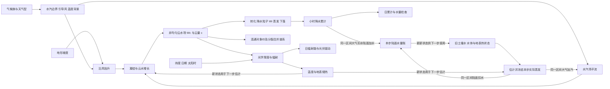
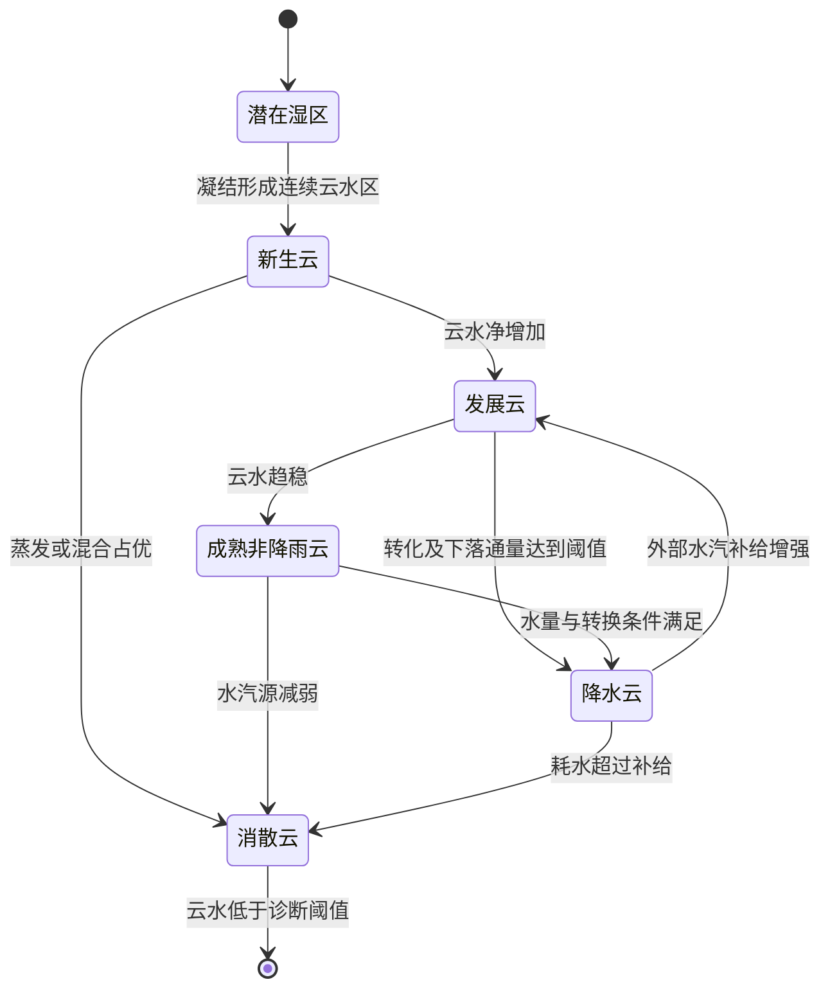

# 任务五：云团、降雨与辐照

## 1. 调查问题

本主题讨论如何在粗网格上构造具有空间结构、运动和生命周期的云雨，并让云、水汽、降水、辐射、温度之间存在可解释的关系。重点不是生成像云的图片，而是保存云为什么出现、雨量从哪里来、太阳能为什么变化、日—小时统计能否同时成立的可检查链条。

建议面向 0.5–10 km 水平网格、小时平均/累计输出；内部子步可为分钟级，具体数值是 **【场景先验】**，由平流和转换时间决定。小于网格的积云、雨滴增长、冰相微物理和三维辐射分别降阶为云覆盖率、条件降水效率、相位类别与辐射近似，不应假称已显式解析。

全文 **【物理关系】** 指几何、质量/能量和状态定义，**【经验规律】** 指观测或过程模式支持但受环境影响的统计行为，**【场景先验】** 指 SimGenr 的样本设计。**工程简化** 在公式附近单列。文献中的真实资料用于支持机制、尺度及反例；本调查不下载或拟合这些资料，不把研究地点的经验系数直接迁入项目。

## 2. 关键结论

1. **【物理关系】云的形成涉及水汽凝结及冰相过程；【经验规律】云量、云水含量和降水是不同变量。** 有云不一定下雨，降水粒子也可从上游或上层落到局地低云量像元。仅由 `rain = 常数×cloud` 无法表达这些情形。[R1][R2]
2. **【物理关系】平流使云水和水汽发生位移；【经验规律】云的生长、消散和传播还受湿度、上升运动及微物理影响。** 云团移动速度不能被一项独立的“每小时移动多少格”参数替代；云层引导风也不等同于地面10m风。[R3][R4]
3. **【工程判断】连续云水场作为权威状态、连通云团作为诊断，是当前项目比刚性椭圆对象更合适的降阶方案。** 形状可由多尺度非均匀湿度场与非均匀平流自然改变；分裂、合并应改变对象谱系，不改变场上的总水量。
4. **【经验规律】云团尺度和寿命具有过程依赖。** 普通雷暴单体约半小时的生命周期不能直接等同于包含多个单体的数小时系统；粗网格小时输出应表达事件平均影响，而不是把短生命单体拉长成全天不变的雨斑。[R5]
5. **【物理关系】太阳几何限定直射方向；【经验规律】云影响辐射取决于光学厚度、覆盖率、云相和空间结构。** 同样云量可以对应薄云或厚云，因此单一云量衰减系数只能作为明确声明的简化。[R6][R7]
6. **【物理关系】地表能量收支分为短波、长波、显热、潜热和储热。** 白天遮光与夜间云下长波作用不同，不能给多云天气整天减去同一个温度值。[R8]
7. **【物理关系】日总降水和小时累计的和必须一致，但任意给定的日云量、日辐照及云辐射公式不一定同时可行。** 先独立生成所有日变量，再分别归一化小时序列只能保证各自聚合，不能自动保证联合机理一致。应提供 `hourly_first` 与 `daily_conditioned` 两种明确模式，第5.6节给出不可行反例。
8. **【经验规律】云边散射和侧向输运可以增强局地GHI，甚至超过局地水平TOA投影。** `GHI<=TOA_horizontal` 可作为本项目“无侧向辐射”的模式上限，不能叫普适物理上限。粗网格和小时平均通常削弱短时极值，但不足以证明三维效应严格消失。[R9][R10]

## 3. 模态关联图

云对象建议状态机如下；**【工程简化】** 名称是诊断标签，不代替真实微物理。成熟云可一直不降雨；降雨并不强制意味着云进入消散。

分裂和合并是上述状态的对象谱系事件，不是额外“生成/消灭水”的箭头。图中的滞后仅指通量估计使用旧状态：同一笔蒸发和降水须在同一积分区间分别由陆面与大气双方入账。不能在陆面本步扣水、大气下步才加水；若确需延迟，交换中的水必须成为显式缓冲库存并参与总量检查。

| 输入变量 | 输出变量 | 影响方向 | 空间尺度 | 时间尺度 | 关系类型 | 推荐实现 | 参考来源 |
|---|---|---|---|---|---|---|---|
| 水汽、温度、气压、抬升 | 凝结/蒸发、云水 | 饱和超量促凝结，干空气可蒸发 | 格点气柱及亚网格 | 秒–小时 | 物理与闭合简化 | 显式Wv/Wc转移 | R1、R2 |
| 云层风、风切变 | 云水位置、形状 | 平移、拉伸、旋转，不必保形 | km–数百km | 分钟–小时 | 物理与经验 | 变速平流、尺度噪声 | R3、R11 |
| 云水、转换时间、降落时间 | 降水粒子、地面雨 | 有水才能转换，落地存在延迟 | 云层至地面、下游数km | 分钟–小时 | 物理与工程闭合 | 两储库加再蒸发 | R2、R4 |
| 地形、上游水汽、引导风 | 降雨空间偏移 | 迎风抬升，雨峰可移过山顶 | 山脉宽度1–100km | 分钟–日 | 物理与经验 | 有限水源的地形触发 | R4 |
| 云量、液水路径、有效半径 | 光学厚度、短波透过 | 光学厚度增加通常降低透过 | 云内/格点 | 分钟–小时 | 物理与简化辐射 | 分覆盖率和光学厚度 | R6 |
| 太阳几何、云光学状态 | GHI/DNI/DHI | 直射被遮挡，散射及增强依结构 | 点–区域 | 分钟–季节 | 物理与经验 | 模式标记的辐射诊断 | R7、R9、R10 |
| 短波、长波、地表性质 | 温度日较差、蒸发 | 日夜效应不同，存在热惯性 | 格点代表面 | 小时–日 | 物理与经验 | 地表储热状态或条件温差 | R8 |
| 日雨量/日能量预算 | 小时分配 | 总量约束，不唯一决定形状 | 同一格点支撑域 | 日↔小时 | 数学约束 | 非负有界条件分配 | R12及本文推导 |
| 水体、土壤水、风与温差 | 水汽供给 | 有限蒸发与平流，非“临水必有云” | 格点至下风侧 | 小时–季节 | 物理与经验 | 旧状态估计并冻结；同一区间双方记账 | R2 |

## 4. 物理机制与经验规律

### 4.1 云量不等于云水，也不等于雨区

**【物理关系】** 云量 `c` 是面积或体积覆盖比例，液态水路径 `Wc` 是每单位地面面积的云液水质量，降水 `P` 是穿过地面的水通量积分。三个变量的单位不同。**【经验规律】** 薄卷云、层云、浅积云和深对流可出现相近总云量但不同雨量与辐射效应。ECMWF等过程模式分别保存覆盖率和多种水成物；本项目无需完整复制，但不能只保留一个变量承担全部过程。[R1][R2]

**工程简化：** 初期用暖云单层，保存 `cloud_fraction`、`cloud_water_path_kg_m2`、`precipitating_water_path_kg_m2`。冰相暂作为独立模式边界，不在零度以下仍解释成同一暖雨物理。近地面RH也不能直接替代云层RH：需要有效云层温度/湿度或明确称为饱和倾向代理。

### 4.2 移动、传播与形变

**【物理关系】** 给定风场会平流已有凝结物；风的空间梯度造成形变。**【经验规律】** 对流系统还能通过下风侧新生单体表现出传播，因此追踪到的雨团速度不总等于任一高度的风速。[R3] **工程简化：** 为背景层云使用引导风；对流类允许有明确上限和统计来源的传播残差，并在元数据中标为先验，不把它伪装成10m风。

若每小时风为10 m/s，1h位移为36km；当前旧配置 `hourly_cloud_motion_km_per_hour=1.15` 若单独解释成同样风场的平流，量纲转换后只有约0.32m/s。该旧项目前不在活动小时路径中使用，不能据名称声称现在存在真实云运动。多尺度纹理加非均匀风能够形成非椭圆云，但形状逼真仍不等于动力学真实。[R3][R11]

### 4.3 有限水源、雨的延迟与蒸发

**【物理关系】** 云水转为降水粒子不立即全部到地面，降落过程中可再次蒸发；**【经验规律】** 转换效率取决于滴谱、云厚、相态、气溶胶和云内运动。[R1][R4] 用统一临界云量确定必雨会把未解析微物理误写成确定规律。

**工程简化：** 保留两个水储库和分天气型转换时间。若不保存水储库，只生成条件降雨概率，也必须声明“统计云雨模式”只守恒给定日降水预算，不守恒整根大气水柱。水体附近较湿可作为条件先验；没有蒸发和输送台账时，不能称每一滴雨都来自地图内湖泊。

### 4.4 云辐射与温度作用

**【物理关系】** 在相同太阳几何与环境下，增加云光学厚度会改变直射与散射比例；总GHI不是简单的直射指数衰减。**【经验规律】** 云底长波发射通常抑制夜间地表冷却，白天短波遮蔽通常减弱加热，净效应还依赖云高度、地面反照率和季节。[R6][R8]

**工程简化：** 可使用云量与云光学厚度两参数的低阶辐射闭合，并用热惯性把辐射传给温度。当前代码的日较差随日均云量减小是合理方向的统计代理，但不能称为完整地表能量方程。若今后增加能量方程，应删除同一云效应的固定温度扣减，防止重复计算。

## 5. 公式或可执行规则

### 5.1 连续水场、非均匀纹理与云对象

**【工程简化】** 对格点空气柱保存 `Wv,Wc,Wr`，分别是水汽、云水、降水粒子的单位地面面积质量，单位kg/m²。设云层引导风 `U=(u,v)` 为m/s，空间坐标为m，原始非均匀湿度倾向可由
$$
\psi(x,t)=\sum_{j=1}^{J}\sigma_j\psi_j(x,t),\qquad
\psi_{j,t+\Delta t}=a_j\mathcal A_{U,\Delta t}\psi_{j,t}
+\sqrt{1-a_j^2}\epsilon_{j,t}
$$
构造。`ψ,ε,σ_j` 无量纲；`ε_j` 是指定相关长度 `L_j`（km）的随机场；`a_j=exp(-Δt/τ_j)`，时间同单位。**【场景先验】** 3–6个尺度、各自方差和记忆时间属于样本设计；没有统一“真实分形指数”。参考多尺度随机降水研究只借鉴结构，不使用雷达资料估计本项目参数。[R3]

`ψ` 只能调节亚网格凝结倾向、覆盖率或新生概率；它不能直接向 `Wc` 无账加水。一个简单诊断覆盖率可以写为
$$
c=1-\exp[-W_c/W_*(\psi)],\quad
W_*(\psi)=W_{*,0}\exp(-b_\psi\psi).
$$
`W*,W*,0,Wc` 均为kg/m²，`bψ`无量纲。**【场景先验】** 该映射不是云微物理定律；优点是保证 `Wc=0⇒c=0`，并允许相同云水因亚网格聚集度而产生不同覆盖率。若改用预报云量方程，应确保其面积统计和水量变量一致。

以 `Wc>Wdetect` 或 `c>cdetect` 的连通区诊断对象ID，记录质心、面积、平均水量、生命周期标签与父/子ID。**【工程简化】** 分裂由场被拉伸或局部蒸发后断开识别，合并由连通识别；两个对象合并时仅合并谱系，水场不重绘、不重复相加。绘图用平滑轮廓不会改变物理栅格。诊断阈值、连通规则和对象最小面积需作为配置，以km²而不是像元数表达。

### 5.2 平流与开放边界水量台账

**【物理关系：柱水量收支形式】**
$$
\partial_t W_v+\nabla_h\cdot(\mathbf U W_v)=E_s+J_v-C+E_c+E_r,
$$
$$
\partial_t W_c+\nabla_h\cdot(\mathbf U W_c)=C-A-E_c,
$$
$$
\partial_t W_r+\nabla_h\cdot(\mathbf U_r W_r)=A-F-E_r.
$$

`W` 为kg/m²；`U,Ur` 为m/s；各右端 `Es,Jv,C,Ec,Er,A,F` 为kg/(m²·s)，分别是地表蒸发、外部垂直/背景供给、凝结、云水蒸发、雨水蒸发、云雨转换、落地通量。每项量纲相同。`Jv` 是开放气柱缺失输送的显式接口，不能设成“补到任意目标雨量”却不输出其值。[R1][R2]

**工程简化：** 使用保正有限体积通量和显式入流边界；若采用半拉格朗日法，必须另查质量残差，常规插值方法并不自动守恒。无源、无雨、周期边界测试可检查总水量不变；实际区域采用开放边界时则检查“总储量变化=入流−出流+蒸发+外部供给−降水”。周期边界只是算法单元测试，不应默认让云从地图右边出去又从左边进入。[R3]

对于显式迎风方案，取
$$
\Delta t\left(|u|/\Delta x+|v|/\Delta y\right)\le C_{max},
$$
格距为m，`Δt`为s，`Cmax≤1`是所选数值格式的稳定性条件；若还有扩散或非线性源项，应同时满足其限制。以10m/s、1km格距为例，单向 `Cmax=0.5` 得 `Δt≤50s`；因此“内部5min”不能无条件适用于全部高风细网格。

全域水预算可计算
$$
\varepsilon_W=\sum_i A_i\Delta(W_{v,i}+W_{c,i}+W_{r,i})
-\Delta t[\mathcal F_{in}-\mathcal F_{out}+\sum_i A_i(E_{s,i}+J_{v,i}-F_i)].
$$
`Ai` 为m²；边界总通量 `F_in,F_out` 为kg/s；因此残差为kg。内部凝结、转换和再蒸发相互抵消。二维柱模式仍未闭合空气动量和垂直结构；水量账闭合不能被宣传为完整大气守恒。

### 5.3 饱和调整、转雨与小时累计

**【工程简化，受物理非负约束】** 对有效云层空气面质量 `Ma`（kg空气/m²）及其饱和比湿 `qs`（kg水/kg空气），子步凝结质量可取
$$
\Delta W_{cond}=\max(W_v-M_a q_s,0),
\quad \Delta W_{auto}=(W_c-W_{c,0})_+[1-e^{-\Delta t/\tau_c}],
$$
$$
\Delta W_{fall}=W_r[1-e^{-\Delta t/\tau_f}].
$$
`Wc,0` 是kg/m²转换阈值，`τc,τf,Δt` 都为s；每项为kg/m²。按顺序扣除上一个储库并加入下一个储库；有多条竞争耗水路径时必须按可用水量限额或共同隐式求解，不能每条路径各自取一次完整储量。`qs` 来自云层T和p；只有地面状态时 `Ma,云层温度` 都是额外先验。[R1][R4]

其中 `(x)+=max(x,0)`。`Ma`可在选定等压层下用压差`Δp/g`表示（Pa除以m/s²得到kg/m²）；层顶、层底和使用湿空气/干空气质量的约定必须固定。如果启用热力耦合，凝结释放和蒸发消耗的潜热还需满足 `ΔTc=Lv(ΔWcond−ΔWevap)/(cp Ma)`，`Lv`为J/kg、`cp`为J/(kg·K)，所以`ΔTc`为K。更新云层温度后重新求`qs`，通过有界迭代求饱和调整；若选择固定温度的一次调整，需把相应潜热列为外部热库交换，不能同时宣称气柱能量闭合。[R2]

雨水再蒸发可取 `ΔWevap=min[Wr, Ma(qs−q)+, Wr(1−exp(−Δt/τe))]`，全部项为kg/m²；**【场景先验】** `τe` 仅是暖雨降阶时间尺度。转化参数可以按“层状/对流/地形云”切换，但不能从这些标签推出真实暴雨发生概率。地形抬升应影响有效云层冷却或凝结源，并扣减 `Wv`，不能额外生水。

**【物理关系：单位换算】** 1kg/m²液态水相当于1mm水深。若 `F` 用kg/(m²·s)，则1h累计雨量为
$$
P_h\,[\mathrm{mm}]=\frac{1000}{\rho_w}\sum_{k\in h}F_k\Delta t_k,
\quad \rho_w\simeq1000\ \mathrm{kg/m^3}.
$$
不能把 `mm/h` 的雨率在元数据里称为“该小时累计mm”而省略时间长度；非1h步长时该错误会直接污染径流和事件总量。

### 5.4 不保存云水时的最低限度概率模型

若近期无法增加气柱水过程，**【工程简化】** 使用显式 `statistical_cloud_rain` 模式：
$$
\Pr(Z_h=1\mid c_h,q_h,w_h,s_h)
=\operatorname{logistic}\left[b_0+b_c c_h+b_q(q_h/q_*)
+b_w(w_h/w_*)+b_s s_h\right],
$$
$$
\widetilde P_h=Z_h X_h,\qquad X_h\sim\mathrm{Gamma}(k,\theta).
$$
`Zh` 为0/1湿小时指示；`c`无量纲；`q,q*`单位kg/kg；`w,w*`单位m/s；`s`为无量纲天气型指标；所有 `b` 无量纲；`k`无量纲，`θ`为mm/当前时段，因此 `X`为该时段累计mm。**【经验规律】** 雨发生与雨量分开、条件于天气型的框架有天气生成器先例；**【场景先验】** 这里具体Logistic函数、Gamma分布和系数均需配置，不能称文献拟合结果。[R12]

`q`应优先指云层湿度；若只有地面RH，可用作有不确定性的代理，并在字段名中注明。湿小时状态还应有持续性，不能逐小时独立掷硬币；对流与层状过程使用不同相关长度和持续时间。统计模式不允许声称满足 `Wv+Wc+Wr` 守恒；其硬约束只包括雨量非负、给定累计预算与时空分布接口。

### 5.5 云光学厚度、短波和温度

**【物理关系加均匀暖云近似】** 球形液滴的光学厚度与云内液态水路径近似关系为
$$
\tau_{opt}\simeq\frac{3 W_{c,in}}{2\rho_w r_e},\qquad
W_{c,in}=W_c/c\quad(c>0).
$$
`τopt`无量纲；`Wc,in`为kg/m²云内路径，`Wc`为格点平均路径；`ρw`为kg/m³；`re`为m。分子分母同为kg/m²。假设液滴消光效率接近2且有效半径适用；冰晶、强垂直非均匀以及复杂滴谱需要其他处理。`c→0`时不能直接除零：`c=0`须有 `Wc=0`，很小c可使用子像元类别或统一的小覆盖诊断下限，并报告其影响。[R6]

**【工程简化；透过函数参数为场景先验】**
$$
I_h=I_{clr,h}\{(1-c_h)+c_h\mathcal T(\tau_{opt,h},\mu_h)\},
\quad \mathcal T=\frac{1}{1+a_{rad}\tau_{opt}}.
$$
`I,Iclr`为W/m²小时平均；`c,τopt,μ,a_rad`无量纲；`μ`为太阳天顶角余弦。示例有理式未使用全部 `μ` 依赖，只保证光学厚度增大时云下总透过减小；它不是完整多次散射解。不能用 `exp(−τ/μ)` 同时代表直射和总GHI，该指数描述的是直射消光而缺少散射回补。云下透过函数、直散分解以及PV平面转换应有一个共享责任模块，防止下游再次按云量扣除辐射。[R6][R7]

FAO-56的 `Iclr≈(0.75+2×10⁻⁵z)I0` 来自低阶晴空估计，其中 `z`为m；当前实现把日尺度近似应用于小时太阳几何并设置截断，需要标明是工程延用。日落日出须积分小时窗口，不能只取正午点值。**【场景先验】** 若此模式同时设置 `0≤I≤I0,horizontal`，这是“忽略侧向辐射”的模型约束；真实云边增强违反该上限不等于违反能量守恒，因为能量可从邻近区域进入。[R7][R9]

**【物理关系】** 地表能量账可写
$$
C_s\frac{dT_s}{dt}=(1-\alpha)I+L_{down}-\epsilon_s\sigma T_s^4-H-\lambda E-G.
$$
`Cs`为J/(m²·K)，`Ts`为K，`t`为s；`α,εs`无量纲；`I,Ldown,H,λE,G`为W/m²；`σ=5.670374419×10⁻⁸ W/(m²·K⁴)`；`λ`为J/kg，`E`为kg/(m²·s)。该式约束地表储热，不能直接把 `Ts` 等同2m气温。[R8]

**工程简化：** 若不解完整地表通量，只求有限幅度的温度异常状态 `dδTa/dt=(δTeq−δTa)/τT`，其中 `δTa,δTeq`为K、`τT`与t同时间单位，`δTeq`由标准化辐射、夜间云长波代理和背景天气共同产生。此时温度模块是有机理方向的统计响应，不能称能量闭合；参数在负荷模型中的建筑热惯性之后还会再次产生记忆，两者物理对象不同，应保留各自字段。

### 5.6 日—小时一致性与不可行输入

**模式A：`hourly_first`，推荐作为有云水状态模式。** 先连续生成整段小时/子小时原始状态，诊断云雨辐射，再聚合：
$$
P_d=\sum_{h\in d}P_h,\qquad \overline I_d=\frac1{24}\sum I_h,
\qquad H_d=0.0036\sum I_h\quad\mathrm{MJ/m^2}.
$$
`Ih`为1h平均W/m²；`Hd`为日辐射能；常数0.0036来自3600s与10⁶J/MJ。其余状态日均按实际时段长度加权。**【工程简化】** 年气候目标只约束期望或长时段分布，不能要求每个随机年精确等于年气候均值。截取一周前先预热并保存状态，不能每天清零云水。

**模式B：`daily_conditioned`，用于已给定日统计的条件合成。** 给定日总雨量 `Pd≥0` 和小时非负候选权重 `wh`，无雨率上限时 `Ph=Pd wh/Σwh`；`Pd=0`时全零，`Pd>0且Σwh=0`时不可行。若有每时段上限 `Mh`（mm），求 `Ph=min(λwh,Mh)`，选择λ使累计等于Pd。**【数学硬约束】** 可用支持集 `S={h:wh>0且Mh>0}` 上必须满足 `Pd≤ΣS Mh`；只检查全天所有上限之和会错把没有候选雨的小时也当成可分配容量。

在 `daily_conditioned` 中，云雨联合候选不满足预算时可重采样候选或返回不可行；若选择放宽目标，必须保存原始目标、实际目标与调整原因。不能增加无云降雨“修补项”后仍声称云水过程完全解释了雨量。

**【数学硬约束】** 云量与辐照预算必须联合检查。考虑最简固定透明度模型
$$
I_h=I_{clr,h}(1-bc_h),\quad 0\le c_h\le1,\quad
\sum c_h=24\overline c_d,\quad
\sum I_h=24\overline I_d.
$$
`b∈[0,1]`为既定场景系数，其他单位同上。给定 `Iclr,h` 后这是一个线性可行性问题；可通过把既定云量分配到最大/最小晴空辐射小时，计算可达到的日辐射上、下界。边界外目标必须拒绝，不能分别调云均值和辐照均值后说仍满足同一辐射公式。更完整光学厚度模型需要对同一状态联合求解，单独标量归一化一般不够。

**独立可检验反例：** 单像元 `云日均=0`、每小时 `c∈[0,1]`，必然所有小时c=0。若所选晴空曲线日均为200W/m²，而同时输入日GHI均值20W/m²，且该模式不允许气溶胶变化或其他衰减，则不存在同时满足二者和上式的小时序列。把GHI整体乘0.1只能守住输入日GHI，已经改变辐射机理；给夜间塞云不能解决，因为云日均本来为0。

日温度、RH、站压和风同样不可被无限制独立锁定：一旦小时T/q/p0已固定，RH和p是诊断量；日风标量均值应大于等于日向量模，具体反例见任务04第5.6节。推荐 `constraint_report` 保存 `requested,achieved,hard,soft,residual,feasible`，而不是把所有误差都强行归零。

## 6. 参数范围与单位

**【证据使用原则】** 表中具体研究条件下的数量级仅用于拒绝明显量纲错误；“建议扫描”均是项目先验，不能解释为气候风险的真实分布。极端事件频率、尾部雨量、云团形状参数需要单独标注。

| 参数 | 单位 | 文献数量级/物理定义 | 项目建议与属性 | 适用范围/来源 |
|---|---|---|---|---|
| 普通雷暴单体寿命 | min | NOAA示例约30 | 输出小时平均；内部需更短子步 | 不是整个多单体系统寿命，R5 |
| 云纹理相关长度 | km | 无通用定值，过程依赖 | 建议2–10、10–50、50–200三档先验 | 最小尺度须≥若干格点，R3 |
| 引导风 | m/s | 位移=风速×时间 | 建议情景扫描2–20；与10m风分开 | 系统传播可偏离风，R3 |
| 云雨转换/下落时间 | s | 地形雨论文示例约1000 | 建议300–3000先验 | 子步分辨、暖云近似，R4 |
| 云内液水路径 | kg/m² | 光学关系由水量/滴径确定 | 建议0.02–0.5扫描；非全球范围 | 用单位和τ关系筛查，R6 |
| 液滴有效半径 | μm | 暖云液滴通常为微米级；具体滴谱有差异 | 建议5–20先验，计算需乘10⁻⁶转m | 冰云不适用同一公式，R6 |
| 光学厚度 τ | 无量纲 | 可由Wc,in与re诊断 | 上述扫描对应约1.5–150，不独立再抽 | 该区间为公式推导，不是观测分位数 |
| 湿小时概率/Gamma形状 | 0–1；无量纲 | 条件分布结构有生成器依据 | 系数与形状按天气族设定 | 原论文不提供本项目通用值，R12 |
| 雨率上限 | mm/h | 无全球固定上限 | 由极端情景声明，不能随意裁剪 | 上限与日总量联合可行 |
| 内部子步 | s | 满足平流、源项稳定条件 | 自适应，按CFL与转换时间选择 | 不固定承诺5min总是足够 |
| 温度响应时间 τT | h | 大气和地表热惯性依环境变化 | 建议1–12的敏感性扫描 | 是低阶代理，不等于建筑热惯性 |
| 云透过系数 arad | 无量纲 | 有理透过式属工程近似 | 配置并扫描，不标文献常数 | 应检验晴空/厚云两个极限 |

## 7. 对 SimGenr 生成阶段的影响

本节核对 `physics_v3` 的活动代码，避免把旧配置或过往实现当作当前功能。

| 阶段/文件 | 已实现或部分实现 | 缺失/冲突 |
|---|---|---|
| 阶段4 `climate_generator.py` | 年云量与年雨量背景、太阳几何辐照 | 云量部分依赖归一化年雨量，缺云层属性；地形增雨已进入年预算 |
| 阶段5 `generate_daily_weather` | 湿日Markov、相关Gamma雨量、温湿云条件关系 | 无显式水汽耗减/云水/降水粒子状态；雨量在统计层先生成 |
| 阶段5 `_advect_and_innovate` | 日尺度随机场按风向作整数位移与创新 | 位移为cells/day、并非风速×时间；边界用nearest复制；不能称物理云水输送 |
| 阶段5 `generate_hourly_weather_week` | 小时AR(1)云场、0–1云均值投影、单日脉冲雨量分配 | 小时云没有空间平流、对象生命周期、非均匀形变；同一日全域共享雨脉冲中心与宽度 |
| 同一小时函数辐射部分 | 夜间零值、小时窗积分、日GHI预算和TOA模式上限 | 独立云均值投影与辐射缩放不保证固定云辐射公式；缺光学厚度与三维增强 |
| `WeatherConfig`旧云团配置 | `hourly_cloud_system_count/cloudlet_count/radius/motion/raining_cloud_fraction`仍可见 | 当前路径未调用它们；不应据配置名称宣称存在对象模拟，应弃用或显式实现 |
| 阶段3/7土地、阶段2水文 | 提供水体和土地类别 | 无小时蒸发/土壤水反馈供给；若后续加入，应使用前一步水状态 |
| 阶段11风光与负荷 | 已接收GHI/T/风等小时驱动 | 不得在PV再加一次云折减；应追踪天气改变向源荷的传递，而非另造独立出力扰动 |
| `tests/test_weather_physics.py` | 日小时守恒、太阳几何、压强与风约定检查 | 还缺云雨联合可行性、云平流方向、水量源汇、跨午夜连续、对象谱系检查 |

当前日降雨是期望上受年雨量背景控制，未把每年随机总量强制等于同一个常数，这是合理的随机语义。改动时应保留“期望气候”和“本次合成年”的区别。

## 8. 推荐的简化实现

**第一步：先把统计模式做完整。** 新增 `weather_generation_mode` 与 `cloud_radiation_mode`。保留目前的日条件路径作为兼容模式，但增加联合可行性报告、候选支持集预算检查、跨午夜连续雨事件。将旧云对象参数标为已弃用，避免修改无效参数却误以为改变实验。

**第二步：新增连续云场模块。** 建议 `evolve_cloud_fields(state, forcing, dt_seconds)` 输入上游气候/风/有效云层湿度、地形抬升与地表蒸发；输出更新 `Wv,Wc,Wr,c` 和质量台账。`advect_column_water` 只处理输送；`transfer_condensate` 只处理相变；`diagnose_cloud_objects` 只生成ID与谱系。分清职责即可避免同一个雨量既在云团对象又在天气场累加。

**第三步：共享辐射。** `diagnose_solar_fluxes` 接收太阳方向、云量、光学厚度、地表反照率和简化模式；输出GHI，后续可扩展DNI/DHI、向下长波与模式残差。当前FAO晴空近似和未来查表辐射不可叠加，PV只消费输出字段。夜间太阳短波为零是本项目忽略曙暮光的模式选择；不要把负太阳高度附近的真实微弱散射视为坏观测。

**第四步：整体聚合与条件模式分支。** `aggregate_hourly_weather` 为唯一日聚合函数。`hourly_first` 中天气状态连续运行，日字段都是结果；`daily_conditioned` 中调用 `check_daily_weather_feasibility` 再受限生成。若为配合日预算给气柱引入外部补水，必须通过 `Jv` 显式记账并命名为“条件化供给”，不能说它是自然蒸发。

**第五步：控制闭环。** 推荐采用旧状态估计、同一区间记账的显式分裂算子：

1. 从步初土壤/湖泊、地表热及大气状态估计潜在蒸散需求，将实际蒸发限制在步初可用水量内并冻结。记冻结的整格蒸发深为`E^n`（mm/步）；水体与陆地份额分开，不能各自使用一次完整格面积。
2. 大气做水平输送，接收同一笔`E^n`对应的水汽，再做凝结、云雨转换、再蒸发和落地降水，得到本步`P^n`（mm/步）。大气水账在该区间加入`E^n`、扣除`P^n`，不得把下一步才入账的量混入本步残差。
3. 将同一`P^n`交给任务03土壤/河湖算子；陆面账在同一区间加入`P^n`、扣除冻结的`E^n`，再计算入渗、快流、渗漏、基流及河湖更新。两边使用同一时间区间、覆盖面积及mm↔kg/m²转换；完成子步后蒸发和降水在陆气总账中相消。
4. 用更新云状态诊断辐射，计算地表热的新状态，并在同一区间记录已冻结蒸发的潜热通量。凝结/再蒸发的潜热由大气相变模块按第5.3节记账；不能再次把同一潜热既作独立显热源又作相变源。新温度和含水量只影响下一子步通量估计。若热模型仅是温度响应代理，保留“未闭合完整热量账”的标记。

**与任务03第5.2节桶的接口：** 该桶独立运行时允许新降雨入渗后蒸发；双向显式耦合时，本步实际蒸发必须唯一归属于冻结交换量。陆地的`E^n`已不大于步初根区水量，因此可通过传入受限需求`E^n/Δt_h`使原桶的蒸发公式恰好返回`E^n`，或者提供等价的`fixed_evaporation_depth_mm`接口；原潜在需求另存，不能覆盖或误称实际值。不得再用新降雨计算第二笔额外蒸发并只从陆面扣除。这样保留原桶公式和收支结构，也消除了当前降雨—蒸发—云之间的同一步代数循环。

若只有日尺度土壤更新，日内仍需保留并逐次扣减可用水余额，或将陆气双向耦合关闭；不能每个小时重复使用同一份日初完整库存。若选择延迟交换，则新增交换缓冲库存，纳入每步及全窗口初末水量和相应能量台账。不得调用当天最终雨量反向决定清晨云。新增 `warmup_hours`、状态快照和确定性事件ID，跨日/跨周读取同一过程。

| 建议测试 | 控制实验 | 通过条件 |
|---|---|---|
| `test_cloud_advection_translation` | 无源、匀速风、已知水斑 | 质心水平位移=UΔt；总水量与边界通量闭合 |
| `test_cloud_split_merge_budget` | 形变后分裂再重连 | ID谱系改变但不凭空增减云水 |
| `test_no_condensation_without_available_water` | 水汽和入流为零 | 云水及雨量不能从随机纹理中产生 |
| `test_rain_can_evaporate_before_ground` | 有Wr、干燥下层 | Wr减少、水汽增加；雨量可小于转换量 |
| `test_cloud_radiation_daily_infeasible` | c日均0、低GHI目标 | 明确拒绝或显式放宽；不得静默称成功 |
| `test_budget_support_feasibility` | 有限雨窗口、小雨率上限 | 只按支持集容量判断是否可分配 |
| `test_cloud_cross_midnight_continuity` | 云进入午夜前后 | 状态连续，日聚合边界不重置对象 |
| `test_land_atmosphere_exchange_same_interval` | 无外边界流，已知蒸发和降水 | 同一交换量双方记账；陆气总水量不因跨模块顺序漏一拍 |
| `test_cloud_radiation_transfer_to_pv` | 固定太阳/温度，增加τ | 简化模式中透过降低并传到PV；云边模式另测 |
| `test_coarse_grid_extreme_event` | 同事件先细算再面积/时间聚合 | 累计水量/辐射能一致，峰值允许降低 |

统计测试需要多种子和不确定区间；不以任意一个雨图中“高云量却没有雨”的像元判错。联合极端应检查持续期、空间覆盖与源荷响应，而不是用单一全局相关系数取代事件结构。

## 9. 硬约束、软约束和情景假设

**硬约束：** 单位、非负水量、分数范围；云雨内部转移不能超过可用储量；每次相变成对转移；开放边界通量入账；指定模式下日小时预算与联合可行性；光学厚度使用云内或格点均值的语义一致。`GHI=DNI·max(cosθz,0)+DHI` 仅在各项为相同时间/面积支撑和对应定义时使用，小时平均不能随意用整点cos替代小时内积分。

**模型内硬约束：** 在明确无侧向辐射、无云边增强的模式里，可保持现有 `GHI≤TOA_horizontal` 检查；在只允许遮蔽的云透过模式，`GHI≤clear_sky_GHI` 是该模型结构约束。二者均不能反过来拒绝真实观测中的增强现象。暖云相位、忽略曙暮光和二维引导风也是模型边界，须和自然定律分开。

**软约束：** 条件于相似云型和太阳几何，较厚云通常降低短波；湿润且上升的气柱更容易产生云；干燥下层更容易产生雨蒸发；云雨场通常有时空持续性。云量—降雨没有全域确定函数，云量—温度的符号也不能不分昼夜强制。

**场景假设：** 云型比例、转化时间、亚网格形状谱、出生率、传播残差、外部水汽供给、日预算是否固定、微物理阈值与极端事件概率。每个样本保存这些参数和模式；所谓“百年一遇暴雨”在无观测概率标定时不能使用，可称“指定强度压力测试”。

## 10. 局限性

二维暖云储库不表达冰相降雪/冻雨、气溶胶激活、碰并滴谱、深对流动力、冷池传播、垂直风切变与真实云底高度。给粗网格加噪声并不能替代这些过程；推荐通过天气类别和条件效率降阶，并把相应风险变量设为未模拟，而不是设零。

对象数、周长与分裂次数对阈值和分辨率敏感，不宜作为跨分辨率硬目标。空间纹理的谱形接近文献并不能证明云型比例或暴雨尾部分布真实。对雷暴等短事件，小时平均会抹去快速光伏爬坡和阵风；因此该数据集不能直接验证分钟级控制或设备载荷。

**辐射边界尤其需要保留：** Emck与Richter在特定热带山地观测到很强局地辐射增强，其绝对值不能移作所有地点上限；它足以否定“局地GHI永不超过TOA投影”的普适说法。[R9] Gristey等的浅积云研究显示，即使空间平均，三维与一维辐射仍可能不同；因此粗化只能作为忽略三维效应的工程理由，不能作为效应严格为零的证明。[R10]

给定完整日预算再生成小时属于条件合成，使用了当日总量信息。它可构造合成实况或回溯分解，但不能自动当作只知道过去的天气预测。面向源荷预测数据时，应独立保存预报发布时刻、可用信息、预报误差和实况；不要把未来日总雨量/GHI条件隐藏进输入。

## 11. 参考文献及每篇文献的用途

- **[R1] Tiedtke, M. (1993). “Representation of Clouds in Large-Scale Models.” _Monthly Weather Review_, 121, 3040–3061.** [期刊原文](https://journals.ametsoc.org/view/journals/mwre/121/11/1520-0493_1993_121_3040_rocils_2_0_co_2.xml)。支持分别预报云水与云覆盖、云的形成消散需有源汇；本项目三储库是降阶建议，不声称复制该方案全部云型和过程。
- **[R2] ECMWF. “Atmospheric physics”，云与地表过程官方说明。** [官方页面](https://www.ecmwf.int/en/research/modelling-and-prediction/atmospheric-physics)。支持水汽/云液水/冰/雨雪分量、蒸发与地表水热通量的耦合架构；用于说明一个cloud字段不足以覆盖云雨机制，不直接移植IFS参数。
- **[R3] Pulkkinen, S., Nerini, D., Pérez Hortal, A. A., Velasco-Forero, C., Seed, A., Germann, U., Foresti, L. (2019). “Pysteps: an open-source Python library for probabilistic precipitation nowcasting (v1.0).” _Geoscientific Model Development_, 12, 4185–4219. DOI:10.5194/gmd-12-4185-2019.** [开放论文](https://gmd.copernicus.org/articles/12/4185/2019/)。支持平流、尺度分解、增长消散不确定性和场结构验证；雷达外推方法不等于从零生成有物理闭合的云，本报告仅借鉴空间统计和输送结构。
- **[R4] Smith, R. B., Barstad, I. (2004). “A Linear Theory of Orographic Precipitation.” _Journal of the Atmospheric Sciences_, 61, 1377–1391.** [期刊原文](https://journals.ametsoc.org/abstract/journals/atsc/61/12/1520-0469_2004_061_1377_altoop_2.0.co_2.xml)。支持地形抬升、平流、云水转化与下落时间共同控制地形雨及背风蒸发；1000s是文中示例，不是通用暖雨常数。
- **[R5] NOAA/National Weather Service. “Life Cycle of a Thunderstorm.”** [官方气象教材页面](https://prod-01-alb-www-noaa.woc.noaa.gov/jetstream/thunderstorms/life-cycle-of-thunderstorm)。支持单体发展、成熟、消散及约30min数量级；用于提醒小时输出分辨不了完整单体演化，不据此设所有云寿命为30min。
- **[R6] Brenguier, J.-L., Burnet, F., Geoffroy, O. (2011). “Cloud optical thickness and liquid water path – does the k coefficient vary with droplet concentration?” _Atmospheric Chemistry and Physics_, 11, 9771–9786. DOI:10.5194/acp-11-9771-2011.** [开放论文](https://acp.copernicus.org/articles/11/9771/2011/)。支持云光学量与液水及滴谱的关系，以及柱平均和局部平均不能任意互换；其飞行观测用于机制与平均尺度问题，不移植场地滴谱。
- **[R7] Allen, R. G., Pereira, L. S., Raes, D., Smith, M. (1998). FAO-56, Chapter 3, “Meteorological data.”** [FAO原文](https://www.fao.org/4/x0490e/x0490e07.htm)。支持太阳几何、晴空近似与辐射能单位；日尺度农业估计用于低阶内核，不能证明小时云透过系数或普适GHI上限。
- **[R8] NASA. “Clouds and Radiation” 与 “The Earth's Radiation Budget.”** [云短波/长波说明](https://science.nasa.gov/earth/earth-observatory/clouds-and-radiation/)、[能量收支说明](https://science.nasa.gov/ems/13_radiationbudget/)。支持云短波反射、长波作用与能量记账的区别；本报告不使用其中全球平均通量给每个像元指定固定温度扣减。
- **[R9] Emck, P., Richter, M. (2008). “An Upper Threshold of Enhanced Global Shortwave Irradiance in the Troposphere Derived from Field Measurements in Tropical Mountains.” _Journal of Applied Meteorology and Climatology_, 47, 2828–2845. DOI:10.1175/2008JAMC1861.1.** [期刊原文页面](https://journals.ametsoc.org/view/journals/apme/47/11/2008jamc1861.1.xml)。支持云相关散射可产生超过常用局地辐射上限的实测反例；这些极端值只否定错误普适检查，不用作本项目全球最大辐照参数。
- **[R10] Gristey, J. J., Feingold, G., Glenn, I. B., Schmidt, K. S., Chen, H. (2020). “Surface Solar Irradiance in Continental Shallow Cumulus Fields: Observations and Large-Eddy Simulation.” _Journal of the Atmospheric Sciences_, 77, 1065–1080. DOI:10.1175/JAS-D-19-0261.1.** [期刊原文页面](https://journals.ametsoc.org/view/journals/atsc/77/3/jas-d-19-0261.1.xml)、[NOAA公开全文](https://repository.library.noaa.gov/view/noaa/24928/noaa_24928_DS1.pdf)。支持云下遮蔽与云隙增强、三维和一维辐射差异及其尺度依赖；真实观测和LES仅支撑模型边界，不用来拟合本项目辐照概率。
- **[R11] Hinkelman, L. M., Evans, K. F., Clothiaux, E. E., Ackerman, T. P., Stackhouse, P. W. Jr. (2007). “The Effect of Cumulus Cloud Field Anisotropy on Domain-Averaged Solar Fluxes and Atmospheric Heating Rates.” _Journal of the Atmospheric Sciences_, 64, 3499–3520. DOI:10.1175/JAS4032.1.** [期刊原文](https://journals.ametsoc.org/view/journals/atsc/64/10/jas4032.1.xml)。支持云倾斜、拉伸和非均匀性对辐射的影响；不是把椭圆画复杂即可获得真实辐射的证据，而是保留形状—辐射近似边界的理由。
- **[R12] Richardson, C. W. (1981). “Stochastic simulation of daily precipitation, temperature, and solar radiation.” _Water Resources Research_, 17(1), 182–190. DOI:10.1029/WR017i001p00182.** [论文页面](https://agupubs.onlinelibrary.wiley.com/doi/10.1029/WR017i001p00182)。支持条件天气统计架构；本文有界小时预算和联合可行性是针对SimGenr的数学推导，不能归称原论文已解决全部小时云水过程。

## 12. 建议立即实现、建议后续实现、暂不实现

| 优先级 | 修改 | 可执行落点 | 依据与验收 |
|---|---|---|---|
| 建议立即实现 | 日条件与小时优先模式分开 | `weather_generation_mode`、元数据 | R12与第5.6节；不得混淆预算输入与实况结果 |
| 建议立即实现 | 云辐射/雨预算联合可行检查 | `check_daily_weather_feasibility` | 云日均0反例、雨支持集反例均能识别 |
| 建议立即实现 | 辐照上限重命名为模型假设 | `radiation_bound_mode` | R9、R10；真实增强不再被称违背物理 |
| 建议立即实现 | 删除或弃用无效云团参数 | 配置迁移提示与有效参数摘要 | 当前活动路径明确可查 |
| 建议立即实现 | 小时相关云场引入物理平流与跨日状态 | `advection_mps`、连续事件状态 | R3；已知风的位移正确、不每日重启 |
| 建议后续实现 | 暖云三储库和开放边界水账 | Wv/Wc/Wr、转移函数 | R1、R2、R4；无源水量守恒、源汇闭合 |
| 建议后续实现 | 非均匀场与对象谱系 | 多尺度场、连通ID与父子链 | R3、R11；合并分裂不改变储量 |
| 建议后续实现 | 光学厚度、DNI/DHI和地表热状态 | 共享辐射模块、滞后反馈 | R6–R8；单位与能量/诊断语义一致 |
| 暂不实现 | 完整冰相微物理、3D辐射、深对流动力和真实暴雨重现期 | 需超出当前网格的垂直结构与校准 | 明确降阶或未模拟，不能用更多贴图噪声代替 |

[R1]: https://journals.ametsoc.org/view/journals/mwre/121/11/1520-0493_1993_121_3040_rocils_2_0_co_2.xml
[R2]: https://www.ecmwf.int/en/research/modelling-and-prediction/atmospheric-physics
[R3]: https://gmd.copernicus.org/articles/12/4185/2019/
[R4]: https://journals.ametsoc.org/abstract/journals/atsc/61/12/1520-0469_2004_061_1377_altoop_2.0.co_2.xml
[R5]: https://prod-01-alb-www-noaa.woc.noaa.gov/jetstream/thunderstorms/life-cycle-of-thunderstorm
[R6]: https://acp.copernicus.org/articles/11/9771/2011/
[R7]: https://www.fao.org/4/x0490e/x0490e07.htm
[R8]: https://science.nasa.gov/earth/earth-observatory/clouds-and-radiation/
[R9]: https://journals.ametsoc.org/view/journals/apme/47/11/2008jamc1861.1.xml
[R10]: https://repository.library.noaa.gov/view/noaa/24928/noaa_24928_DS1.pdf
[R11]: https://journals.ametsoc.org/view/journals/atsc/64/10/jas4032.1.xml
[R12]: https://agupubs.onlinelibrary.wiley.com/doi/10.1029/WR017i001p00182
