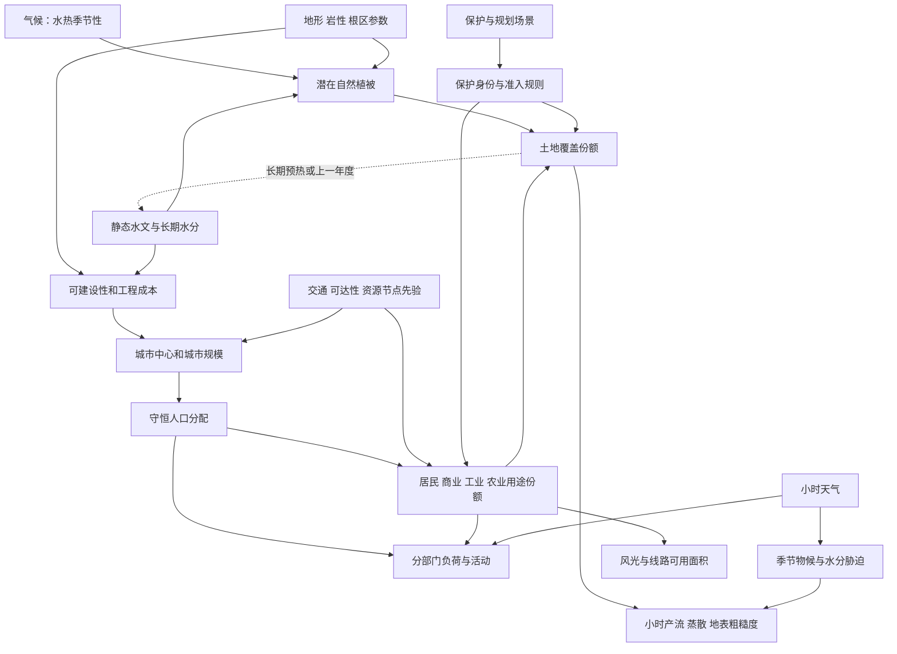

# 任务六：植被、土地覆盖与城市空间

## 1. 调查问题

本主题研究气候和水分怎样约束潜在植被，自然覆盖怎样与农业、保护政策、城市活动叠加，以及人口与土地如何共同决定负荷和设施可用空间。建议空间支撑为 0.5—5 km 的混合像元，城市活动可用亚网格份额表达；静态布局代表某一合成年份，植被物候按日/月更新，人口活动按小时变化。

研究不尝试从真实地区拟合土地转换或人口模型。文献中的观测只支撑机制和统计形式，所有地域相关权重必须作为场景先验。本文所有新增配置、函数与测试均是实施建议，不能视为已实现功能。

## 2. 关键结论

1. 【物理关系】植被生长受到能量、水和物质可用性的约束；【经验规律】年均温和年降雨可以估计潜在生产力，但季节性的水热错配、土壤蓄水和土地管理会改变实际植被。[L2][L3][L4]
2. 【经验规律】地貌、土地覆盖、土地利用和保护身份是不同维度。“山地”可以覆盖森林、草地或裸岩，“保护区”也可以包含水体或有人活动的景观。把这些混成一个互斥分类会丢失关键关系。[L1][L8]
3. 【场景先验】城市核心、居民区、商业区与工业区的多中心格局应由可建设性、交通/可达性、岗位需求和规划选择共同生成。不存在“所有城市工业均在外环”或“人口仅由自然适宜度决定”的普适定律。[L6][L7]
4. 【物理关系】人数等于密度乘面积后求和；【经验规律】城市内部密度可用递减核作基线，但核形状、中心凹陷、多中心与城市边界会影响统计规律。不能把每城人数归一化成 0—1 后仍称人口密度。[L5][L7]
5. 【工程简化】粗格中保留面积份额和活动强度，分类图只用来显示主导类型。五个独立适宜度图之和并不等于土地面积；电源容量与径流参数都应由明确的可用面积和覆盖份额驱动。
6. 【场景先验】静态保护、城市与产业布局依据长期背景或独立规划情景生成；待预测的一周天气不能反向决定其位置。水分—覆盖反馈在独立预热/逐年迭代中闭合，运行周只影响物候与活动状态。

## 3. 模态关联图

**土地利用决策树建议：**先识别水面及不可用地形，再附加保护/治理约束；在可用陆地上生成潜在覆盖；根据外生人口与岗位/农业需求配置城市和用途；最后计算覆盖份额、用途份额及活动强度。该树是工程顺序，不意味着农业、保护区或城市在现实历史中都以同一顺序出现。

| 输入变量 | 输出变量 | 影响方向 | 空间尺度 | 时间尺度 | 关系类型 | 推荐实现 | 参考来源 |
|---|---|---|---|---|---|---|---|
| 温度 °C、降雨 mm/yr | 潜在生产力 g干物质/m²/yr | 在模型适用范围内随水热增加趋于饱和 | 气候区/粗像元 | 年际及多年 | 经验规律 | Miami 仅作潜力基线 | L2、L9 |
| 月水量收支、根深 m | 水分胁迫与植被适宜度 | 干季缺水可抑制生长 | 根区响应单元 | 日至季节 | 物理收支及经验规律 | TAW/实际ET，保留水热季节性 | L3、L4 |
| 坡度/坡向、土壤代理 | 覆盖/农业适宜度 | 光照、侵蚀、根区及机械作业共同影响 | 坡面至农业斑块 | 季节及长期 | 经验规律 | 不把坡度单独当森林概率 | L1、任务02 |
| 水位/HAND、长期饱和频率 | 湿地份额 | 长期/周期湿润有利湿地条件 | 河漫滩/湖滨 | 季节及多年 | 经验规律 | 独立水文条件加植被类型 | 任务03、L1 |
| 保护政策、生态斑块 | 准入掩膜与成本 | 按情景规则约束用途 | 区域/廊道 | 长期 | 场景先验 | 独立 protected 属性 | L8 |
| 可建设面积、交通、人口目标 | 城市中心/规模 | 共同约束；非单一确定映射 | 城市群/城市 | 多年 | 经验规律及场景先验 | 候选约束加多中心配置 | L5、L6 |
| 人口人数、分配核、格面积 | 人/km² | 质量分配恒等式 | 城市/粗像元 | 静态基年 | 物理关系 | 按面积归一的核及密度上限 | L5；工程守恒 |
| 岗位/用途份额、时钟、天气 | 分部门负荷 MW | 改变规模、时相和温度敏感性 | 节点服务区 | 小时至季节 | 经验规律及场景先验 | 容量与活动曲线分开 | 任务08 |
| 覆盖份额、不透水比例 | 径流/粗糙度/局地热 | 有效参数随组成变化 | 粗像元 | 小时及长期 | 物理与经验关系 | 面积加权和响应单元 | 任务03、04 |

## 4. 物理机制与经验规律

### 4.1 潜在生产力、覆盖类型与实际状态

【经验规律】Miami 型模型以温度和降雨的较小限制决定潜在年生产力，适合生成一个低参数背景。[L2][L9] 它不是植被覆盖率、叶面积指数 LAI 或遥感 NDVI。森林和高产农田可以具有相近年生产力，而结构、地表粗糙度、管理和负荷关联完全不同。

【经验规律】相同年总降雨和年均温，若降水集中在寒冷季而生长季干旱，植物感受到的条件与雨热同期不同。Stephenson 的水量平衡分析和 Zaks 等的生产力研究支持把季节光、热、水约束分开。[L3][L4] **工程简化：**先用月气候与土壤桶生成长期水分胁迫指标，再抽样树木、草本、裸地的潜在份额；无需发展完整动态植被模型。

### 4.2 覆盖、用途与保护的正交表达

【经验规律】FAO 将覆盖定义为地表生物物理状态，用途强调人的安排、活动和投入。[L1] **工程简化：**建议 `landform_class`、`cover_fraction`、`land_use_fraction`、`protected_mask` 四套字段独立保存。森林是覆盖，林业是用途；草地可以服务放牧、城市公园或自然保护，不能凭草地标签确定负荷。

【场景先验】保护区面积比例及空间选择是治理假设。可以偏好生态连续性、水源涵养和稀有景观，但不应把保护区完全放到难建山顶以减少城市冲突，也不把所有保护类别视为同一种绝对禁入政策。[L8] 当前项目若默认保护区禁止新建设，应明确为本场景约束。

### 4.3 城市层次及可达性

【经验规律】城市的居住人口、就业、服务与交通彼此联系，空间配置具有层级与路径依赖。[L6] **工程简化：**采用“城市群中心 → 主/次中心 → 居住与岗位需求 → 用途份额”，商业可靠主中心和交通枢纽，工业可靠资源、货运或低成本大地块；具体偏好是可切换情景。

【经验规律】单中心密度随距离衰减是经典近似，[L5] 但现代多中心、中心商业化与地理阻隔会偏离它。不要直接将全域城市规模固定为严格 Zipf 定律；[L7] 表明边界和城市定义会明显影响缩放结论。项目可以提供单中心、多中心、工业卫星城和低密度扩张四种先验，不把其中任何一种称为全球城市模式。

### 4.4 城市与水体的双向作用

【经验规律】临水兼具资源、交通和景观收益，也可能有洪泛约束；距水越近并非总是越适合。低于河道相对水位的连通低地与陡岸高地，即使水平距离相同，暴露也不同。**工程简化：**将长期水源可达性、静态洪泛易感性和事件水深分开；城市布局读取前两项，运行故障读取最后一项。

【物理关系】城市覆盖改变雨水进入根区的面积比例；【经验规律】粗糙度、蒸散和热储存随建成环境变化。第一版以单向的覆盖→产流/天气修正为主；长期反馈在预热中迭代。不要让本周低辐射改写城市位置，或本周降雨减少时立即把湿地改成住宅。

## 5. 公式或可执行规则

### 5.1 潜在生产力与水分限制

【经验规律】Miami 背景可写为

$$
N_T=\frac{N_*}{1+\exp(a-bT)},\qquad
N_P=N_*[1-\exp(-cP)],\qquad N_{pot}=\min(N_T,N_P).
$$

$N_T,N_P,N_{pot},N_*$ 为 g 干物质 m⁻² yr⁻¹；$T$ 是年均温 °C；$P$ 是一个合成年内的累计降水深，单位 mm，不是瞬时降水率；$a$ 无量纲、$b$ 为 °C⁻¹、$c$ 为 mm⁻¹，因此 $cP$ 无量纲。若输入元数据以 mm/yr 表示年降水率，应先乘一个 yr 取得这里的年度累计深度。常用式的 $N_*=3000,a=1.315,b=0.119,c=0.000664$ 见 L9。指数参数按指定摄氏温标定义，不能直接将 K 代入。它是一组历史经验系数，不是普适生理常数。

**量纲与语义检查：**当前代码用 $N_{pot}/3000$ 形成 0—1 潜力，再乘坡度与噪声因子。应将其称为 `vegetation_potential_index`，并另存实际覆盖；不能称 NDVI 或实际 NPP。L9 的部分示例代码注释出现 day/year 混写，需以年温雨输入及后续年产量换算核对；本项目公式必须明确按 yr 输出，不能照抄注释而改成每日量。若要转换 gC，需另给干物质碳分率；本主题不默认该分率恒定。

【物理关系与经验闭合】FAO 根区可利用水为

$$
TAW=1000(\theta_{FC}-\theta_{WP})Z_r,
$$

$TAW$ 为 mm；$\theta_{FC},\theta_{WP}$ 为 m³/m³；$Z_r$ 为根深 m。[L4] 设从田间持水量算起的水分亏缺为 $D_r$（mm），无胁迫可消耗比例为 $p\in[0,1)$，则

$$
K_s=\begin{cases}1,&D_r\le pTAW,\\
\operatorname{clip}[(TAW-D_r)/((1-p)TAW),0,1],&D_r>pTAW.
\end{cases}
$$

$K_s$ 无量纲。它是水分胁迫近似，不应替代任务03的土壤收支；用于蒸散时还要受当前可用水约束。`TAW=0` 的格不执行除法，应按无可利用根区水处理。

**工程简化：**可另定义逐日物候状态 $v_{d+1}=v_d+[1-\exp(-\Delta t_d/\tau_v)](v^*_d-v_d)$。$v,v^*\in[0,1]$，$\Delta t_d,\tau_v$ 为 day；$v^*$ 来自季节光热与前期 $K_s$，不是天气单小时噪声。此式是项目松弛模型，森林死亡、播种收割和火灾需独立事件，不能从该状态推导真实碳收支。

### 5.2 覆盖份额与用途分配

【物理关系】同一粗格覆盖份额 $f_{ik}\ge0$、$\sum_kf_{ik}=1$，其中 $i$ 为格、$k$ 为覆盖类。包含水、雪冰、树木、草本、农作覆盖、裸地、建成面等互斥基类时，需要定义冠层与地表遮盖的层次；不能把树冠和其下草地面积重复相加。

【工程简化】用途得分 $u_{ik}=\sum_j\beta_{kj}x_{ij}+\eta_{ik}$，$x$ 为按明确尺度标准化的特征，$\beta,u,\eta$ 无量纲。可用

$$
g_{ik}=\frac{M_{ik}\exp(u_{ik}/\tau_u)}{\sum_lM_{il}\exp(u_{il}/\tau_u)}
$$

生成允许区域内的份额；$M_{ik}\in\{0,1\}$ 为该用途的准入掩膜，$\tau_u>0$ 无量纲，控制混合程度。该 softmax 是工程分配规则，不是由自然定律推出的土地选择概率。若该格所有 $M=0$，必须返回明确的不可分配状态。

若区域农业或建成面积有指定需求 $A_k^*$（km²），仅做逐格 softmax 不保证 $\sum_i a_ig_{ik}=A_k^*$。应采用有界迭代比例调整或约束优化，在准入、份额和需求约束之间检查可行性。人口或用途目标超出可用空间时报告不可行，不能悄悄覆盖水体或保护区。[L6]

### 5.3 人口与城市核

【经验规律与场景选择分开】以单中心 Clark 形式 $w_{ci}=\exp(-r_{ci}/L_c)$ 作基线，$r,L$ 为 km；多中心可叠加 $w_{ci}=\sum_m a_{cm}\exp(-r_{cmi}/L_{cm})$，$a\ge0$ 为无量纲中心权重。[L5] 对城市 $c$ 给定人数 $P_c$（人）、允许居住比例 $b_i\in[0,1]$，守恒分配为

$$
\rho_{ci}=\frac{P_cw_{ci}b_i}{\sum_j a_jw_{cj}b_j},\qquad
\rho_i=\sum_c\rho_{ci}.
$$

$a_i$ 为 km²，$\rho$ 为人/km²，因此 $\sum_i a_i\rho_{ci}=P_c$。核可被地形或可达性扭曲，归一化仍需在实际允许区域重算。城市重叠时保存来源城市贡献或服务区映射；只用“最大影响城市 ID”不能保证按该 ID 汇总等于每城目标人口。

【场景先验】可加入 $\rho_i\le\rho_{max,i}$（人/km²）。截断密度后需要重新分配剩余人口并检查容量可行性，不能直接 clip 造成失人。城市规模可按 $P_c=P_{tot}q_c/\sum q_c$、$q_c=r_c^{-\alpha}\xi_c$ 生成，$r_c$ 是无量纲排名、$\alpha$ 是场景指数、$\xi_c>0$ 为随机因子；这里强制总人口的恒等式是约束，排名幂律只是先验。[L7]

### 5.4 土地与负荷容量的接口

【工程简化】建议输出人口、各部门面积和活动指数三类独立量。人口规模给居民基准负荷一个参考，不足以确定工厂或商业负荷。可以用

$$
C_i^{res}=10^{-3}\rho_i a_i p_i^{res},\quad
C_i^{com}=a_i g_i^{com}q_i^{com},\quad
C_i^{ind}=a_i g_i^{ind}q_i^{ind}.
$$

$C$ 为 MW；$p^{res}$ 为 kW/人；$q^{com},q^{ind}$ 为 MW/km²；$g$ 为面积份额。所有强度都是规划情景，不是地区真实估值。部门时间曲线在任务08生成，节点分配守恒并记录服务格权重，不能再次按总人口重复放大容量。

### 5.5 渐变边界

【工程简化】城市强度与自然过渡可用距离型函数 $u(d)=1/[1+\exp((d-R)/\ell)]$，$d,R,\ell$ 均为 km，$u$ 无量纲。$\ell$ 控制城郊过渡而非地图像素数。保护区法定边界、水体与建设禁入边界应保留硬规则；平滑只作用于允许区域内的混合份额，不能把不允许用途“模糊”到边界另一侧。

## 6. 参数范围与单位

| 参数 | 数量级或范围 | 来源与适用性 |
|---|---|---|
| Miami 潜力尺度 | 3000 g干物质/m²/yr，指数参数见5.1 | 历史经验式，L2/L9；不是全部生物群系的生理最大值 |
| 生产力的量级例 | 温带草地约 0.07—1.3 kg/m²/yr；热带雨林约 1—3.5 kg/m²/yr | L2 历史汇编示例，只用于量级检查；不复制其区域参数、不当作现代精确分布 |
| 根区水示例 | 壤砂 90、粉土 170、粉黏土 120 mm/m | L4 的示例；根深/水分胁迫仍按场景设置 |
| 作物无胁迫可耗水比例 p | 常见示例 0.30—0.70，许多作物约0.5 | L4；随作物和蒸散需求变化，非天然生态统一阈值 |
| 当前保护区比例 | 可用非水陆地的 0.10 | `LandConfig` 场景先验；不是 IUCN 推荐统一比例 |
| 当前陡坡/农业软硬限制 | 0.22；0.14/0.24 m/m | 项目准入参数；对应坡角约12.4°、8.0°/13.5°，不是度数本身 |
| 当前城市间距/半径 | 最小8 km；2.5—8 km | `CityConfig` 先验；真实城市间距无统一硬阈值 |
| 当前城市规模指数 | α=1.25 | 项目先验，L7说明不应解释成普适城市定律 |
| 建议城市密度 | 500—20000 人/km² 作常规探索范围 | 纯项目先验；以总格面积计，含绿地后不等于居住地块净密度；允许另建低密度/高密度情景 |
| 建议城郊过渡/物候时间常数 | 1—5 km；7—60 day | 项目先验，分别用于粗格混合与季节松弛；不能推断实际建设或植被恢复速度 |
| 农业/工业/商业强度 | 不给全球固定值 | 按任务08场景配置，并保留输出单位；禁止把 `economic_activity` 的0—1当GDP或就业人数 |

## 7. 对 SimGenr 生成阶段的影响

| 文件与现状 | 已实现/部分/缺失 | 影响与建议 |
|---|---|---|
| [land_generator.py](../../world_generator/land/land_generator.py) 的植被 | 部分：读年均温/年降水，Miami 归一化潜力加坡度和噪声 | 已具长期气候联系；缺水分季节性、实际覆盖类型、根区和物候 |
| 同文件 `LAND_COVER` | 冲突：plain/hill/mountain、水/湿地与 protected 被放进一个互斥字段 | 拆分地貌、覆盖、治理；保留旧字段作为兼容展示标签 |
| 同文件保护斑块 | 部分：保护比例在非水体上按分数排序；随机斑块半径用5—13像元 | 比例守恒已有；斑块缺物理尺度与连通性治理场景 |
| [city_generator.py](../../world_generator/city/city_generator.py) | 部分：气候舒适、坡度、水源及洪泛打分；公里间距、排名规模、双高斯核；按面积守恒人口 | 应保留守恒；缺交通/岗位显式状态，半径受最大城市相对大小控制；经济活动仅0—1代理 |
| [land_use_generator.py](../../world_generator/land_use/land_use_generator.py) | 部分：居住、商业、工业、农业、公园的独立连续评分再选最大分类 | 五张评分不是面积份额且不保证和为1；`del grid` 后仍依赖全图归一化，跨范围比较失真 |
| 阶段8源荷节点 | 已从人口形成容量，部分采用用途评分 | 新增面积份额时须同时更新容量接口，避免“每个适宜度都占一整格”的重叠用地 |

生成顺序建议为：静态地形/排水 → 气候 → 独立长期水分预热 → 潜在植被/土壤 → 保护与可建设约束 → 城市/人口 → 用途分配与最终覆盖 → 短期天气/物候/动态水文 → 源荷。若气候受覆盖反照率或蒸散影响，采用低频预热反馈后冻结背景，避免静态 DAG 出现无初值循环。

## 8. 推荐的简化实现

先做数据语义拆分，新增 `cover_fraction[k,y,x]`、`use_fraction[k,y,x]`、`impervious_fraction`、`vegetation_potential_index`、`soil_root_depth_m` 与 `governance_restriction`。旧 `land_cover` 用映射函数兼容，文档禁止其被当作新的生物物理覆盖真值。

随后补齐需求分配：城市总人数是外生情景，居民密度按有效面积守恒；商业/工业由岗位或容量需求场景形成，而非重复套用居民数。道路未显式生成时，`accessibility_index` 明确为潜在交通先验；以后生成道路可与城市进行少数次静态迭代，不宣称当前已存在真实交通成本。

最后加入季节状态。先在长期气候和独立天气样本上预热土壤水，得到干季水分亏缺与饱和频率，再确定潜在森林/草地/湿地倾向。短期世界可固定覆盖份额，只更新物候、土壤湿度与活动；避免模拟一周便要求完成森林演替。

土地决策无需输出一份貌似精细的地籍图。对每格保留份额、主导类别和配置来源，使风光可用面积、粗糙度与产流参数可以检查是否来自同一地表组成。

扩域试验要区分“局部量被全图归一化意外重标度”与“区域需求发生合理重分配”。保持局部气候、水文、保护身份和需求条件时，原格潜力和物理密度的单位不应改变；但新增城市、上游区域或重新配置全域保护配额后，份额与人口可以合法变化。不能以整次扩域重跑后所有土地标签逐格不变作为硬约束。

## 9. 硬约束、软约束和情景假设

**硬约束：**份额在[0,1]且互斥基类和为1；人口积分等于目标；所有部门面积不得超过允许面积；密度上限截断需补分配；不存在未声明的建成区水体重叠；改变格面积后总人口、总部门面积按约定保持；保护禁建是声明政策下的硬约束。

**软约束：**潜在植被对生长季水分和温度有合理响应；城郊强度平滑、多中心连通且有地形阻隔；农业倾向较平缓地形，湿地与长期湿润环境相容；这些不是“每格必须单调”规则，因为管理、土壤与次中心可以产生局部例外。

**场景假设：**人口总量、城际距离、规模指数、产业结构、经济强度、保护比例、准入规则、农业灌溉、城市密度上限和土地转换优先级。不得写成由自然地理唯一决定的人类社会结果。

## 10. 局限性

粗网格不能解析街区、单栋建筑、城乡户籍、迁居决策、地价或真实产业链。指数密度和用途 softmax 的作用是生成可检查样本，不是因果识别模型。人口规模相同仍可能有完全不同的负荷、交通和土地结构。

潜在植被模型忽略养分、CO₂、火灾、虫害、放牧、灌溉、作物历与生态演替；即使年生产力量级合理，也不能推导真实碳汇、NDVI 或生物多样性。保护区既不必然无人，也不必然森林。图幅内归一化可用于显示，但若用于物理生成，应保留原始量和固定参考尺度，避免地图扩展后旧城市的负荷与植被相对强度改变。

## 11. 参考文献及每篇文献的用途

- **L1** Di Gregorio, A. & Jansen, L. J. M. (2000)，FAO *Land Cover Classification System: Classification Concepts and User Manual*，软件版本1.0，定义与分类章节。 [官方定义](https://www.fao.org/4/x0596e/X0596e01e.htm)、[分类设计](https://www.fao.org/4/x0596e/X0596e01f.htm)。支持覆盖/用途分离、混合制图单元与环境属性独立；本文件的新字段是项目工程设计，不冒充 FAO 原有数据结构。
- **L2** Lieth, H. (1976)，*From the Computer: Biological Productivity of Tropical Lands*, FAO Unasylva 28, No.114；并引 Lieth (1973) 的 Miami 工作。 [作者发表于FAO的原文](https://www.fao.org/4/k1100e/k1100e04.htm)。支持以温雨估算潜力、自然与管理景观差异和生产力量级；文中历史外推不作为全球地区参数迁移依据。
- **L3** Stephenson, N. L. (1990). *Climatic Control of Vegetation Distribution: The Role of the Water Balance*. American Naturalist 135, 649–670. [USGS作者论文记录](https://pubs.usgs.gov/publication/1007567)。支持水量平衡及季节水热匹配对植被分布的解释力；其北美研究不提供所有生态区的统一分类阈值。
- **L4** Allen, R. G., Pereira, L. S., Raes, D. & Smith, M. (1998). *Crop Evapotranspiration*, FAO-56，章8。 [水分胁迫、根区水量与作物表](https://www.fao.org/4/X0490E/x0490e0e.htm)。支持 TAW/Ks、根深和耗水比例的公式及量级；天然植被和复杂土壤仍需其他参数化。
- **L5** Clark, C. (1951). *Urban Population Densities*. JRSS Series A 114(4), 490–496. [期刊记录](https://academic.oup.com/jrsssa/article/114/4/490/7094988)。期刊记录可核实出处，原文存档存在访问限制；本主题的负指数公式同时核对 Torrens, P. M. & Alberti, M. (2000), *Measuring Sprawl*, UCL CASA Working Paper 27，式(iv)，[大学机构报告全文](https://discovery.ucl.ac.uk/id/eprint/1370/1/paper27.pdf)。这组资料支持单中心径向密度衰减的经典近似、总密度/净密度和支撑尺度区分；不支持所有城市严格指数或本项目核尺度与密度上限。
- **L6** Verburg, P. H. et al. (2002). *Modeling the Spatial Dynamics of Regional Land Use: The CLUE-S Model*. Environmental Management 30(3), 391–405. [作者大学记录](https://research.wur.nl/en/publications/modeling-the-spatial-dynamics-of-regional-land-use-the-clue-s-mod/)。支持生物物理/社会驱动、层级、空间联系与转换约束联合建模；本文不迁移菲律宾或马来西亚案例系数。
- **L7** Arcaute, E. et al. (2015). *Constructing Cities, Deconstructing Scaling Laws*. Journal of the Royal Society Interface 12, 20140745. [作者预印本及期刊DOI](https://arxiv.org/abs/1301.1674)。支持城市边界、人口与通勤定义影响缩放结论；不说明任何一个合成规模指数为全球真值。
- **L8** Dudley, N.（编）(2008；2013增补重印)，IUCN *Guidelines for Applying Protected Area Management Categories*，含最佳实践与治理类型指导。 [官方入口](https://iucn.org/content/guidelines-applying-protected-area-management-categories-0)。支持保护区以管理目标与治理属性表达；不支持把保护身份当覆盖类型或统一规定本项目保护比例。
- **L9** FAO，*Technical Manual: Global Soil Organic Carbon Sequestration Potential Map (GSOCseq)*，在线章9 Miami NPP 示例（网页未单列本章修订年份，访问2026-09-09）。 [官方技术手册代码与单位转换](https://fao-sid.github.io/GSOCseq/stage-1-preparation-of-input-data.html)。用于核查 Miami 公式形状及系数；示例注释的时间单位需交叉检查，不复制其中数据下载、拟合或碳转换设定，也不将在线代码与某个纸本版次未经核对地等同。
- **L10** Zaks, D. P. M., Ramankutty, N., Barford, C. C. & Foley, J. A. (2007). *From Miami to Madison: Investigating the Relationship between Climate and Terrestrial Net Primary Production*. Global Biogeochemical Cycles 21, GB3004. [原始研究全文](https://agupubs.onlinelibrary.wiley.com/doi/full/10.1029/2006GB002705)。支持用生长季辐射、热量和水分约束改进简单年温雨关系；其观测汇编在本项目只支撑机理，不作为参数拟合数据。

## 12. 建议立即实现、后续实现与暂不实现

以下 API、配置与测试名称均为建议，尚未实现。

| 优先级 | 配置/函数建议 | 验收测试建议 | 依据 |
|---|---|---|---|
| 立即 | `landform_class`、`cover_fraction`、`use_fraction` 与 `governance_restriction`；`migrate_legacy_land_labels()` | `test_cover_fractions_sum_one`；保护森林仍同时具有森林覆盖与保护身份；旧标签映射可追溯 | L1、L8 |
| 立即 | `vegetation_potential_index` 语义；明确年单位与非NDVI | `test_miami_zero_rain_is_zero`；`test_potential_is_not_actual_cover`；不输出未建模碳汇 | L2、L9、L10 |
| 立即 | `allocate_population_with_caps()`、保留城市来源权重 | `test_population_integral_after_clipping`；多城重叠仍逐城守恒；无足够居住容量必须报不可行 | L5；质量分配 |
| 立即 | `LandConfig.patch_radius_km`、固定参考尺度代替全图归一化 | `test_world_extension_does_not_rescale_existing_land`：固定局部环境/保护身份及需求条件，只检查无意重标度；同物理斑块跨分辨率面积近似不变 | L1、任务02 |
| 后续 | `allocate_land_use_with_demands()`、`accessibility_index`、`employment_proxy` | 部门面积守恒；工业/商业可独立于居住人口变化；软化边界不越过硬排除 | L6 |
| 后续 | `VegetationSeasonalConfig`、`spinup_soil_vegetation()`、`phenology_state` | 相同年总量但雨热不同季产生不同胁迫；改变测试周不改变已冻结城市/覆盖；月水量闭合 | L3、L4、L10 |
| 暂不 | 真实地价/GDP、个体迁移、完整生态演替、实际NDVI、碳汇、土地政策因果效果 | 缺观测与过程时不生成似乎经过真实校准的指标 | 模型边界 |
