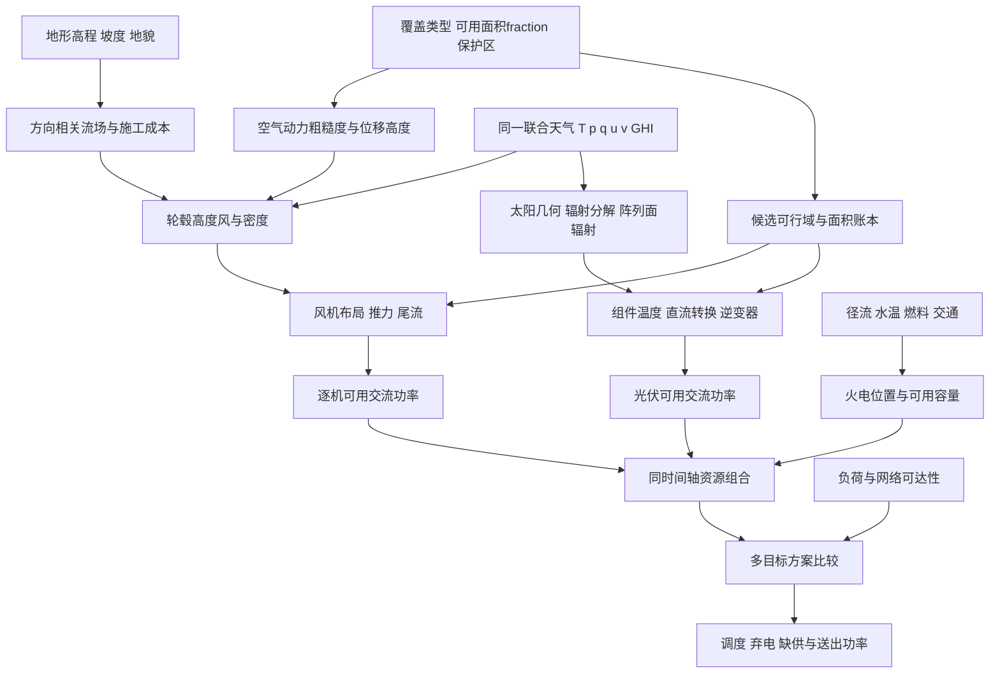

# 07 能源资源、设备转换与多目标选址

## 1 调查问题

本篇针对能源候选点、装机规模、风光可用功率和火电选址之间的机制关系。代码核对基线为 `d064633`，重点文件为 `energy/energy_candidate_generator.py`、`grid/node_builder.py`、`operation/source_load_forecast.py` 和 `core/config.py`，均位于 `world_generator/`。以下“现有”指该基线可见实现，“推荐”均为研究建议，本篇没有修改实现、下载观测序列或拟合地区参数。文献访问日期为 2026-09-09。

核心问题不是让资源地图更平滑，而是让资源、设备和选址各自承担正确的含义。近地风不等于轮毂风；平均风速不等于风机平均功率；地图上的平坦程度不等于空气动力粗糙度；适宜度也不等于可开发面积。候选位置应说明为何可以建设，设备目录应说明可以建设什么，天气转换应说明每小时能够发多少电，网络运行才决定最终送出了多少电。

调查还覆盖三个容易遗漏的耦合：上游风机改变下游入流，因此风电需要离散设备与风向；光伏铺设主要依赖可用面积、阵列排布和辐射几何，不能照搬风机间距模型；热电机组即使靠近负荷，也需要燃料、水和交通条件。对这些关系分层描述，可避免用一个综合分数同时替代工程可行性、经济性和可靠性。

## 2 关键结论

1. **【物理关系】风能通量与空气密度和风速三次方有关，但电功率还取决于风机控制区间。** 额定以上不能无限增加，切出以上也不能继续维持额定。应先在小时尺度对设备曲线求功率，再积分成年能量。用年平均风速的三次方排序只是一种粗筛，不能称为容量因子估计；风速分布形状与切出频率会改变排序。[1](https://tethys.pnnl.gov/publications/definition-5-mw-reference-wind-turbine-offshore-system-development)

2. **【物理关系】同一地形的风影响具有方向和高度依赖。** 山脊可能加速，也可能伴随分离流和湍流；森林和城市涉及粗糙度长度与位移高度。现有 `terrain.roughness` 是地形起伏指标，不能直接代入对数风廓线当作米单位的粗糙度长度。应由覆盖类型产生单独的 `aerodynamic_roughness_m`，并保留上游风场已经包含哪些地形修正的元数据。[2](https://www.wasp.dk/software/wasp/wind-atlas-generation/wind-atlas-methodology)

3. **【经验规律】尾流损失随下风距离、横向偏移、推力系数和来流条件变化。** 固定“五公里项目间距”不表示风场内尾流已消失。Jensen 顶帽和高斯尾流都是具有假设与校准范围的工程模型，适合成为分级选项，不能证明复杂山地中所有布局的准确性。[3](https://orbit.dtu.dk/en/publications/a-note-on-wind-generator-interaction/)、[4](https://durham-repository.worktribe.com/output/1313906/a-new-analytical-model-for-wind-turbine-wakes)

4. **【物理关系】光伏转换必须区别水平总辐射、阵列面辐射、直流功率和交流功率。** 温度修正使用组件或电池温度，不能只使用气温。工程简化另行规定：当前不含曙暮光的低阶模式把太阳中心位于地平线下的时段设为零辐射、零光伏出力；这不是现实中该时段所有散射光严格消失的物理定律。Faiman 热模型和 PVWatts 转换可构成透明的低阶实现，其系数仍应绑定设备与安装条件。[5](https://onlinelibrary.wiley.com/doi/abs/10.1002/pip.813)、[6](https://docs.nrel.gov/docs/fy14osti/62641.pdf)

5. **【经验规律】多地点和风光组合可能降低波动，但互补程度依赖天气区域、时段和网络。** 不能在生成时强制风光负相关，也不能将年容量因子较高直接解释为可靠供电贡献较高。应在同一时间轴的联合天气样本上评估低出力持续时间和净负荷，再检查输出通道是否拥塞。[8](https://journals.ametsoc.org/view/journals/apme/46/11/2007jamc1538.1.xml)

6. **【物理关系】采用湿式冷却的火电受到水量和水温影响；【场景先验】燃料类型、运输方式、生态取水上限和选址退距须由世界设定给出。** 美国和欧洲研究中的减额比例不能直接用作全球统一火电系数。当前没有这些输入，应声明“理想燃料供应、未建模冷却约束”，而不是由河流邻近度伪造水资源充分性。[9](https://www.nature.com/articles/nclimate1546)

7. **【场景先验】目前 3 MW/km² 风电密度、35 MW/km² 光伏密度、人均峰值和固定容量信用均为可解释的合成设定。** 它们有助于控制世界规模，但不构成在任意地区成立的资源定律。工程简化应保留这些配置的来源状态，优先让设备数、占地和可用功率之间可核对。

## 3 模态关联图

图中可用功率是天气与设备决定的上限，送出功率是运行结果。资源选择可以利用少量联合天气样本反馈，但不能用同一段未来测试天气优化站点后再宣称模型具备独立预测能力。资源地图还应区分长期气候分布与本次天气实现，防止偶然的单次好天气被永久固化成最优站址。

## 4 物理机制与经验规律

### 4.1 风场高度、方向和空气密度

**【物理关系】** 风速必须附带高度基准。近地十米风描述地面以上参考高度，轮毂高度是相对当地地面的设备高度，海拔则用于气压背景；三者不能相加两次。云团平流通常反映更高层的大气运动，也不应直接用轮毂风或十米风替代。建议天气接口显式携带 `wind_reference_height_m`、风向约定和气压是地面实压还是海平面订正压。

在近似水平齐次、中性层结、处于适用表面层的条件下，可用对数廓线外推高度。若缺少稳定度信息，常数幂律只是场景模型；同一个指数同时用于开阔水面、森林和城区会掩盖不同的垂直切变。WAsP 的方法明确区分区域风气候与局地地形、粗糙度、障碍影响，因此应避免在已经局地化的风上再次完整乘上山脊增益。[2](https://www.wasp.dk/software/wasp/wind-atlas-generation/wind-atlas-methodology)

**【物理关系】** 标量日均风速通常大于或等于日均风矢量的模。若同时要求二者相等，又要求小时标量和矢量严格还原这些日均量，三角不等式的等号会限制小时风向变化。能源侧依赖风向来判断上下游，因而不能把这种约束当作无害的数据整理。建议消费小时 `u,v` 并诊断瞬时风速；日标量均值、日矢量均值与主导风向分别保存，其差别本身反映方向变化。

**【物理关系】** 低海拔高气压和低温通常增加同体积空气的质量，从而改变亚额定区的可提取风功率。当前使用气温、地面气压和轮毂高度进行近似密度订正是已有进展；若增加比湿，使用虚温可进一步保持湿空气状态一致。若输入已经是轮毂气压，便不应再次做高度递减。不能把密度修正后的功率曲线与设备原生密度修正重复叠加。

### 4.2 离散风机、占地与尾流

**【物理关系】** 风机额定功率来自有限个设备，项目装机应为设备容量的离散求和。风场边界围合面积、永久基础道路面积和不可同时建设的安全空间是三个不同账本；将整个风场面积完全排除农业通常过于保守，将其完全允许任意高建筑又不合理。风电与其他用地能否共存，须通过用途兼容规则处理。

**【经验规律】** Jensen 模型把下游尾流近似为随距离扩张的截面，高斯模型改进了速度亏损的空间分布；两者都需要知道转子直径、推力、风向和相对位置。[3](https://orbit.dtu.dk/en/publications/a-note-on-wind-generator-interaction/)、[4](https://durham-repository.worktribe.com/output/1313906/a-new-analytical-model-for-wind-turbine-wakes) 项目中心点之间的公里退距可用于场址筛选，却无法替代以转子直径为单位的机组布局约束。风向旋转后，原本横向排列的机组可能成为上下游，固定全年尾流损失会遗漏这种条件依赖。

推荐把项目划分为若干机组实例，在风向投影坐标内排序，只对上游机组累积亏损，并按尾流与转子相交比例处理偏航方向。若缺少湍流资料，可先提供“无尾流诊断上界”和“具有公开先验的尾流情景”两套结果，比较损失敏感性。多个尾流的平方和合成是工程近似，不能将其称作严格动量守恒求解。

### 4.3 光伏连续铺设、太阳几何与热转换

**【物理关系】** 光伏可以通过面板串并联细分，世界尺度上将容量近似为可用面积的连续函数是合理降阶，但面积必须说明是场区总面积、组件投影面积还是组件实际面积。倾角改变受光与行间遮挡，地面覆盖率又改变给定场区能安装的组件量；不能同时按组件效率和已经包含排布损失的土地容量密度各算一次安装量。

**【经验规律】** 从 GHI 推断散射比例需要经验分解模型。现有 Erbs 模型原始工作使用特定观测站的辐射资料，不能保证极地低太阳高度、强气溶胶或破碎云条件同样准确。[7](https://lab.semi.ac.cn/download/0.8008504120577069.pdf) 若上游能够直接提供能量一致的 DNI/DHI，则应跳过重复分解；若只有 GHI，需记录分解模型版本，并对太阳高度很低时进行数值保护而不凭空产生辐射。

组件温度由吸收辐射、气温和散热共同决定。Faiman 模型提供便于实现的稳态近似，但散热系数随背板通风、安装方式和风速测量高度变化。现有用同一幂律把十米风外推到两米再输入热模型，只是一种近似接口；设备参数应说明拟合时使用的风速高度。[5](https://onlinelibrary.wiley.com/doi/abs/10.1002/pip.813) 降低温度通常有利于晶硅转换效率，但型号差异、积雪遮挡、积灰和老化不应被合并成随温度单调变化的“总效率”。

### 4.4 火电资源条件与多目标选址

**【物理关系】** 河边不是无限冷源。冷却可用性取决于可取流量、取水温度、允许排热和冷却工艺，且与热浪、低流量的联合事件有关。干式冷却减少取水需求，但高气温下仍有性能代价。现有地理阶段的汇水面积与河流标记尚不等于带季节变化的实际流量，不能直接据其生成 MW 级冷却上限。[9](https://www.nature.com/articles/nclimate1546)

**【场景先验】** 煤、天然气、生物质等燃料具有不同物流需求。未生成矿区、港口、铁路或管线时，最小可行方案是显式声明燃料可达性情景，并输出缺失约束标志；距离负荷近和工业用地适宜不能证明燃料可达。发展到水热联合约束前，还应在接口中区分机组额定容量、维护停机、环境减额和燃料限供，便于追溯每种不可用原因。

**【场景先验】** 选址目标至少包含资源收益、施工与接入成本、环境兼容和组合风险。加权和可作为简化，但权重决定的是世界价值偏好，不是自然规律。推荐保存一组非支配方案或至少输出各分项得分，不把不同量纲原始值直接相加，也不对硬性保护区禁建做罚分后允许权重抵消。资源互补的系统价值还取决于输电瓶颈与负荷形状，应交给运行样本比较。[8](https://journals.ametsoc.org/view/journals/apme/46/11/2007jamc1538.1.xml)

## 5 公式或可执行规则

以下为建议的可实现规则；其中设备曲线、尾流和热模型包含经验近似，不能仅因公式形式而归为精确物理。

**风廓线与密度。** 中性对数外推可写为

$$
v(z)=v(z_r)\frac{\ln[(z-d)/z_0]}{\ln[(z_r-d)/z_0]},\qquad
\rho=\frac{p}{R_d T_v},\qquad T_v\simeq T_K(1+0.61q).
$$

`v` 为 m/s；`z,z_r,d,z0` 均为 m，依次表示目标高度、参考高度、位移高度和空气动力粗糙度长度，要求两个有效高度均大于 `z0`；`p` 为目标高度实压 Pa，`Rd=287.05 J/(kg·K)`，`TK` 为 K，`q` 为 kg/kg，所得 `ρ` 为 kg/m³。只在相应表面层近似有效。无条件使用指数外推时应命名为 `shear_model=power_law_scenario`。

**风功率与尾流。** 物理可提取功率为 `P=0.5 ρ A Cp v³`，输出 W，其中转子面积 `A=πD²/4` 为 m²，`Cp` 无量纲，且还需发电机与控制约束。建议通过参考密度曲线对等效风速 `v_eq=v(ρ/ρ_ref)^(1/3)` 插值；切出判断仍按照设备实际风速与控制说明执行，避免密度降低时错误绕过安全切出。

Jensen 亏损近似为 `δ(x)=(1−sqrt(1−Ct))/(1+2kx/D)²`，`x>0` 为下风距离 m，`D` 为 m，`Ct,k,δ` 无量纲。只有尾流覆盖的下游转子受影响，`x<=0` 时贡献为零；`Ct` 应随工作风速取值。先在统一方向约定下计算坐标投影，再做覆盖加权，最后将有效风速输入曲线，不应从已经截断的额定功率上机械减去同一比例。

**光伏转换。** 无行间遮挡的基准写为

$$
G_{POA}=DNI\max(\cos\theta_i,0)+DHI\frac{1+\cos\beta}{2}
 +\alpha_gGHI\frac{1-\cos\beta}{2},
$$
$$
T_m=T_a+\frac{G_{POA}}{U_0+U_1v_m},\quad
P_{DC}=P_{STC}\frac{G_{POA}}{1000}[1+\gamma(T_m-25)](1-L),\quad
P_{AC}=\min(P_{AC,r},\max(0,\eta_{inv}P_{DC})).
$$

辐射均为 W/m²；`θi,β` 为入射角和倾角，计算使用弧度；`αg,L,ηinv` 无量纲；气温和组件温度为 ℃，温差等于 K；`U0` 为 W/(m²·K)，`U1` 为 W·s/(m³·K)，`vm` 为 m/s；`γ` 为 K⁻¹。`PSTC,PAC,r` 使用同一 MW 单位。此式中的散射为各向同性工程简化。当前无曙暮光模式在太阳中心低于地平线的子时段把辐射和光伏出力设零，再对小时积分；含日出日落的整小时仍可能非零。这是模型边界，不排除现实曙暮光或其他弱光源。损失拆项后不能重复计入 `L`。

**占地与指标。** `Ausable=Σcell Acell fusable`，`Ppv=qland Ausable`，其中面积 km²、`fusable∈[0,1]`、土地密度 MW/km²。风电采用 `Pwind=Σturbine Prated` 并另记项目包络面积。`CF=Σt Pavail,t Δt/(Prated Σt Δt)` 为无量纲，`Δt` 为 h；送出能量和气象可用能量分别计算。互补评价使用 `N_t=L_t−Σr P_r,t` 的 MW 时间序列，同时报告其上分位数、持续缺口和爬坡 MW/h，避免仅报告相关系数。

**火电冷却初筛。** 可用排热上限近似 `Qreject≤ρw cp,w Qusable ΔTallow`。取 `ρw` 为 kg/m³、`cp,w` 为 J/(kg·K)、水流量为 m³/s、温升 K，结果为 W 热功率；机组电功率需通过技术特定的排热/发电比转换。生态基流和允许温升是地区规则或场景输入，不能从 DEM 推导。

## 6 参数范围与单位

| 参数 | 单位与约束 | 本项目可采用值或范围 | 来源与适用性 |
|---|---|---|---|
| 参考高度、轮毂高度 | m，正值且廓线有效 | 当前 10、90；目录逐设备设定 | 90 m 是 NREL 5 MW 参考机示例，非通用机高 [1] |
| 转子直径、额定功率 | m、MW，正值 | 示例 126 m、5 MW | [1] 的研究参考机，不能覆盖所有现代陆上机组 |
| 切入、额定、切出风速 | m/s，严格有序 | 当前 3、11.4、25 | 对应参考曲线设定 [1]，运行控制仍需设备说明 |
| 空气动力粗糙度长度 | m，`z0>0` | 官方工具示例从水面约 0.0002 到森林/城市 1.5 及以上 | [10] 为类别示例；不能把连续地形粗糙指标映射为该实测量 |
| 幂律指数与尾流扩张率 | 无量纲 | 当前指数 0.14；尾流率暂无推荐统一值 | 场景先验，需覆盖类型、稳定度和湍流条件支撑 |
| 光伏倾角、方位角 | °；倾角 0–90，方位统一约定 | 当前 30、180 | 场景选择，固定南向不适用于全部纬度 |
| 直流/交流比、逆变效率 | 无量纲；正值，效率 0–1 | 当前 1.2、0.96 | 设备与经济设计先验；PVWatts 方法支持该区分 [6] |
| 温度系数、散热系数 | K⁻¹；见第5节 | 当前 −0.004、25、6.84 | 前者是合成晶硅设定，后两者沿用 Faiman 风格经验值；不定义全球置信区间 [5] |
| 风光土地容量密度 | MW/km²，非负 | 当前 3、35 | 合成土地情景；须明确是否含道路、间距和可用面积比例 |
| 冷却流量与允许温升 | m³/s、K，非负 | 暂无通用默认值 | 需区域水量/温度及冷却技术情景，[9] 不提供可全球迁移阈值 |

范围中的数学合法域不等于现实可信域。例如效率介于零和一是硬边界，但效率为 0.02 或 0.999 是否符合具体设备，必须另查设备资料。原始研究没有给出可迁移范围时，最诚实的接口是可配置且标注未校准，不能用“常见范围”掩盖来源缺失。灵敏度实验应围绕技术情景成组变化；增大转子直径同时改变机组容量、间距和推力曲线，不能独立抽样出互不兼容的设备。

## 7 对 SimGenr 阶段影响

| 输入 | 输出 | 方向 | 空间尺度 | 时间尺度 | 关系类型 | 推荐实现 | 来源 |
|---|---|---|---|---|---|---|---|
| 覆盖、坡度、保护约束 | 可用面积 | 约束后减少 | 子网格至项目 | 建设期 | 场景先验 | fraction 与适宜度分开；面积账本 | 本篇工程建议 |
| 参考高度风、粗糙度 | 轮毂风 | 随方向和条件变化 | 上游影响区至转子 | 小时 | 物理关系及近似 | 带高度元数据的廓线适配 | [2][10] |
| 气压、温度、比湿 | 空气密度 | 同压下升温减密度 | 机组 | 小时 | 物理关系 | 虚温与实压计算 | 状态方程；[1] 设备边界 |
| 机组坐标、风向、推力 | 尾流后风速 | 下游减小 | 数个至多个转子直径 | 小时 | 经验规律 | 离散风机与可选尾流 | [3][4] |
| 太阳角、辐射、设备温度 | 光伏可用功率 | 非线性且限额 | 阵列或项目 | 小时 | 物理关系及经验模型 | POA→热模型→DC→AC | [5][6][7] |
| 水量、水温、燃料 | 火电可用容量 | 可用性受限 | 流域与物流网络 | 小时至季节 | 物理关系及场景先验 | 技术相关环境减额 | [9] |
| 同时序风光与负荷 | 组合风险 | 地区依赖 | 多站点至系统 | 小时至多年 | 经验规律 | 联合样本风险而非强制负相关 | [8] |
| 选址方案与网络容量 | 送出、弃电 | 拥塞减少送出 | 支路与区域 | 调度时段 | 物理关系 | 资源筛选后网络校验 | 第09篇 |

**现有且应保留：** 候选点包含水域、保护区及退距限制；同种和跨种项目间距具有物理公里单位；容量分配采用固定面积与子网格积分，避免简单依赖候选数量和像素数量；人口对应负荷总量具有面积单位；光伏资源评分使用已有全云量影响后的辐射，未再把云量完整乘一次。小时风功率已考虑高度、密度、切入额定切出和系统损失，光伏已包含太阳几何、辐射分解、热修正与交流限额。

**部分实现：** `_allocate_source_capacity` 对共享子单元做唯一分配，但将 `land.buildability` 用作可用比例，语义仍混有适宜度；风电仍是连续 MW/km² 配额而非离散机组；地形粗糙度只参与建设/资源分数，没有独立空气动力粗糙度。`_thermal_suitability` 有负荷距离、用地、坡度和洪水条件，但没有实际冷却水、燃料或运输可达性；固定容量信用只是规划筛选系数。

**缺失：** 设备型号目录、逐机风向尾流、风场内排布、屋顶与地面光伏面积分离、行间遮挡、火电环境减额、联合风险选址和多目标结果存档。当前 `p_gen_available_mw` 与 `p_gen_scheduled_mw` 的区分值得保留，但后续运行仍需单列真正的 VRE 弃电，不把火电降出力混入同一能源损失解释。

## 8 推荐简化实现

第一层先整理接口，不扩大计算量。新增 `ResourceSiteState` 保存真实可用面积比例、面积来源、适宜度和约束掩膜；新增风速高度、气压基准、辐射时间平均窗口及方位角约定。`_allocate_source_capacity` 只用面积比例积分，把适宜度留给排序。保留现有容量密度模式作为明确命名的合成模式，并在输出中记录模式版本，确保旧数据仍可追溯。

第二层增加小型设备目录与离散风机。建议 `WindTurbineSpec` 包含额定 MW、轮毂 m、转子 m、参考密度、功率与推力曲线；`layout_wind_turbines` 在可行域内放置设备，先使用确定性网格或带固定种子的泊松式间距策略。配置 `wind_layout_spacing_crosswind_d` 和 `wind_layout_spacing_downwind_d` 时把数值标为情景；由于主导风向随季节变化，应在多个方向扇区评分，不能只围绕全年单个平均角度排布。

第三层把 `evaluate_wind_wakes` 设为可选。小规模世界可按每小时风向排序，跳过明显无交叠的机组对；大规模先预计算方向扇区几何，再小时插值。先实现单尾流与无尾流对照，再加入多尾流合成。不能为了视觉上得到“合理损失”而把结果后归一化到指定容量因子，否则真实的风资源和布局差别会被抹除。

第四层完善光伏安装情景。将 `pv_mounting_type`、`pv_ground_coverage_ratio`、屋顶有效比例、组件温度参数和逆变器容量绑定到同一技术配置。先支持固定倾角无跟踪阵列，并明确忽略近场遮挡；随后增加可解释的行间遮挡。若只拥有场区土地容量密度，应避免同时利用组件面积效率重复推算装机。夜间、阴天和低太阳角的边界测试比增加复杂模型名称更有价值。

第五层增加火电“约束信息完整性”输出。若没有水量、冷却技术或燃料图，则 `thermal_constraint_coverage` 明确列出未建模项；若采用合成冷却情景，输入必须与同一天气驱动的水文状态一致。将 `_thermal_capacity_target` 的固定风光信用字段注明是情景参数，可靠性研究使用第09篇的时序评估结果替代，而不自动把新增设备名牌容量等同于备用。

建议的回归包括：同一物理面积改变网格分辨率，允许容量仅存在积分误差；风机总容量严格等于目录容量之和；上游机组移到下游后尾流关系随风向翻转；没有交叠时不产生尾流损失；风场旋转并同步旋转风向时结果一致；无曙暮光模式中整小时太阳均低于地平线时光伏为零；相同 POA 下热模型散热增强使组件降温；交流输出不超逆变器容量；禁建掩膜和已用面积不被候选点放宽过程绕过。这些测试验证机制和明确的模型边界，不要求世界最终具有预设的漂亮容量因子。

## 9 硬约束、软约束、场景假设

**硬约束：** 非负且单位一致的容量与能量；风机控制曲线的运行边界；光伏交流容量上界；合法的高度廓线输入；同一不可共用面积不重复分配；显式禁建区不能用高分抵消；冷却取水超过可用流量时不得继续宣称该冷却方案可行。无曙暮光模式还须遵守其定义的夜间零辐射和零出力边界，但该约束来自模型选择。尾流计算必须只从上游传向下游，转子与地面、设备之间的几何冲突也不能通过分数修补。

**软约束：** 远离居民、降低线路距离、避开复杂施工地形、提高可用能量、减轻组合波动和降低环境影响。每项必须说明是偏好还是法规约束；一旦场景声明某一退距是硬要求，应从软评分转为可行域规则。网络接入成本可先用路线长度近似，但应称为成本代理，不能写成经验证的工程造价。

**场景假设：** 设备目录、土地兼容性、产权可用率、退距、维护损失、粗糙度类别、冷却技术和燃料供应情景。优先采用数量不多但内部一致的情景包，例如“开阔农地风电”与“城市屋顶光伏”，而不是让所有参数独立均匀抽样。场景包定义的是可比较的合成世界，不代表某一真实城市或国家的统计分布。

## 10 局限性

本篇引用风机参考设计、简化尾流、组件热模型和区域资源研究，支持机制选择与边界识别，不支持在缺少校准条件下宣称年发电量误差小于某一百分比。复杂山地分离流、稳定边界层、阵风控制、结冰和极端切出需要更高分辨率模型；小时平均风也不能重建秒级载荷与风机疲劳。合成世界中可加入这类事件标签，但标签概率需要独立情景说明。

光伏的小时模型不能完整描述云边增强、秒级爬坡、积雪迁移、双面增益、局部遮挡和设备失配。各向同性天空模型便于审计，却不应被称作所有天空条件的物理真值。火电没有水温和可靠物流网络时，只能评估理想可用容量；补上河流距离不会自动补齐水量、许可和热排放条件。

资源互补是有条件的统计性质。少量合成年份可能漏掉持续低风、连续阴天、热浪低水或异常寒潮，因此不能凭一个代表年计算可靠容量。站址优化与评估还需分离随机样本，保存同一情景下的资源、天气和负荷共同索引。这里不下载或拟合真实数据，推荐值的用途是帮助下一次机制实现与可证伪测试，而不是为实际电站投资或规划提供地点级结论。

## 11 参考文献及用途

1. Jonkman, J., Butterfield, S., Musial, W., Scott, G.（2009）. [Definition of a 5-MW Reference Wind Turbine for Offshore System Development](https://tethys.pnnl.gov/publications/definition-5-mw-reference-wind-turbine-offshore-system-development), NREL/TP-500-38060。用途：公开设备目录示例、轮毂和转子参数、运行区间；限制：研究参考机，不是全球典型机型。
2. DTU Wind Energy. [WAsP Wind Atlas Methodology](https://www.wasp.dk/software/wasp/wind-atlas-generation/wind-atlas-methodology)。用途：区域风气候与局地地形、粗糙度、障碍影响分离；限制：方法说明不等于任意地形误差保证。
3. Jensen, N. O.（1983）. [A note on wind generator interaction](https://orbit.dtu.dk/en/publications/a-note-on-wind-generator-interaction/), Risø-M-2411。用途：下游尾流工程降阶模型；限制：简化尾流扩张和来流假设。
4. Bastankhah, M., Porté-Agel, F.（2014）. [A new analytical model for wind-turbine wakes](https://durham-repository.worktribe.com/output/1313906/a-new-analytical-model-for-wind-turbine-wakes), Renewable Energy 70:116–123, DOI 10.1016/j.renene.2014.01.002。用途：高斯尾流和动量约束的改进方向；限制：验证条件不能无条件迁移至复杂山地。
5. Faiman, D.（2008）. [Assessing the outdoor operating temperature of photovoltaic modules](https://onlinelibrary.wiley.com/doi/abs/10.1002/pip.813), Progress in Photovoltaics 16:307–315, DOI 10.1002/pip.813。用途：辐射、气温、风速与组件温度关系；限制：经验散热系数与具体安装相关。
6. Dobos, A. P.（2014）. [PVWatts Version 5 Manual](https://docs.nrel.gov/docs/fy14osti/62641.pdf), NREL/TP-6A20-62641。用途：从辐射到直流、逆变和系统损失的透明链路；限制：简化发电估算，不覆盖所有组件物理。
7. Erbs, D. G., Klein, S. A., Duffie, J. A.（1982）. [Estimation of the diffuse radiation fraction for hourly, daily and monthly-average global radiation](https://lab.semi.ac.cn/download/0.8008504120577069.pdf), Solar Energy 28:293–302, DOI 10.1016/0038-092X(82)90302-4。用途：只有 GHI 时的经验辐射分解；限制：观测区域和时间聚合范围需保留。
8. Archer, C. L., Jacobson, M. Z.（2007）. [Supplying Baseload Power and Reducing Transmission Requirements by Interconnecting Wind Farms](https://journals.ametsoc.org/view/journals/apme/46/11/2007jamc1538.1.xml), Journal of Applied Meteorology and Climatology 46:1701–1717。用途：多站点联合输出与空间互补；限制：美国中西部样本结论不能变成任意世界的恒定容量信用。
9. van Vliet, M. T. H. 等（2012）. [Vulnerability of US and European electricity supply to climate change](https://www.nature.com/articles/nclimate1546), Nature Climate Change 2:676–681, DOI 10.1038/nclimate1546。用途：热电冷却与水温、流量共同约束；限制：文中区域气候情景减额不是通用设备系数。
10. DTU. [WindKit Topography documentation](https://docs.wasp.dk/windkit/latest/user_guide/topography/index.html)。用途：空气动力粗糙度、位移高度与覆盖变量的单位区分；限制：给出的类别量级是建模参考，仍需适用性判断。

## 12 立即 / 后续 / 暂不实施清单

**立即：** 记录现有设备与面积参数为场景先验；拆分可用面积 fraction 与评分；增加风速高度、气压基准和太阳角约定；将风机项目与光伏场区的占地语义分开；保留可用、计划和实际送出三个量；补充网格分辨率、风向翻转、无曙暮光模式边界和容量上界等测试。上述属于下一次实现建议，本研究提交只含文档。

**后续：** 引入小型风机目录和离散布局、方向尾流、光伏安装方式与行间遮挡；在具备流量和水温后增加冷却约束；用共同天气样本比较多目标候选方案；结合电网运行评价互补收益与可交付容量。实现顺序应先补输入语义，再加局地设备模型，最后进行系统优化，防止下游复杂度建立在上游含义错误之上。

**暂不实施：** 不复制某地区的年容量因子、尾流损失或热电减额作为全球常数；不把地形粗糙度直接当作 `z0`；不强制风光负相关；不以真实数据下载拟合替代本轮机制研究；不在缺少设备、许可和网架资料时开展真实项目经济选址。复杂 CFD、秒级风机控制和全寿命组件模型留待明确研究需求与验证资料齐备后再考虑。
