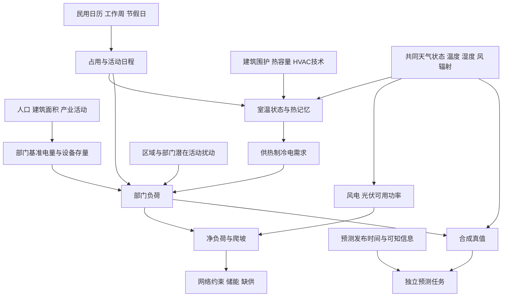

# 08 部门负荷、温度记忆与源荷联合相关

## 1 调查问题

本篇研究电力需求如何从人口、建筑、产业、日历和天气形成，以及负荷怎样与风电、光伏和电网压力共享同一组气象原因。代码核对基线为 `d064633`，重点为 `world_generator/operation/source_load_forecast.py`、`energy/energy_candidate_generator.py`、`grid/electrical_builder.py` 及配置。文献访问日期为 2026-09-09。本文仅提出机制、接口和验证建议，不改代码，不下载真实用电曲线，不拟合地区参数。

需要分开的四类量是：人口与建筑活动规模、年或周基准电量、某一情景下的设计峰值、每小时实际需求。人口可以约束规模，却不能单独确定商业营业时间、工业班制、建筑热惯性和空调普及率。类似地，土地用途适宜度可以描述在哪里更可能出现某种活动，不能直接解释为该部门实际消耗的电量比例。

另一个问题是生成与预测的边界。当前接口名称保留 `forecast`，实现已经说明它在已实现天气条件下生成合成源荷。这适合构造模拟世界的“真值”，却不是具有发布时间和预测时效的业务预报。如果随后以真实未来天气生成负荷，再将其当作未知未来预测的输入，就会高估预测能力。源荷相关研究必须同时说明共同驱动、条件信息和评估时间边界。

## 2 关键结论

1. **【物理关系】建筑负荷响应具有记忆。** 围护结构和内部热质量储存热量，室外温度变化不会立即等比例转化成空调电功率。电阻电容灰箱模型提供可解释的降阶路径；当前指数平滑温度是其中一部分动态的近似，不是完整室温与设备控制模型。[1](https://backend.orbit.dtu.dk/ws/portalfiles/portal/126769045/modelselection09.pdf)

2. **【经验规律】温度与电需求的关系依赖部门、季节、技术和地区。** 英国研究支持在当地研究期分离温度、年周期和社会经济趋势的重要性，但其冬季需求温度斜率不能直接迁移到高空调普及率的热带世界。统一的冷热阈值只能作为透明情景参数。[2](https://centaur.reading.ac.uk/68474/)

3. **【场景先验】住宅早晚峰、商业工作时段和工业平稳班制是合理的可解释模板，而不是每个地区必须满足的日曲线。** 模板需绑定工作周、节假日、民用时间和部门电量份额。基准曲线归一化应使用固定参考周或年度，不能每生成一个短窗口就重新归一化，否则相同日期的负荷会随请求窗口变化。

4. **【物理关系】同一天气会共同影响负荷与风光转换；【经验规律】联合极端的发生形式取决于气候区域。** 持续低风、高负荷和太阳不足不应通过各通道独立极端抽样拼接。欧洲系统压力研究展示天气型与净负荷之间的条件关系，但不能据此让所有合成大陆都具有相同的冬季风险。[4](https://onlinelibrary.wiley.com/doi/10.1155/2020/5481010)、[5](https://rmets.onlinelibrary.wiley.com/doi/10.1002/met.1858)

5. **【经验规律】区域聚合能否平滑波动取决于空间协方差。** 独立噪声会过度平滑大区域，总体统一噪声又会使所有城市同步。当前距离相关的平稳残差是一项有用基线，但还没有表达部门共同活动、区域经济冲击或天气型依赖的尾部相关。典型气象年若在不同地点拼接不同年份月份，也会破坏共同事件的时间对齐。[3](https://natlabrockies.github.io/ResStock.github.io/docs/data.html)

6. **【物理关系】储能面对的是净负荷缺口的功率与持续能量，单点风速或负荷相关系数不能决定缺供。** 能源生产低谷与供需不匹配低谷应分别统计，同一资源组合在不同负荷形状下可能具有不同风险。[6](https://doi.org/10.1016/j.renene.2018.02.130)

7. **【经验规律】只验证边际误差不足以验证联合生成器。** 应同时考察时间持续性、站点差分、聚合峰值和极端共现；多变量适当评分能提供补充，但也有敏感性差异。工程上不应凭所有节点各自的直方图接近目标，就宣称空间相关正确。[7](https://sites.stat.washington.edu/people/raftery/Research/PDF/Gneiting2007jasa.pdf)、[8](https://journals.ametsoc.org/abstract/journals/mwre/143/4/mwr-d-14-00269.1.xml)

## 3 模态关联图

共同天气驱动建立有因果解释的源荷依赖，残差层只补充已解释机制以外的变动。若把温度影响、城市热岛影响和天气型影响各自作为完整负荷乘子反复加入，就可能重复计算同一热事件。建议每一层记录解释对象，先生成物理环境与社会活动状态，再生成负荷真值，最后另外构造预测可知信息。

## 4 物理机制与经验规律

### 4.1 部门活动、基准电量与峰值

**【场景先验】** 住宅、商业、工业三个部门足以构成第一版低维模型，但其份额应说明是年度电量份额、峰时功率份额还是建筑面积份额，三者不能混用。土地的商业适宜度高可能意味着将来适合商服发展，并不等于当前商业用电占比高。建议先由城市与用地生成活动存量，再由设备强度映射基准电量；没有活动存量时，直接采用公开标注的部门电量先验比伪造精细人口行为更诚实。

人口密度乘以网格面积可得到人数，乘人均参考需求可得到总量。可是在有大型工业设施、旅游通勤和跨区域公共服务时，总量不只由常住人口决定。世界生成器可以保留“居民基准+商业就业代理+工业节点”三部分，避免把所有工业负荷都摊给人口密度。若只使用人均峰值，应说明它代表的是综合社会负荷情景，而不是每个居民直接使用的功率。

**【经验规律】** 日周周期来源于活动安排，而非天文辐射本身。当地太阳时决定太阳角，民用时间决定上班和营业；跨经度地区若共享时区，两者有偏差。把商业开门时间直接绑定太阳时会在地图扩展时引入错误的同步关系。节假日和周末也不是全球统一的周六周日，学校与工业连续生产情景应允许不同日历。当前真实日期参与工作日判断是已有改进，但仍需独立的民用时间接口。

### 4.2 建筑热惯性与电气化技术

**【物理关系】** 建筑能量平衡包含围护传热、通风渗透、太阳得热、内部得热、设备供热制冷和蓄热。最小电阻电容模型可以只有一个室温状态；若要区分空气与墙体，应增加第二个热容量。模型阶数应由目标时间尺度决定：小时源荷合成不必模拟每一面墙，却也不应声称一个“八小时记忆”完整代表所有建筑。

灰箱研究强调模型结构与参数辨识应同时具有统计和物理依据。[1](https://backend.orbit.dtu.dk/ws/portalfiles/portal/126769045/modelselection09.pdf) 在本项目不拟合真实数据的约束下，推荐先生成少量建筑原型的热时间常数和设备强度情景，保证参数彼此协调。轻型商店、重型住宅和持续生产厂房可以具有不同记忆，但不能把这种人为分组表述为已测得的建筑群分布。

**【物理关系】** 制热和制冷的电耗还取决于设备效率与控制。热泵的电功率与所需热功率通过 COP 联系，COP 可受室外温度影响；电阻加热和热泵不能共享同一个不加说明的温度斜率。湿热条件下存在潜热负荷，干球温度度时模型对此只有部分解释。若增加湿度项，应优先采用与温度、比湿一致的空气状态，不能在相同温度下任意把相对湿度超出物理范围来制造峰值。

设备容量会限制能提供的冷热量，但不会限制人的舒适需求。达到设备上限后，模型应记录未满足热需求或室温偏离，而不是自动把电负荷无限抬高。如果仍用线性冷热度模型，超出适用温度范围时应记录情景外推，避免对任意极端温度宣称线性可靠。英国日尺度结论说明温度敏感性还会随季节和社会技术状态改变。[2](https://centaur.reading.ac.uk/68474/)

### 4.3 空间残差、聚合与尾部相关

**【物理关系】** 聚合负荷的方差等于各节点方差与所有协方差之和。节点数量增加时，独立分量会被平均，共同分量不会消失。因此，为每个节点叠加同样大小的独立噪声，会让大城市总负荷异常稳定；把所有节点绑到一个噪声，则会产生不真实的完全同步。距离应使用公里，不能拿归一化地图坐标与二十公里长度直接比较。

**【场景先验】** 当前指数距离核和 AR(1) 可以作为可审计的基础随机过程。需要明确其表示的是扣除天气和日历后的相对残差，而不是天气场本身。距离衰减可推广为各向异性，但道路方向、区域产业联系与气象平流不是同一个原因，不能简单共用一条“相关长度”。同址的不同部门也可能具有独立活动噪声，空间重合不应强制所有残差完全相同。

残差的边际分布也影响极端。高斯潜变量经指数变换可保证负荷为正，并用均值修正保持期望；但是它没有自动获得真实城市的尖峰频率或非高斯尾部依赖。若采用 Student-t 或天气型混合分布，应说明这些是尾部压力情景，并与普通天气样本分开报告。不能通过调大方差而让绝大多数年份不再具有合理部门能量预算。

### 4.4 源荷共同天气与持续极端

**【物理关系】** 温度、风、辐射、湿度、气压和水文状态受到共同天气过程影响。负荷模型对温度的响应和风光模型对风、辐射的响应，会自然形成条件相关。应先让气象状态自洽，再由各转换模型形成源荷；独立指定“风电减半、负荷加倍、辐射不变”只有在明确命名为人工压力试验时才可使用。

**【经验规律】** 欧洲研究中的环流型与系统净负荷关系表明，供需压力具有地区和季节差异。[4](https://onlinelibrary.wiley.com/doi/10.1155/2020/5481010)、[5](https://rmets.onlinelibrary.wiley.com/doi/10.1002/met.1858) 这些结果支持引入具有持续性的天气型，而不是支持全世界复制某一种冷静风事件。热浪可能同时增加制冷需求、降低光伏效率、限制热电冷却；寒潮可能增加制热需求并影响风机结冰。是否同时发生以及强度多大，应由情景结构决定。

**【经验规律】** 低发电事件与供需缺口事件是不同定义。[6](https://doi.org/10.1016/j.renene.2018.02.130) 深夜光伏为零不一定意味着系统困难，午间高辐射也不一定足以缓解晚峰；一个数小时峰值考验 MW，一个持续数天缺口考验 MWh 和补充能源。应同时报告净负荷阈值事件持续时间、累计缺口、空间范围和恢复过程，而不是只列年均相关系数。

## 5 公式或可执行规则

**部门基准模型。** 对节点 `i`、部门 `s`、小时 `t`，可先定义

$$
L_{i,t}=\sum_s B_{i,s}\,a_s(t)\,h_s(T^*_{i,t},q_{i,t},\ldots)\,M_{i,s,t}.
$$

`L,B` 为 MW，`B` 是不含新增气象增量的部门参考平均功率；`a` 是固定参考日历下均值为一的活动系数；`h` 为设备与气象响应系数；`M` 是均值为一的正残差。三者无量纲。若已知年基准电量 `Eref` 为 MWh，可令 `B=Eref/8760 h`，闰年或不同日历使用实际参考总小时数。若基准电量已经含平均 HVAC，不应再把完整平均 HVAC 负荷加一遍，应拆分基荷和气象增量。

**温度记忆。** 指数记忆模型为 `T*_t=aT*_(t−1)+(1−a)T_t`，`a=exp(−Δt/τ)`。`T,T*` 为 ℃，`Δt,τ` 为 h，指数无量纲；这是因果一阶低通近似。初始 `T*` 应使用预热状态或作为显式初值，不应每截取一段训练窗口都重置成该窗口第一小时气温。当前 `τ=8 h` 是情景值，不是所有建筑的热时间常数。

**冷热度简化。** `h_s=1+b_h,s max(T_h,s−T*,0)+b_c,s max(T*−T_c,s,0)`，平衡温度为 ℃，斜率为 K⁻¹。冷热阈值要求 `Th≤Tc`；斜率非负。该简化把设备存量和效率折进斜率，因此更换热泵普及情景时必须同步调整，不能将斜率视为纯建筑物理常数。

**更物理的一阶建筑模型。**

$$
C\frac{dT_{in}}{dt}=\frac{T_{out}-T_{in}}{R}+Q_{solar}+Q_{int}+Q_{HVAC}.
$$

若功率用 kW、时间用 h，则 `C` 为 kWh/K，`R` 为 K/kW，`RC` 为 h，右侧全部为 kW。`QHVAC` 制热为正、制冷为负；电功率为相应热功率绝对值除以 COP，再按设备能力与控制规则限制。必须区分建筑热功率 kW 与节点电功率 MW，汇聚时除以一千；太阳得热应通过窗面积和得热系数转换，不能直接把 W/m² 当作建筑总功率。

**平稳空间残差。** 令 `z_t=φz_(t−1)+sqrt(1−φ²)ε_t`，`ε_t~N(0,K)`，`z_0~N(0,K)`。采用 `|φ|<1`，即可保持协方差 `K`；若初始为零，前段方差会偏小。基线 `Kij=σ²[c exp(−dij/ℓ)+(1−c)1(i=j)]`，`d,ℓ` 为 km，`c∈[0,1]`，`σ` 为无量纲相对标准差，`K` 无量纲。令 `M_i=exp(z_i−Kii/2)` 使其期望为一。新增部门相关时，核矩阵必须对称半正定，不能逐对随意填入看似合理的相关系数。

**聚合与净负荷。** `Var(ΣiLi)=ΣiVar(Li)+2Σi<jCov(Li,Lj)`，单位 MW²；`N_t=ΣiL_i,t−ΣgPavail,g,t` 为 MW。连续事件能量 `Egap=Σevent max(N_t−Pfirm,t,0)Δt` 为 MWh，阈值必须说明是资源侧理想可交付能力还是网络约束后的能力。后者需第09篇运行求解，不能用总量净负荷代替局部缺供。

**联合评价。** 站点差分的经验变差、聚合峰值、连续事件长度和跨变量尾部共现率应作为单独诊断。若训练概率预测器，可采用 CRPS 评价边际，采用能量分数和变差分数补充联合分布；不同物理量先用训练集确定的尺度标准化，避免 MW 数值量级压过温度。生成器没有真实观测时，这些指标是内部情景对比和机制测试，不能称为外部校准通过。[7](https://sites.stat.washington.edu/people/raftery/Research/PDF/Gneiting2007jasa.pdf)、[8](https://journals.ametsoc.org/abstract/journals/mwre/143/4/mwr-d-14-00269.1.xml)

## 6 参数范围与单位

| 参数 | 单位与合法域 | 当前值或建议范围 | 来源及适用性 |
|---|---|---|---|
| 人口密度、面积 | 人/km²、km²，非负 | 由上游人口守恒产生 | 数量关系；不直接规定工业强度 |
| 人均综合峰值 | kW/人，非负 | 当前 1.5 | 合成社会规模先验，不是居民实测用电 |
| 基准均峰比例 | 无量纲，需解释参考期 | 当前固定 0.62 | `electrical_builder` 实现常数，需改为可命名情景 |
| 部门份额 | 无量纲，非负且和为一 | 当前住宅/商业/工业 0.55/0.30/0.15 | 场景电量先验；当前还受用途适宜度调制 |
| 冷热平衡温度 | ℃，`Th≤Tc` | 当前 16、22 | 未地区拟合；[2] 不支持全球统一迁移 |
| 冷热敏感系数 | K⁻¹，非负 | 当前 0.016、0.025 | 场景设备强度，不能作为热传导系数 |
| 热记忆时间 | h，非负 | 当前 8；不设无来源通用区间 | [1] 支持灰箱机制，具体原型需显式先验 |
| AR 系数与残差尺度 | 无量纲；`abs(φ)<1`，`σ≥0` | 当前 0.85、0.035 | 合成统计先验；极限行为可测试 |
| 空间相关长度 | km，正值 | 当前 20 | 场景相关尺度，不是城区自然边界 |
| 共同方差比例 | 无量纲，0–1 | 当前 0.55 | 核权重先验；现有共同项仍随距离衰减 |
| 建筑 R、C 与 COP | K/kW、kWh/K、无量纲，正值 | 暂不设通用默认 | 需建筑原型与设备情景，不搬用单栋辨识结果 |

“当前值”仅用于复现代码，不意味着文献认可了其区域适用性。温度度时、设备存量、能效和电气化比例之间存在可替代解释；如果同时随机改变所有系数，最终峰值变化难以归因。推荐设计少量组合场景，并输出基准电量、气象增量、部门电量和峰时贡献，使参数作用可核查。

极端压力试验也应区分幅度和概率。可以人为设定一个持续七天的热浪情景来研究承受能力，但若没有概率模型，不应把它标成二十年一遇。类似地，当前残差标准差是典型扰动的相对尺度，不能据其高斯尾部外推出现实地区稀有事件频率。单个城市、单个部门或特定研究年份的参数，只能作为有明确边界的对照情景。

## 7 对 SimGenr 阶段影响

| 输入 | 输出 | 方向 | 空间尺度 | 时间尺度 | 关系类型 | 推荐实现 | 来源 |
|---|---|---|---|---|---|---|---|
| 人口、活动存量 | 基准电量 | 随规模增长 | 栅格至服务区 | 年与规划期 | 场景先验 | 人口守恒加部门强度 | 数量关系；[3] 方法边界 |
| 民用日期、工作周 | 部门活动曲线 | 时段依赖 | 城市与区域 | 小时、周、节假日 | 经验规律 | 可配置日历与固定参考归一化 | 本篇简化建议 |
| 温度、建筑热状态 | HVAC 电耗 | 滞后且非线性 | 建筑原型至节点 | 小时至数日 | 物理关系 | 指数记忆→低阶 RC | [1][2] |
| 用途实际份额、设备 | 部门负荷份额 | 类型依赖 | 服务区 | 季节至年 | 场景先验 | 不以适宜度冒充电量比例 | [3] 建筑存量框架 |
| 共同天气 | 负荷与风光 | 地区依赖 | 天气系统至大陆 | 小时至季节 | 物理关系及经验规律 | 同一状态驱动转换 | [4][5] |
| 节点距离、活动联系 | 空间残差 | 协方差结构 | 节点至区域 | 小时 | 场景先验 | 半正定核与平稳 AR | 本篇统计构造 |
| 净负荷与可供能力 | 缺口持续能量 | 缺口增加风险 | 系统及孤岛 | 小时至多日 | 物理关系 | 事件功率与能量联合统计 | [6] |
| 生成或预测集合 | 联合质量诊断 | 指标条件依赖 | 多点多变量 | 样本集合 | 经验规律 | 边际和相关评分并用 | [7][8] |

**现有：** 人口密度具有“人/km²”含义，负荷候选总容量来自人口总数与人均设定，改变候选数不会凭空增加总人口负荷。`_load_profile` 使用实际工作日、三个部门模板、固定参考周归一化、因果温度记忆和正值随机乘子；`_spatial_load_residuals` 按物理公里计算距离，以平稳初始化和创新缩放维持方差。源荷转换消费同一小时天气，而不是为风光和负荷分别生成完全独立的天气。

**部分：** `electrical_builder._bus_param` 将候选容量的 0.62 作为基准平均负荷，但候选容量最初来自“人均峰值”，两者连接仍是固定合成均峰比。HVAC 与残差会使最终峰值超出候选名义值，当前不能把候选容量解释为严格不可逾越的真实峰值。`_sector_weights` 使用节点处住宅、商业、工业适宜度调制先验，而非服务区实际建筑或电量份额。温度记忆只有一个状态，没有室温控制、设备上限、湿度潜热或技术相关 COP。

**缺失：** 民用时区与太阳时间显式区分、节假日、建筑原型存量、部门共同随机因子、天气型条件残差、多日联合压力事件标签和独立预测发布时间。火电可用容量目前恒定，故热浪低水与负荷高峰的共同驱动只实现了一部分。负荷无功采用固定功率因数换算，适合简化输入但不代表电压依赖或电机动态负荷；这些限制应由第09篇说明。

## 8 推荐简化实现

首先统一规模接口。建议 `LoadScenarioConfig` 显式提供 `baseline_reference_period`、`load_scale_basis`、`sector_energy_shares` 和 `calendar_timezone`；峰值驱动与电量驱动二选一作为主约束。若使用年电量模式，按固定年度参考温度和日历推导基准；若使用设计峰值模式，说明设计温度与分位水平，并用独立校准情景确定比例，不能对每个输出片段重新拉伸到同一个峰值。

其次将负荷分解结果保存。`generate_sector_load_components` 可输出住宅基荷、商业活动、工业活动、供热、制冷和残差各项，以便检查温度变化究竟增加了哪部分能量。部门份额应由负荷服务区内实际用途比例或建筑存量加权，缺少时采用明示的先验；不要继续从单个栅格适宜度推断整个服务区结构。上游人口与建筑面积改变时，保持单位换算和总量守恒。

第三步保留现有指数记忆作为低成本模式，并增加少量建筑原型的 RC 可选模式。`advance_building_thermal_state` 接收上一步状态、外温、太阳得热、内部活动和控制目标，返回新状态、用电和未满足舒适需求。初始状态由一段独立预热天气得到，或在数据集元数据里明确初值；切割训练窗口只切片，不重新运行状态初始化。这样相同世界的同一时刻不会因窗口划分而产生不同负荷。

第四步扩展残差时保持解释清楚。可用“区域共同活动+部门共同活动+空间局地残差”三个潜变量组件，并通过线性因子构造保证半正定。天气型只在有明确情景设计时改变参数；日历已经解释的周末差异不能再次完整放入随机均值。随机种子按世界、年份、组件和节点标识派生，避免新增一个节点导致所有旧节点时间序列完全改变，同时允许联合采样保留共同随机场。

第五步定义联合事件库。建议 `StressEventSpec` 保存事件原因、持续时间、影响范围、气象状态变化方式、是否具有概率解释以及可用技术减额。热浪、寒潮和持续低资源事件均在天气层生成，源荷层通过已有响应得到结果。纯人工设备故障可以独立于天气，但需明确是技术故障情景；若宣称天气致故障，就要说明暴露和条件概率模型。

第六步为预测任务单独设计数据接口。保留 `realization` 真值，新增 `forecast_issue_time`、`lead_time_hours` 和可知的天气集合或误差模型；训练集、验证集和测试集按世界或连续时间块隔离。设备选址、尺度拟合、标准化和温度响应参数选择不得使用测试期真值。完美天气输入可以作为有明确名称的上限对照，但其结果不能代表实际天气预报误差存在时的表现。

推荐测试重点包括：相同日期在不同请求窗口内结果一致；改变节点候选数不改变总人口对应基准量；零气象敏感度时温度不改变 HVAC；温度阶跃产生因果滞后而非提前响应；`τ→0` 趋近即时温度；长序列残差方差与目标协方差匹配；共址独立部门仍可保留非共同扰动；同一共同天气事件在所有节点保持时序对齐；固定种子可复现；联合极端指标对持续时间变化敏感。统计检查应设置抽样容差，不要求一次短样本相关系数精确等于设定值。

## 9 硬约束、软约束、场景假设

**硬约束：** 人数、面积、电量和功率的单位转换；各部门基准份额非负且有正确归一化；电负荷非负；时间顺序连续且记忆只能使用过去状态；协方差矩阵半正定；平稳 AR 系数与初始化一致；所有源荷使用共同时间索引；设备供热制冷功率和热量平衡满足定义。若物理模型达到设备上限，必须把电功率与未满足热需求分别记账。

**软约束：** 日曲线具有可解释峰谷、相邻区域存在适度相关、工业相对平稳、商业受营业时间影响、气象异常产生适度需求变化。这些形状不是必须对每个随机实现逐点成立的硬条件。不能为让曲线看起来“合理”而反复平滑，使极端持续性和噪声协方差偏离设定；也不能因某一城市出现不同峰时就判定物理错误。

**场景假设：** 城市产业结构、工作周、假期、空调与电采暖渗透、设备效率、围护类型、舒适设定、活动共同因子和压力事件概率。建议将假设归入可命名的社会技术情景，并输出其版本。未来电气化情景与历史建筑存量不是同一个分布，不能只调大负荷幅度而保留所有部门和气温响应关系不变。

## 10 局限性

这里提出的机制足以改进合成世界的一致性，仍不等于真实负荷统计模型。没有本地建筑存量、分部门电量、设备和气象联合记录，无法确认某城市的峰时、峰幅、温度斜率或极端尾部。引用英国和欧洲研究是为了确定应考虑的因素及其条件性，不能据此指定全球统一温度响应。美国建筑存量方法也不能直接把其建筑类型占比移植到其他区域。

简化模型遗漏电动车充电、分布式自发自用、价格响应、生产计划、通信基础设施和大型特殊负荷。加入屋顶光伏后，必须区分总需求与电表净需求，否则光伏既在发电侧扣一次，又在负荷侧扣一次。需求响应还会产生跨时段转移和反弹，不能用每小时独立减载表示完整用户行为。无功、谐波和电压动态也超出当前小时有功模型范围。

联合样本数量有限时，极端持续时间和共现率的不确定性很大。天气型模型、残差模型和技术减额模型即便各自看似合理，也可能在组合后重复强化同一风险。需要按机制逐项做对照，报告哪些结果来自天气、哪些来自技术、哪些来自人为压力参数。适当评分用于概率预测评价时需要观测或可信参考；仅在合成数据内部评分不能证明现实有效。

## 11 参考文献及用途

1. Bacher, P., Madsen, H.（2011）. [Identifying suitable models for the heat dynamics of buildings](https://backend.orbit.dtu.dk/ws/portalfiles/portal/126769045/modelselection09.pdf), Energy and Buildings 43:1511–1522, DOI 10.1016/j.enbuild.2011.02.005。用途：建筑灰箱热模型、状态记忆及模型阶数选择；限制：论文建筑案例参数不能直接移植为世界建筑群参数。
2. Thornton, H. E., Hoskins, B. J., Scaife, A. A.（2016）. [The role of temperature in the variability and extremes of electricity and gas demand in Great Britain](https://centaur.reading.ac.uk/68474/), Environmental Research Letters 11:114015, DOI 10.1088/1748-9326/11/11/114015。用途：温度、季节、趋势与需求极端需分离；限制：英国研究期的斜率与相关系数不是通用值。
3. National Laboratory of the Rockies / NREL ResStock. [Data documentation](https://natlabrockies.github.io/ResStock.github.io/docs/data.html) 与 [End Use Load Profiles source page](https://resstock.nrel.gov/datasets)。用途：建筑存量、部门终端用能和实际年份天气的组织方式；特别用途：典型气象年跨地点月份不同步的聚合限制。未下载其数据，也未采用美国建筑比例作为本项目参数。
4. Bloomfield, H. C. 等（2020）. [Meteorological Drivers of European Power System Stress](https://onlinelibrary.wiley.com/doi/10.1155/2020/5481010), Journal of Renewable Energy, article 5481010, DOI 10.1155/2020/5481010。用途：同一天气对需求、可再生出力和系统净负荷的联合影响；限制：欧洲区域与研究期关系。
5. Bloomfield, H. C., Brayshaw, D. J., Charlton-Perez, A. J.（2020，2019 在线发表）. [Characterizing the winter meteorological drivers of the European electricity system using targeted circulation types](https://rmets.onlinelibrary.wiley.com/doi/10.1002/met.1858), Meteorological Applications, DOI 10.1002/met.1858。用途：天气型与电力系统状态的条件关系；限制：冬季欧洲环流分类不应机械复制到其他气候。
6. Raynaud, D., Hingray, B., François, B., Creutin, J. D.（2018）. [Energy droughts from variable renewable energy sources in European climates](https://doi.org/10.1016/j.renene.2018.02.130), Renewable Energy 125:578–589；[作者机构存档](https://hal.science/hal-02327441)。用途：区分能源生产低谷和供需不匹配低谷及持续特征；限制：研究使用欧洲区域日尺度转换模型，不能直接推定小时网络缺供。
7. Gneiting, T., Raftery, A. E.（2007）. [Strictly Proper Scoring Rules, Prediction, and Estimation](https://sites.stat.washington.edu/people/raftery/Research/PDF/Gneiting2007jasa.pdf), Journal of the American Statistical Association 102:359–378, DOI 10.1198/016214506000001437。用途：概率预测适当评分的原则；限制：评分结果依赖参考样本，不能替代物理与外部验证。
8. Scheuerer, M., Hamill, T. M.（2015）. [Variogram-Based Proper Scoring Rules for Probabilistic Forecasts of Multivariate Quantities](https://journals.ametsoc.org/abstract/journals/mwre/143/4/mwr-d-14-00269.1.xml), Monthly Weather Review 143:1321–1334, DOI 10.1175/MWR-D-14-00269.1。用途：联合相关结构的评分补充；限制：需合理选择变量尺度、权重及评估样本。

## 12 立即 / 后续 / 暂不实施清单

**立即：** 在输出说明中区分合成真值与预测；把 0.62 均峰比和部门份额记录为情景；分开土地适宜度和实际部门电量权重；明确民用日历和天气时标；保存负荷分项、基准量与气象增量；保持固定参考期归一化、平稳残差和物理公里相关长度；增加窗口一致性、因果记忆和总量守恒测试。此清单是下一轮实现安排，本次仅提交研究文档。

**后续：** 建筑原型与设备存量、低阶 RC 状态、节假日与部门日历、部门共同因子、天气型条件残差、完整源荷共同极端和独立概率预测接口。先有稳定的时间和规模语义，再增加模型自由度。每增加一个机制，都应能通过分项输出和对照情景说明它改变了哪一种误差，而不只展示更复杂的曲线。

**暂不实施：** 不把某地区日负荷斜率当全球标准；不以独立随机扰动拼接气象致联合极端；不把真实未来天气条件生成称为业务预报；不强制风光与负荷达到指定相关系数；不按每个短窗口重新缩放年电量或峰值；不下载拟合真实数据；不在无验证情况下加入大量深度生成参数或声称稀有事件重现期。
