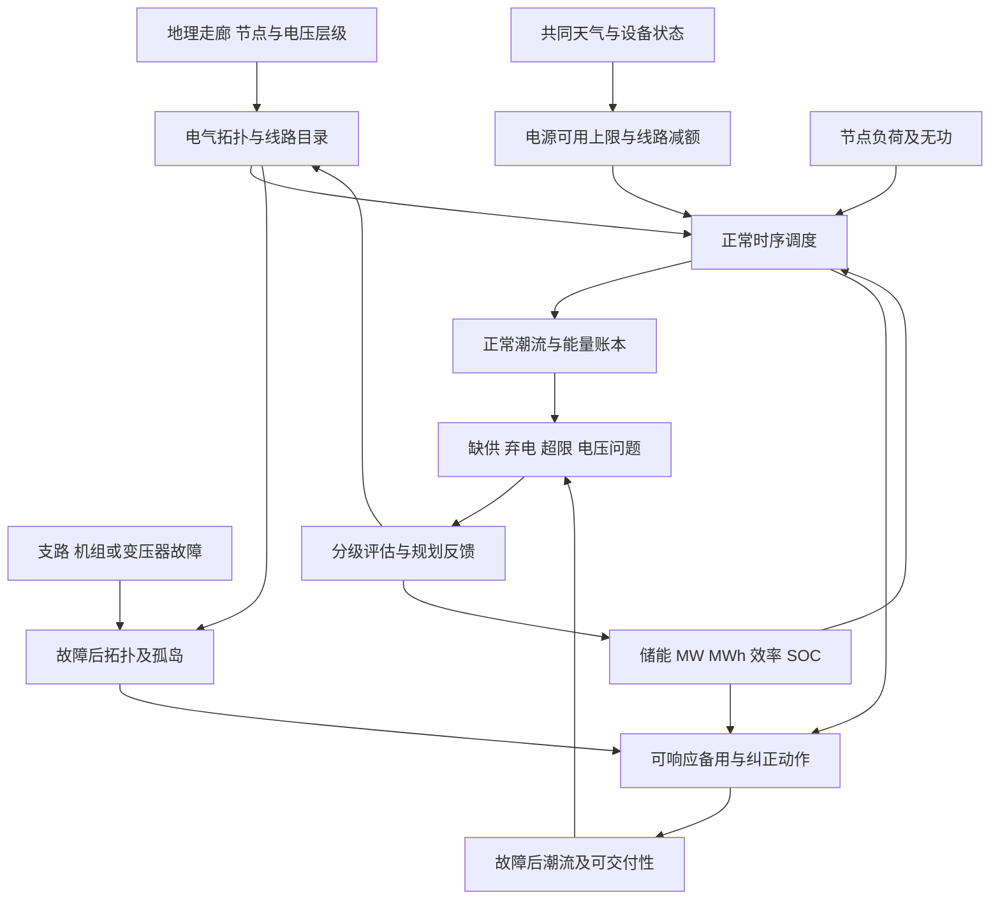

# 09 电网运行、可交付备用与储能时序约束

## 1 调查问题

本篇研究从地理电网到可行运行之间仍需满足的工程条件，以及储能怎样在空间、功率和能量三个维度提供支持。代码核对基线为 `d064633`，主要涉及 `world_generator/grid/topology_builder.py`、`grid/electrical_builder.py`、`operation/power_flow.py`、`operation/storage_dispatch.py` 和 `operation/storage_planning.py`。文献访问日期为 2026-09-09。本文只形成研究文档和后续实现建议，不修改程序或求解器，不下载真实电网数据。

需要回答的不是“线路图是否连通”或“优化器是否返回成功”，而是给定负荷、可用电源、设备能力和故障状态时，每个节点是否得到供电、线路是否超限、储能是否具有足够持续能量。图论连通、直流潮流可解、交流潮流收敛、调度可行、故障后安全和长期充裕性是不同判断。输出应保留这种层次，避免一个“成功”标志掩盖缺供或模型范围。

储能还具有一个容易被忽略的时间边界问题：循环周优化假设末端能量回到起点，完美预知的整周优化知道未来事件，而真实运行只能依据当时可知信息滚动决策。两者都能用于研究，但回答的问题不同。可靠容量、运行备用和电量搬移也不能共用同一个“备用系数”。

## 2 关键结论

1. **【物理关系】电网输电受到基尔霍夫定律与设备额定约束，不由最短路径任意分流。** 地理网络的最小生成树和冗余边是候选结构，不能替代线路参数、变压器层级和运行校核。合成网研究支持用多种结构与电气特征联合验证，而不是只让节点度数看起来接近真实网。[1](https://overbye.engr.tamu.edu/wp-content/uploads/sites/146/2021/04/Grid-Structural-Characteristics-as-Validation-Criteria-for-Synthetic-Networks.pdf)

2. **【物理关系】标准 DC 潮流忽略有功损耗、无功和电压幅值变化。** 它适合某些输电网筛选，但不能从 DC 结果推断电压合格、无功充足或交流热容量完全满足。当前把 MW 流量除以 MVA 额定值是一项有功近似，必须明确标识，不能称为完整支路负载率。[2](https://matpower.org/docs/MATPOWER-manual.pdf)

3. **【物理关系】备用必须在规定时间内达到、维持并通过网络送到需要的位置。** 总系统名牌容量超过负荷不保证局部可交付。储能余下 MW、剩余 SOC、持续时间与故障后支路容量共同决定可用备用；火电还受在线状态、爬坡和可用燃料约束。[3](https://research-hub.nlr.gov/en/publications/operating-reserves-and-variable-generation-a-comprehensive-review/)

4. **【物理关系】局部故障改变拓扑和潮流分配，必须在该故障状态重算。** 一个环并不保证失去任一支路后安全，两个区域仍可能通过弱瓶颈连接。若形成孤岛，每个岛独立平衡，远处的富余发电不能经全局平衡节点虚拟送入。NERC 的特定规划标准可作为单故障研究范围的工程参考，但其地区规则与稳定性要求不能缩减成一个 DC 连通检查。[4](https://www.nerc.com/pa/Stand/Reliability%20Standards/TPL-001-5.1.pdf)

5. **【物理关系】储能 MW 与 MWh 是独立维度。** 能量更新需显式充放电效率、时间步长和初末状态。充电与放电同时发生通常不代表同一变流器的正常物理工作，应通过互斥或严格证明的优化条件处理；仅靠正循环成本不能在所有目标结构下保证互斥。[5](https://research-hub.nlr.gov/en/publications/storage-futures-study-storage-technology-modeling-input-data-repo/)

6. **【经验规律】电池退化与时间、温度、SOC 和循环应力有关，吞吐量成本只是简化代理。** 通用“每循环损失固定百分比”不能替代化学体系和运行条件。循环计数、放电深度与日历老化可以分层加入，但不宜在没有设备参数时宣称获得精确寿命。[6](https://www.research-collection.ethz.ch/handle/20.500.11850/247413)

7. **【经验规律】风光和储能的可靠容量取决于系统风险时段与组合。** 容量因子、固定容量信用、规划裕度和有效负荷承载能力不是同一概念。当前 10% 风电和 12% 光伏信用可以保留为场景筛选，却不能据此证明系统达到某一缺供风险水平。[7](https://durham-repository.worktribe.com/output/1543174/capacity-value-of-wind-power)、[8](https://msites.epri.com/resource-adequacy/resource-acredidation/resource-accreditation-methods)

## 3 模态关联图

反馈箭头表示规划可以根据运行样本增加线路或调整储能，不表示单次调度允许瞬时建设新设备。建议将规划决策和小时运行决策分开存储；如果研究采用联合扩容优化，应明确设备在整个研究期之前统一投运，并为投资成本提供一致的时间尺度。这样可以防止把按周最优扩容误读为现实中每周更换电网容量。

## 4 物理机制与经验规律

### 4.1 地理网络与电气拓扑

**【物理关系】** 地图上两条线路相交，不必然意味着电气相连；只有显式母线、开关或变电设施才建立连接。相反，为避免地图交叉而删除某条边，也可能削弱必要电气通道。线路路由决定长度、施工难度和暴露环境，电气端点与电压等级决定如何进入潮流模型，二者应分别保存。

**【场景先验】** 地理最小生成树、近邻候选边和环网补边可以产生可解释的初始骨架。但真实输电网还受发电分布、负荷中心、历史扩建、电压层级和走廊限制影响。Birchfield 等研究给出的合成网络验证思路提示，应综合检查线路长度分布、节点度、发电负荷分布和电气运行等属性，而不能只对齐一个拓扑统计量。[1](https://overbye.engr.tamu.edu/wp-content/uploads/sites/146/2021/04/Grid-Structural-Characteristics-as-Validation-Criteria-for-Synthetic-Networks.pdf)

当前统一电压的输电等值是一项合理边界：它避免直接把不同电压母线用普通线路连接而没有变压器。未来若引入 110/220 kV 层级，需要显式变压器变比、阻抗、容量、相移和有载调压规则。不能仅给节点加不同电压标签，然后继续使用单电压线路公式。配电网较高的电阻电抗比、径向结构和电压问题也意味着它不应无说明地沿用同一 DC 近似。

### 4.2 AC、DC、损耗与电压

**【物理关系】** AC 潮流同时解电压幅值和相角，节点有功、无功与复电压和导纳矩阵联系；线路电阻造成有功损耗，电抗和电纳影响无功与电压。DC 模型采用近似单位电压、小相角差和可忽略损耗，适合快速筛查传输分布。[2](https://matpower.org/docs/MATPOWER-manual.pdf) 存在电阻参数不代表代码实际计算了电阻损耗，存在 `voltage_setpoint_pu` 也不代表电压已经求解。

若只计算有功，`|P|/Smax` 是低估视在功率负荷的可能来源。例如同一条线有较大无功时，即使有功未达额定，视在功率也可能超限。低阶研究可以保留有功传输限值，但字段名应包含 `active_power_proxy` 或元数据明确该近似；不能把它与 AC 电流或视在功率热限值混合比较。

**【物理关系】** 随意给每条 DC 线路减去固定“百分比损耗”会破坏节点账本，除非增加损耗分配和迭代平衡。若需要中间层，可在收敛外循环中用当前功率估计电流与电阻损耗，将一半损耗分配至两端再重算；这仍不是电压验证。推荐更清楚的路线是 DC 筛选后对少量关键时段做 AC 验证，并分别报告模型结果。

### 4.3 备用、单故障与可交付性

**【物理关系】** 规划容量裕度描述长期装机与峰荷关系，运行备用描述特定时段的可响应增量。已停机火电的名牌容量不能自动成为短时备用，处于满功率放电的储能也没有同方向 MW 余量。不同备用产品的响应和持续时间并不统一，应由场景给出，而不是用一个乘数兼容所有时间尺度。[3](https://research-hub.nlr.gov/en/publications/operating-reserves-and-variable-generation-a-comprehensive-review/)

备用的地理可交付性尤其重要。假设区域甲有大量备用，区域乙负荷通过一条满载线路供电，甲增加出力可能无法送至乙。发生线路故障后，备用潮流方向还会改变；因此检查“总备用大于最大机组”只回答系统总量的一部分问题。最小可行实现是对选定故障建立纠正调度，限制响应量与爬坡，同时在故障网络上执行节点平衡和支路限值。

**【物理关系】** N-1 场景必须明确失去什么设备。失去一个并联回路不等于整条地理走廊消失；母线故障可能同时切除多条相关连接；共因天气故障又不同于独立随机单设备停运。NERC TPL-001-5.1 的 P1 类单故障是特定体系的规划参照，其要求还涉及稳定和电压表现，不能把项目的 DC 单支路检验称为全面满足该标准。[4](https://www.nerc.com/pa/Stand/Reliability%20Standards/TPL-001-5.1.pdf)

形成孤岛后，要重新识别连通分量和各岛参考节点。参考节点只是相角基准，不是无限能源；发电不足应显式缺供，发电过剩应降出力或弃电。如果岛内存在储能，其可用持续时间取决于故障发生时 SOC，不能为每一个故障场景都重新赠送满电初值。故障前调度与故障后纠正必须通过共享初态关联，才算真正检验备用。

### 4.4 储能状态、效率、循环与老化

**【物理关系】** 储能能量状态在时段边界定义，小时功率在时段内部平均，因而 `T` 个功率样本应对应 `T+1` 个 SOC 能量状态。充电效率损失发生在进入储能时，放电效率损失发生在从储能向交流侧输出时；若 SOC 定义在电池侧，放电量应除以效率，而不是再乘一次。效率位置要与计量边界绑定，变流器损失不能重复出现在额外系统损失里。

循环边界 `E_T=E_0` 防止短期优化无偿耗尽初始能量，适合研究周期性代表时段。但它不保证周与周衔接真实，也可能在预知未来情况下选到有利的起点 SOC。非循环模式需要固定初始状态与合理终端价值或终端约束；滚动运行还需将实际末态传给下一窗口。不能把代表周循环和真实时间滚动混在一组结果中不作说明。

**【经验规律】** 电池退化包括与日历时间相关的老化和与运行应力相关的循环老化。Xu 等提出可按不同应力因素和不规则循环处理的寿命评估框架，其参数仍需对应电芯与实验条件。[6](https://www.research-collection.ethz.ch/handle/20.500.11850/247413) 项目可以先记录吞吐量、等效循环与 SOC 暴露，再用设备情景进行敏感性比较；不能将简单吞吐量罚项称为已校准的全寿命成本。

### 4.5 缺供、弃电与可靠容量

**物理账本必须区分需求、服务量和缺供。** `gross_load=served_load+unserved_load`；可再生可用功率等于实际出力加可再生弃电，火电从可用上限降到计划值则通常是经济调度或备用保留，不应全部解释为弃风弃光。当前通用 `curtailed_generation_mw` 在基础平衡中可能包含火电回退，后续汇总必须按技术与原因拆分。

**【经验规律】** 有效负荷承载能力衡量加入资源后，在保持某个可靠性风险水平时允许增加多少负荷。它依赖既有资源、负荷、故障和天气序列，并会随资源渗透率变化。[7](https://durham-repository.worktribe.com/output/1543174/capacity-value-of-wind-power)、[8](https://msites.epri.com/resource-adequacy/resource-acredidation/resource-accreditation-methods) 因此固定容量信用只适合初步构造世界，正式比较储能或风光可靠贡献应运行多情景时序风险评估。名义循环周优化得到零缺供，不能证明多年极端下零风险。

## 5 公式或可执行规则

**DC 网络。** 定义支路方向关联矩阵 `A`、相角 `θ`、支路导纳系数 `b`，可写

$$
f=\operatorname{diag}(b)A\theta,\qquad
A^Tf=p^{gen}+p^{dis}-p^{ch}-p^{load}+p^{shed}.
$$

`f,p` 为 MW，`θ` 为 rad，`A` 无量纲，`b` 为 MW/rad。若 `Vbase` 为 kV、`Sbase` 为 MVA，`Zbase=Vbase²/Sbase` 为 Ω，`xpu=xΩ/Zbase`，则 `b=Sbase/xpu`；每个孤岛固定一个参考角，并要求该岛注入总和为零。上述按常用标幺约定把基准有功数值用 MW 表示。必须检查 `x>0`，并对孤岛单独构造矩阵。

**AC 与热限值。** 节点复功率 `S_i=V_i conj(Σj Yij Vj)`，其中使用一致标幺值，乘基准 MVA 得到 `P+jQ`；支路两端分别满足 `sqrt(P²+Q²)≤Smax`，单位 MVA。忽略并联支路的简单三相线路，电阻损耗 `Ploss=3I²R` 为 W，`I` 为 A、`R` 为单相 Ω。把损耗近似写成 MW 形式时必须保留电压和功率单位换算，不能用 `P²R` 直接当 MW。

**储能更新。**

$$
E_{t+1}=(1-\lambda\Delta t)E_t+
\eta_cP^{ch}_t\Delta t-
\frac{P^{dis}_t\Delta t}{\eta_d}.
$$

`E` 为 MWh，`P` 为交流侧 MW，`Δt` 为 h，`ηc,ηd∈(0,1]`，`λ` 为 h⁻¹。线性自放电近似要求 `λΔt≤1`；更一般可用 `exp(−λΔt)`。能量限制为 `smin Ecap≤Et≤smax Ecap`，`s` 无量纲；功率与能量容量分别配置 MW 和 MWh。当前忽略自放电时取零，是短时情景简化。

**互斥和持续能力。** 引入二元 `yt`，要求 `0≤Pch≤y Pch,max`、`0≤Pdis≤(1−y)Pdis,max`；若存在紧急放电，它与正常放电共同占用变流器和能量。循环边界、固定初态和滚动初态分别定义，不能同时暗中使用不同规则。放电备用 `Rup` 的必要条件包括 `Rup≤Pdis,max−Pdis` 和 `Rup τres/ηd≤E−Emin`，`τres` 为 h。若已计划放电，持续能量还须扣除同一响应窗口内的基准计划；减少正在充电也可提供上调，但需单独建模其基线和后续能量影响。

**备用可交付。** 对故障 `k`，在移除设备后的网络上求 `Δpg,k`、储能响应和负荷恢复，使 `0≤Δpg,k≤Rg`，并受 `Δpg,k≤ramp_g τresponse` 限制。`ramp` 为 MW/h，响应时间为 h；故障后各节点平衡和 `|fk|≤Fmax,k` 同时成立。备用不是只在目标函数奖励，而是有可验证的可行纠正解。若岛无法平衡，保存缺供和岛标识，不用全局 slack 补足。

**事件指标与寿命代理。** `ENS=Σt,i P_shed,i,t Δt` 为 MWh；单次确定情景的缺供小时数单位 h，只有对有概率权重的情景取期望后才称 EENS 或 LOLE。`Ecurt=Σt,g∈VRE(Pavail−Pdispatch)Δt` 为 MWh。等效全循环可按电池侧充放电吞吐之和除以 `2Eref`，需明确参考额定还是可用能量；交流侧吞吐不能无说明地与电池侧寿命模型混用。

## 6 参数范围与单位

| 参数 | 单位与合法域 | 当前值或推荐情景 | 来源与适用性 |
|---|---|---|---|
| 统一额定电压 | kV，目录离散值 | 当前支持 110 或 220 | 单电压输电等值；不同电压间须有变压器 |
| 线路 R、X、电纳 | Ω、Ω、μS；物理目录 | 当前按长度与 50 Hz 类型表 | 设备示例；不能当作所有走廊导线 |
| 线路容量 | MVA 或明确 MW 代理 | 由 `sqrt(3) U I` 得到 | 电压 kV、电流 kA，结果 MVA；不能随负荷任意抬高 |
| 运行容量比 | 无量纲，0–1 | 当前常用 0.9 | 情景安全余量，不等于 N-1 或动态热额定 |
| 充放电效率 | 无量纲，0–1 | 当前各 0.95 | 回路效率乘积 0.9025；技术情景，不是所有储能通用 |
| SOC 下限与上限 | 无量纲，0–1 且有序 | 当前 0.20、0.90 | 设备操作窗口先验；不是物理总容量消失 |
| 储能额定时长 | h，正值 | 当前规划 2–8 h | 建模场景范围；[5] 强调技术可覆盖更广时长 |
| 火电、储能爬坡率 | 额定功率比例/h | 当前 0.30、0.25 | 合成能力；若改变时间步长须乘实际小时数 |
| 备用响应与持续时间 | s/min/h，须统一换算 | 暂无全球默认值 | 产品及系统要求；[3] 用于分类方法 |
| 缺供与扩容成本 | 货币/MWh、货币/MW、货币/MWh 容量等 | 当前均为合成权重 | 必须区分运行能量和投资容量成本，不能直接当真实经济结论 |
| 电池老化参数 | 随模型而定 | 暂不设跨化学体系通用值 | [6] 参数需设备和应力条件 |

当前一小时时间步让目标中的 MW 数值与单小时 MWh 数值相同，但这只是数值巧合。以后改成十五分钟，运行成本、缺供成本和吞吐量项都须乘 `Δt`，容量投资项则不能同样乘每小时数。比较周、月、年规划也需要共同的投资年化或代表时段权重，否则延长模拟窗口本身就会改变扩容偏好。

备用响应秒数、紧急线路额定持续时间和设备故障率属于运行规范或技术情景。本篇没有以某一地区标准替世界设定这些数值。可用数学边界只能防止明显非法输入，不能证明设定具有现实概率含义；例如效率合理、SOC 合法，并不足以证明某个储能情景寿命或成本可信。

## 7 对 SimGenr 阶段影响

| 输入 | 输出 | 方向 | 空间尺度 | 时间尺度 | 关系类型 | 推荐实现 | 来源 |
|---|---|---|---|---|---|---|---|
| 地理节点、走廊、设备层级 | 电气拓扑 | 多约束选择 | 支路至系统 | 建设期 | 场景先验及工程规则 | 图结构与电气校验分层 | [1] |
| 节点有功、线路电抗 | DC 潮流 | 由全网耦合决定 | 每个孤岛 | 小时稳态 | 物理关系的近似 | 分岛平衡与稀疏求解 | [2] |
| 有功无功、导纳、控制 | AC 电压与损耗 | 非线性 | 母线和支路 | 稳态快照 | 物理关系 | 关键快照 AC 校验 | [2] |
| 单设备故障、预故障状态 | 故障后安全性 | 拓扑及分流改变 | 支路、孤岛 | 故障后各响应阶段 | 物理关系 | 移除设备后重建并重算 | [4] |
| 在线余量、爬坡、SOC | 运行备用 | 受功率能量限制 | 设备至区域 | 秒至小时 | 物理关系与产品先验 | 显式响应与持续约束 | [3][5] |
| 故障网络、备用位置 | 可交付备用 | 瓶颈限制 | 网络和孤岛 | 响应时段 | 物理关系 | 故障后纠正调度 | [2][3] |
| 充放电、效率、初末态 | SOC 与能量损失 | 时序递推 | 单站 | 小时至周期 | 物理关系 | T+1 状态、互斥、边界明确 | [5] |
| SOC、温度、吞吐与循环 | 老化代理 | 技术条件依赖 | 单电芯至站 | 日历年与循环 | 经验规律 | 分层记账后设备情景评估 | [6] |
| 联合负荷、故障、风光 | 可靠容量与缺供 | 组合依赖 | 系统及区域 | 多年情景 | 经验规律 | 风险等价的时序比较 | [7][8] |

**现有：** 地形路由、近邻候选、连通骨架和冗余边；统一电压线路目录及物理电流容量；DC 按连通分量平衡和独立相角参考；显式缺供、回退发电；储能联合优化含多小时 SOC、效率、上下限、循环或初值边界、火电与储能爬坡、支路传输约束和节点负荷削减。充放电松弛出现同时工作时已有二元互斥求解兜底；不能把这些已完成机制当作仍缺失而重复设计。

**部分：** 运行优化使用分岛 PTDF 与有功线路容量代理，适合 DC 情景；基础 `solve_dc_power_flow` 计算潮流并报告超载，但本身不是满足所有线路限额的调度优化。`_dispatch_thermal` 的初步分配含按像素距离的局部权重，仍不是经济或安全约束调度。`storage_planning` 的拥塞、覆盖和持续能量指标可作候选启发式，不能证明容量位置最优。扩容能改善同一情景可行性，但当前合成成本缺少一致的现实经济解释。

**缺失：** AC 电压与无功求解、显式变压器层级、真实 N-1 枚举与故障后响应、备用产品变量、可交付备用校验、开停机与最小出力/最小启停时间、天气相关线路额定、设备故障与修复过程、分原因弃电账本、滚动预测调度和老化模型。已有循环 SOC 与电量守恒不代表已有长期可靠性保证，也不代表每次局部故障均能通过。

## 8 推荐简化实现

第一步先把结果等级写清楚。建议 `OperationModelMetadata` 保存 `network_model=dc_lossless`、`line_limit_interpretation`、`dispatch_information=perfect_foresight`、`capacity_planning_mode` 和 `contingency_scope`。输出状态分别为拓扑合法、正常潮流可解、约束调度可行、是否缺供、是否通过所选故障和是否做 AC 校验。优化器成功但发生有代价的负荷削减，应报告“有缺供的最优可行解”，不能只显示成功。

第二步拆分能源账本。建议 `EnergyAccountingStore` 提供总需求、服务量、缺供、各技术可用/计划/实际出力、VRE 弃电、火电回退、储能交流充放电、储能损失和网络损失。DC 网络损失应明确为模型定义的零，不能伪装成测得零损耗。所有结果在每岛每小时核对，再做能量积分；在全国总量上抵消的局部错误不能被聚合检查放过。

第三步做规模受控的单故障筛选。`enumerate_contingencies` 先支持一条电气支路或一台机组退出；`apply_contingency` 返回新状态且不修改正常网；`evaluate_contingency_dc` 重建连通分量、参数和 PTDF，继承故障前 SOC 与可响应容量。先在峰负荷、低资源、最大线路负载等关键快照运行，再扩展整个时序。可用 LODF 加速不成岛的支路事件，但桥边和近奇异事件必须回到拓扑重算，不能把失效公式结果当安全。[2](https://matpower.org/docs/MATPOWER-manual.pdf)

第四步增加最小备用模型。`ReserveProductConfig` 指定响应时间、持续时间、上/下调方向和是否允许通过减充提供支持；预故障决策分配备用，故障后只允许调用已有备用与规定纠正动作。每个故障的储能初始能量来自同一预故障路径，不能独立优化成满电。对各产品分别检查功率、爬坡、持续能量和网络，这比在名牌容量上再乘一个裕度更直接。

第五步对有限快照做 AC 验证。新增转换函数导出一致的母线、支路、发电机与无功限值，选择轻载高电压、重载低电压、强转送与故障后场景；检查求解收敛、节点电压、机组 Q 限值及两端支路 MVA。若没有验证所需参数，应标为不可检验而非填入任意大无功限额。DC 与 AC 偏差可用于标记适用范围，不必立即把整个长时序改成高成本 AC 优化。

第六步将规划与运行拆开。固定已选线路和储能容量后，运行滚动窗口，只用当时预测，继承实际 SOC；以完美预知调度作为明示上界。后续再研究机组组合、可靠容量和电池寿命。用不同长度代表时段时，应先统一目标量纲与权重，再比较扩容结果，避免求解规模变化被误读为技术经济差别。

推荐测试包括：三节点环与解析 DC 分流一致；移除桥边后孤岛不能接受外部虚拟电源；非桥边退出重新分配潮流并可能产生超载；远端备用受瓶颈限制；满功率储能没有同向余量；同一 SOC 下延长备用持续时间降低可承诺 MW；效率小于一的完整循环净耗电为正；紧急与普通放电共用变流器；改变时间步长仍保持能量与运行成本一致；火电回退不计入 VRE 弃电；有缺供的求解成功不被标成完全满足需求。上述是机制测试建议，而不是本次研究新增的代码。

## 9 硬约束、软约束、场景假设

**硬约束：** 每个电气孤岛独立节点平衡；合法电抗、电压基准和拓扑端点；明确计量边界下的 SOC 递推与容量上下限；充放电和紧急模式共用真实设备能力；故障设备不再参与供电；备用满足响应、持续与网络限制；负荷只能在其所在节点削减，缺供与服务量相加还原需求。AC 模式还需增加有功无功、设备能力曲线、电压和视在功率约束。

**软约束：** 运行成本、偏好的 SOC 区间、循环吞吐惩罚、线路使用裕度和扩容优先级。线路设备额定容量属于硬限值，目标中的拥塞惩罚不能替代它；若允许紧急超额，应新增明确时长和恢复规则。缺供罚价是目标偏好，但缺供量本身必须输出，即使求解器认为它比扩容更便宜。类似地，可再生调度奖励不能合法化同一储能同时充放电消耗能量。

**场景假设：** 单电压等值、无损 DC、设备可用率、备用产品、故障集合、故障概率、修复时长、初末 SOC、代表周、预测信息和合成成本。应优先支持少量清楚的运行模式，不让一个配置同时暗含循环代表周、随机故障年度和完美预知扩容。声明某种故障集全部通过，只能对应实际检验过的时间和设备范围。

## 10 局限性

本篇提出的 DC 单故障与时序储能方案仍不处理频率最低点、惯量、暂态角稳定、保护配合、短路电流和电磁暂态。设备响应时间只有在相应动态模型或可信能力参数支持时才能解释为实际动态安全。NERC 文件用于界定更完整工程问题，不意味着此合成 demo 适用该地区监管体系或已经完成标准合规。

合成拓扑的统计相似性不能证明任意扩容方案可建设。真实走廊还涉及施工、许可、变电站间隔与设备交付；参数目录也不包含所有架空线、地下电缆和变压器。天气相关线容量需要导线热平衡、风向、辐射和环境温度，当前固定额定值不能描述此耦合。加入任意风速增益而未检查导线温度，会把气象约束变成新的经验误差来源。

有限场景中的 EENS 或可靠容量估计对天气、故障、负荷和储能策略敏感。若情景没有概率权重，只能报告条件后果，不能宣称年风险或投资收益。没有化学体系和应力参数时，等效循环只是使用强度，不是寿命剩余百分比。当前研究不拟合真实网络或设备资料，因此推荐实现的价值在于可审计机制与比较一致性，而不是给出真实系统运行许可或可靠性认证。

## 11 参考文献及用途

1. Birchfield, A. B., Xu, T., Gegner, K. M., Shetye, K. S., Overbye, T. J.（2017）. [Grid Structural Characteristics as Validation Criteria for Synthetic Networks](https://overbye.engr.tamu.edu/wp-content/uploads/sites/146/2021/04/Grid-Structural-Characteristics-as-Validation-Criteria-for-Synthetic-Networks.pdf), IEEE Transactions on Power Systems 32(4), DOI 10.1109/TPWRS.2016.2616385。用途：合成网应联合验证地理、电气和结构特征；限制：不能据单项统计相似证明运行安全。
2. MATPOWER. [MATPOWER User's Manual](https://matpower.org/docs/MATPOWER-manual.pdf)，本次读取版本的第 3.7、4、6 节。用途：AC/DC 假设、节点与支路模型、PTDF/LODF 和优化约束；限制：DC 近似不提供电压或动态稳定结论。
3. Ela, E., Milligan, M., Kirby, B.（2011）. [Operating Reserves and Variable Generation: A Comprehensive Review of Current Strategies, Studies, and Fundamental Research on the Impact That Increased Penetration of Variable Renewable Generation Has on Power System Operating Reserves](https://research-hub.nlr.gov/en/publications/operating-reserves-and-variable-generation-a-comprehensive-review/), NREL/TP-5500-51978, DOI 10.2172/1023095。用途：备用响应时间、产品和可变能源的运行联系；限制：各系统实践不同，不能搬用单一阈值。
4. NERC. [TPL-001-5.1 — Transmission System Planning Performance Requirements](https://www.nerc.com/pa/Stand/Reliability%20Standards/TPL-001-5.1.pdf)，特别是 Table 1 与规划性能要求。用途：区分正常、单故障及更复杂事件，说明电压与稳定性范围；限制：仅作为明确版本的北美工程参考，不声明本项目适用或满足该标准。
5. Augustine, C., Blair, N.（2021）. [Storage Futures Study: Storage Technology Modeling Input Data Report](https://research-hub.nlr.gov/en/publications/storage-futures-study-storage-technology-modeling-input-data-repo/), NREL/TP-5700-78694, DOI 10.2172/1785959。用途：独立描述储能功率、能量和时长及技术情景；限制：技术和成本投影有时间边界，不作为当前设备报价。
6. Xu, B., Oudalov, A., Ulbig, A., Andersson, G., Kirschen, D. S.（2018 卷期，2016 提前出版）. [Modeling of Lithium-Ion Battery Degradation for Cell Life Assessment](https://www.research-collection.ethz.ch/handle/20.500.11850/247413), IEEE Transactions on Smart Grid 9(2):1131–1140, DOI 10.1109/TSG.2016.2578950；[作者提供论文页](https://www.researchgate.net/publication/303890624_Modeling_of_Lithium-Ion_Battery_Degradation_for_Cell_Life_Assessment)。用途：日历与循环应力的半经验寿命框架；限制：参数必须绑定电芯与条件，不能用统一吞吐罚项冒充校准寿命。
7. Keane, A. 等（2011）. [Capacity Value of Wind Power](https://durham-repository.worktribe.com/output/1543174/capacity-value-of-wind-power), IEEE Transactions on Power Systems 26(2):564–572, DOI 10.1109/TPWRS.2010.2062543。用途：风电容量价值与风险评估方法；限制：容量因子不是容量信用，结果依赖既有系统和时间序列。
8. EPRI. [Resource Accreditation Methods](https://msites.epri.com/resource-adequacy/resource-acredidation/resource-accreditation-methods)。用途：有效负荷承载能力、等效可靠资源及平均/边际贡献的区别；限制：方法需明确风险指标、对照系统与情景，不能从名牌容量直接得到。

## 12 立即 / 后续 / 暂不实施清单

**立即：** 标明无损 DC、MW/MVA 代理和完美预知边界；拆分 VRE 弃电、火电回退和缺供；保留已有分岛平衡、效率、SOC 和互斥实现；梳理功率、能量与成本单位；把基线潮流报告超限和优化约束满足分开；为桥边故障、储能持续时间和账本增加机制测试。此清单用于下一轮代码计划，本次研究提交未修改运行代码。

**后续：** 先做关键快照的 N-1 DC 重算与预故障 SOC 继承，再增加可交付备用；对少量场景做 AC 电压与无功校验；将规划扩容与固定容量滚动调度分开；增加设备故障修复、技术相关退化和多情景可靠容量。每一步输出独立通过范围，避免后续功能名称覆盖尚未验证的机制。

**暂不实施：** 不把多加环路称作 N-1；不把单个循环周零缺供称作多年可靠；不把全局备用或平衡节点用于跨孤岛供电；不使用固定百分比线路损耗却不重做平衡；不以名牌 MW 或平均容量因子代替可交付能力；不将合成成本当真实报价；不在缺少动态参数时承诺频率、稳定和保护安全；不下载拟合真实电网数据。
