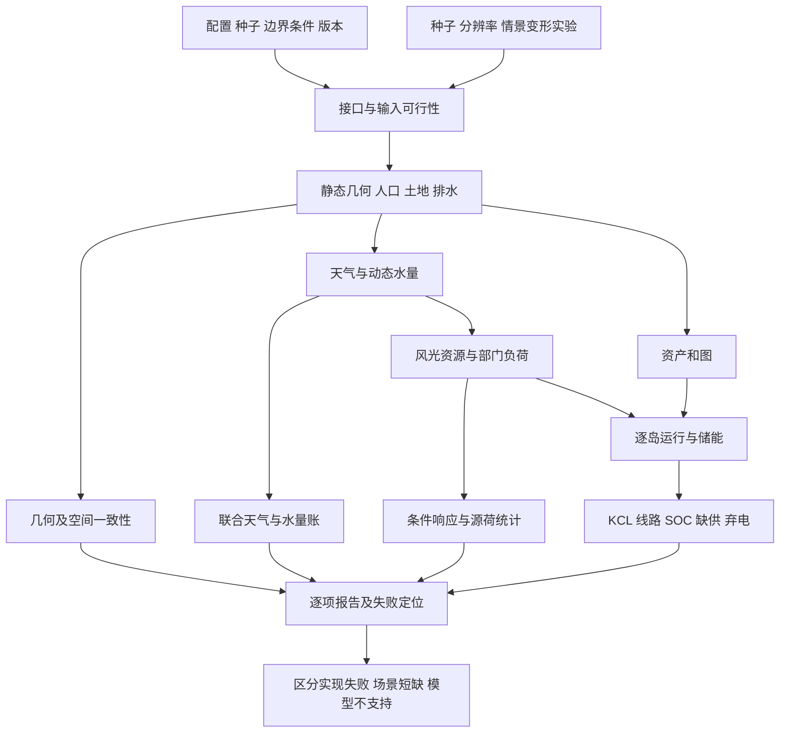

# 任务十：合成世界的机理验证

## 1. 调查问题

本主题要回答：没有真实区域拟合目标时，如何区分实现错误、模型简化、统计异常和场景本身的短缺？如何在不同种子、分辨率和极端情景下验证模态之间的传递关系，而不是只检查每个数组的范围？

文献中的 verification 主要核查是否正确求解选定模型，validation 还涉及模型对用途和现实的充分性；本任务主要完成前者与**机理一致性检验方案**，不把没有外部观测的检查命名为区域实证验证。[1] 基线为 `d064633`；[现有验证脚本](../../scripts/validate_world_physics.py)、[既有测试证据](../VALIDATION_RESULTS.md)与本报告提出的新检查必须分开。

## 2. 关键结论

- **【物理关系】局部守恒优先于全域总和。** 两个孤岛的正负误差可以在全网抵消；两个时刻的SOC误差也可以抵消。必须保留格点、母线、线路、设备和时步的最大残差及其位置。
- **【经验规律】统计特征要按天气机制和情景条件检验。** 全球单一相关系数掩盖昼夜、风机切出、季节与空间聚合效应；应先分层，再比较分布、持续时间、滞后和联合尾部。
- **【场景先验】构造极端情景的概率由实验设计决定。** 一次指定的高温低风事件能检验脆弱性，不能据此估计百年重现期或年可靠性。复合事件应包括同时、连续、前期状态和空间联动四类。[4]
- **【物理关系】合法输入也可能违反错误的接口恒等式。** 例如日标量平均风速通常不等于日平均风矢量的模；不能让“均值全通道一致”消灭山谷风或天气转向。正确检验包含拒绝不可能的约束组合，也包含接受合法反例。
- **【场景先验】验收阈值应绑定量纲、数值精度和用途。** 守恒容差由浮点误差预算确定，统计范围由已声明情景确定；不要用“全部得分高于0.8”一类无参照门槛替代检查。[1,5]
- **【工程简化】变形测试与成对实验适合合成世界。** 改变实体排序、固定区域的网格或某个原始驱动，并检查应保持不变或按已知方向改变的输出。它们不需要真实世界标准答案，但测试前提必须明确。[2,3]

## 3. 模态关联图

| 输入变量 | 输出变量 | 影响方向 | 空间尺度 | 时间尺度 | 关系类型 | 推荐实现 | 参考来源 |
|---|---|---|---|---|---|---|---|
| 连续坐标、格距 | 地形与派生量 | 同坐标低频结构稳定 | 重叠图块/固定区域 | 静态 | 物理关系；噪声构造为先验 | 带halo的拼接及低通比较 | 任务02、[2] |
| 雨、蒸散、库容、边界流 | 水量残差 | 收支闭合 | 格点/河段/流域 | 子步、小时、全窗口 | 物理关系 | 分级水量账，不只总雨量 | 任务03、[1] |
| 原始温湿风、云水 | RH/气压/云雨/GHI | 非线性条件关系 | 云团/格点 | 分钟至日 | 物理关系+经验规律分开 | 联合可行域检查 | 任务04/05 |
| 风速、辐照、温度 | 风光及负荷 | 分运行区间的响应 | 设备/城市 | 小时至数日 | 物理关系+经验规律 | 固定其他量做干预 | 任务07/08、[2] |
| 土地份额、人口 | 站点容量、负荷 | 面积和人数守恒 | 格点到节点 | 静态/年背景 | 物理关系；分配为先验 | 稀疏映射积分核查 | 任务01/06 |
| 注入、图、线路参数 | 潮流和短缺 | 逐岛约束联立 | 母线/线路/分量 | 每时步 | 物理关系 | 独立incidence矩阵和参考算例 | 任务09、[6] |
| 功率、效率、初始能量 | SOC及备用 | 有损时序耦合 | 储能/岛 | 子时段至多日 | 物理关系 | 逐时递推并审计首末状态 | 任务09 |
| 持续天气、前期土壤水、故障 | 极端影响 | 联合条件作用 | 本地到多个区域 | 小时至季节 | 经验规律；事件参数为先验 | 因果一致的场景干预 | [4,7] |

## 4. 物理机制与经验规律

### 4.1 四层证据，而非一个总分

1. **代码与接口核验：** 单位、索引、日期、聚合方法、非法参数、缓存版本、求解状态。其失败说明实现或输入不合法。
2. **解析与守恒核验：** 平面坡度、直链汇流、两母线DC、无流入水桶、恒功率SOC等可手算结果。其通过仅说明相应模型片段正确。
3. **机制与统计核验：** 在满足适用条件的干预下验证响应，比较谱、变差函数、持续期、日周结构和联合事件。其异常需要区分随机波动与结构性缺失。
4. **外部现实验证：** 对真实区域/独立时期的观测与运行记录验证。本次不执行这一层，也不以前三层结果代替它。[1]

**【经验规律】图像连续不是所有模态都处处平滑。** 海岸、岩性边界、城市边缘、设施和锋面可以有跃变。检查应针对无物理原因的tile边界或条纹；D8河网对外部上游区高度敏感，扩大流域后重叠区的汇流量改变可能是正确结果，而非拼接错误。

### 4.2 联合关系的分层

云与雨用 $Pr(R>r_0\mid C,q,regime)$ 和持续期诊断，而不要求“云大必下雨”。其中 $R$ 为声明区间内雨深mm，$r_0$ 同单位；$C$ 为云量比例[0,1]，$q$ 为比湿kg/kg，`regime`为天气型类别，条件概率无量纲。辐照先除去太阳几何/晴空背景再比较云作用；风光—负荷相关先分季节和小时，避免共同日周期制造虚假相关。风机额定区或切出区不做全局正单调断言，光伏温度响应在辐照及逆变器状态固定时检查。

**【物理关系与模型约束区分】** 在忽略曙暮光等散射贡献的低阶太阳模式中，太阳完全位于地平线以下的区间将GHI设零；这不是所有真实弱光条件下都严格为零的断言。`GHI <= 水平面大气顶辐照` 同样是当前无侧向辐射方案的上界假设，不能一概当作局地瞬时云边增强条件下的普适定律。未来改变辐射模型时，必须同步改变验证作用域，不能为通过旧测试而消去新增过程。详见任务05。

## 5. 公式或可执行规则

### 5.1 带量纲的残差

对等式 $a=b$，定义 $r=a-b$，单位与 $a,b$ 相同。建议判据：

$$
|r|\le a_{tol}+r_{tol}\max(|a|,|b|,s_0).
$$

$a_{tol}$ 与被测量同单位，$r_{tol}$ 无量纲，$s_0$ 是**有同样单位**的尺度底值。并报告最大绝对残差、最大归一化残差、均方残差及位置；不能只保留布尔PASS。对不等式 $a\le b$，报告 $v=\max(0,a-b)$。它是数值验收规则，不是新的物理定律。

**【物理关系，当前无损DC模式】** 母线—线路有向关联矩阵 $A\in\{-1,0,1\}^{N\times E}$ 规定正流从from端流出。若 $f_t[E]\,[MW]$ 为线流、$p_t[N]\,[MW]$ 为包含发电、储能充放电和已服务负荷的实际净注入，则逐母线检查 $r^P_t=A f_t-p_t$。逐岛另检查 $\sum_{b\in island}p_{bt}=0$，不可仅查全网总和。若改用有损AC，须按支路两端功率计入损耗，不再要求有功净注入和为零，也不能假定支路两端功率仅反号。

储能时段 $t$ 的能量 $E_t[MWh]$，充/放电 $P_t^c,P_t^d[MW]$，效率 $\eta_c,\eta_d\in(0,1]$，时间步 $\Delta t[h]$：

$$
r^E_t=E_{t+1}-E_t-\eta_cP_t^c\Delta t+P_t^d\Delta t/\eta_d.
$$

要求 $r^E_t$ 接近0；若自放电率 $\lambda[h^{-1}]$ 启用，先明确采用 $e^{-\lambda\Delta t}E_t$ 的具体状态方程，再替换原式，不能在损失账外clip能量。

### 5.2 空间、时间与联合诊断

**【经验规律的统计诊断】** 对已去除声明趋势的场 $z(x)$，距离箱 $h$ 的半变差函数为：

$$
\gamma(h)=\frac{1}{2|\mathcal P_h|}\sum_{(i,j)\in\mathcal P_h}(z_i-z_j)^2.
$$

$\mathcal P_h$ 是物理距离落在该箱内的格点对集合，$|\mathcal P_h|$ 为无量纲对数；半变差函数 $\gamma(h)$ 的单位为被测量单位的平方，距离箱单位km。地形先比较共同可分辨波长的低通结果，再比较细节；不能要求粗格保留已滤掉的高频坡度。

对零均值的时序 $x_t,y_t$，可报告 $\rho_{xy}(k)=Cov(x_t,y_{t+k})/(\sigma_x\sigma_y)$，滞后 $k\Delta t$ 单位h，无量纲相关系数在[-1,1]。零方差时应报告不可定义，不自动填0。温度记忆应体现为因果滞后，但不预设每个世界的相关峰值相同。

**【场景先验】** 低风低光高负荷联合压力事件可以定义为 $J_t=\mathbf1[CF^w_t<c_w,\ CF^{pv}_t<c_s,\ L_t>q_L]$。这里 $CF^w_t,CF^{pv}_t$ 为所选区域该区间风/光可用平均功率除以各自装机MW，无量纲；使用弃电前可用量，避免将调度限制误判为资源不足。$L_t$ 为同一区域原始请求负荷MW，负荷阈值 $q_L[MW]$，$c_w,c_s\in[0,1]$。未装相应资源时，该容量因子与事件标记为`UNSUPPORTED`，不能除以零或默认填零。此事件不等于实际缺供，火电和储能仍可能充分供电。阈值、白昼筛选、参考期和持续时长必须记录：否则每夜光伏为0会使“低风低光”指标失去日间含义。

### 5.3 缺供与可靠性口径

**【物理关系】** 单次场景未供能量为 $ENS=\sum_{t,b}U_{bt}\Delta t[MWh]$，其中 $U\ge0$ 是未满足的请求负荷MW。风光等指定可再生资源的弃电同样按功率积分，使用其弃电前可用功率与实际发电的差；火电经济回退、备用保留、储能放电和储能损失另列，不能并入VRE弃电，也不能把紧急放电重复算一次。

**【场景先验上的概率统计】** 如果场景 $s$ 的概率 $\pi_s\ge0,\sum_s\pi_s=1$ 具有明确含义，可计算 $EENS=\sum_s\pi_sENS_s$，以及小时口径 $LOLH=\sum_s\pi_s\sum_t\mathbf1[\sum_bU_{sbt}>u_{tol}]\Delta t$。这里 $u_{tol}[MW]$ 只用于区分数值残差与事件，原始ENS仍应保留。按所引NERC报告，本文用LOLH表示期望缺供小时、LOLE表示期望缺供日，连续事件次数另记LOLEv；每项注明统计窗口，不能混用小时、日和事件数。没有年度样本和概率设计的三份168h场景只能报告各自ENS、缺供小时及严重程度。[7]

### 5.4 两个必须接受/拒绝的反例

**风统计合法反例：** 前12小时 $u=5,v=0$，后12小时 $u=-5,v=0$，单位m/s。逐小时风速均为5；日均 $\bar u=\bar v=0$，但 $\overline{|U|}=5$。一般有：

$$
\sqrt{\bar u^2+\bar v^2}\le\frac1{24}\sum_{h=1}^{24}\sqrt{u_h^2+v_h^2}.
$$

这是三角不等式。现有日输入校验要求两侧相等，将拒绝上述合法统计。若两侧被硬设相等，非零小时风矢量只能同向，因而不允许真实日内转向。建议新检查接受这个例子，对矢量与标量统计分开建模；这项缺陷不因旧有70项检查通过而消失。

**云—辐照约束不可行反例：** 在只由云衰减固定晴空辐照的方案中，给定每日云均值0和所有小时 $0\le C_h\le1$，必有每小时 $C_h=0$。若晴空日均GHI为200 W/m²，又要求日均GHI=20 W/m²，则两约束不能同时满足。必须报告输入不可行，或显式允许改变气溶胶等另一个已建模驱动；不能偷偷调整云后仍宣称云均值严格守恒。数值200/20是说明约束矛盾的场景例子，不是气候典型参数。

## 6. 参数范围与单位

| 检验参数 | 建议范围/数量级 | 依据及关系类型 | 注意事项 |
|---|---|---|---|
| 物理等式容差 | 当前导出KCL/SOC阈值分别0.002 MW/0.002 MWh | 基线脚本的数值工程选择，非自然常数 | 同时报告实际残差，按规模与float32导出误差审计 |
| 解析小算例 | float64下绝对容差约$10^{-9}$至$10^{-6}$相应单位起步 | 场景先验的测试预算 | 按算例尺度/运算深度确定；不可固定复制到任意规模 |
| 相对容差 | $10^{-7}$–$10^{-5}$可作为导出试验起点 | 场景先验 | 不与小量绝对误差替代关系混淆；须做精度扫描 |
| 物理区域/网格 | 固定64×64 km，格距0.5/1/2/4 km | 分辨率实验场景先验 | 维数为128/64/32/16；其余km参数不随格数缩放 |
| 随机种子重复 | 先4个冒烟、再16–32个分层种子 | 实验成本先验；[3]支撑重复原则 | 不是罕见事件概率收敛保证 |
| 时间长度 | 日内24h、运行168h、季节/低频诊断≥365d | 周期覆盖原则；具体长度为先验 | 年统计至少覆盖年周期，但一次年实现仍非气候样本 |
| 极端持续期 | 3/7/14d干热或低风资源；1–24h暴雨；1–72h故障 | 压力试验先验 | 明确量级为人为情景，不称重现期 |
| 输入幅度 | 温度异常+5/+10°C、初始SOC下/中/上界 | 成对干预先验 | 需同步诊断RH/气压，SOC边界不得超物理容量 |
| 缺供事件阈值 | `u_tol`单位MW，低于所研究最小短缺但高于数值噪声 | 数值/用途先验 | 同时输出无阈值ENS，禁止吞掉真实小用户缺供 |

## 7. 对 SimGenr 生成阶段的影响

| 阶段/检查ID | 指标与预期 | 当前状态 | 失败应如何解释 |
|---|---|---|---|
| 1：V-01 | 地形tile重叠、导数量纲、共同波段谱 | 部分单测已有 | 边界不一致/尺度错误；侵蚀逼真度尚未证明 |
| 2：V-02 | D8无环、出口面积和、湖床与溢流关系 | 已有核心测试 | 数值填洼不能当物理湖深 |
| 动态水文：V-03 | 土壤/河湖逐步水量残差与非负 | 当前无动态模型 | 报`unsupported`，不得PASS或伪造流量 |
| 4–5：V-04 | p/RH由原始态诊断、风标量/向量日统计 | 部分；有风均值冲突 | 输入可行域或诊断状态不一致 |
| 5：V-05 | 云团平流轨迹、对象寿命、雨/GHI预算 | 守恒已有，动态云缺失 | 分开标“预算通过”和“运动未实现” |
| 6–8：V-06 | 人口/面积/分配矩阵闭合，容量不过占地 | 人口与部分站点检查已有 | 适宜度当份额会产生单位正确但语义错误 |
| 11：V-07 | 风机分段响应、PV温升/削顶、负荷滞后 | 多项已有 | 限定运行区间，再判断单调性 |
| 10–14：V-08 | 逐母线KCL、逐岛平衡、线限 | 已有DC检查 | 潮流守恒不代表AC电压安全 |
| 13–14：V-09 | SOC、逆变器、完整爬坡、互斥、初末态 | 已有 | 循环SOC不能替代真实初态压力测试 |
| 故障：V-10 | 断线后分岛/重新求解、备用可交付 | 当前缺系统故障模块 | 不能只把断线潮流置0 |
| 数据：V-11 | 单位/ID/时间/信息边界/缓存版本 | 部分已有 | 外生目标已分离，最终图仍可能泄漏 |
| 跨世界：V-12 | 同域多分辨率、种子分层、联合极端 | 本次提出协议 | 检查未执行不等于通过 |

此前 `physics_v3` 的121项测试、三份场景各70项检查见[原验证报告](../VALIDATION_RESULTS.md)。本表故意包含旧测试未覆盖的输入反例；它是扩展验证计划，不改写此前的运行记录。

## 8. 推荐的简化实现

### 8.1 分级运行与独立判据

建议 `validate_world_contracts` 验证元数据和输入可行域；`audit_conservation` 从导出数组独立重建账本；`run_mechanism_interventions` 做配对干预；`summarize_ensemble_diagnostics` 汇总各世界而非把所有小时当独立样本。共用公式的生成器和测试可能共同出错，至少为守恒和小网络另写可手算判据。[1,2]

数值报告的每项字段应包含 `check_id, relation_class, scope, status, value, unit, atol, rtol, max_location, prerequisites, source, model_version`。状态采用 `PASS/FAIL/UNSUPPORTED/NOT_RUN`；求解器失败与真实缺供另设不同字段。

### 8.2 典型极端场景与传递链

| 场景 | 在哪个原始状态干预 | 必须随动的变量 | 预期检查/不能保证的结果 |
|---|---|---|---|
| 干旱 | 前期降水和土壤/湖泊初态 | 蒸散受可用水限制、基流衰减、湖库容变化 | 水量守恒；当前无动态水文时不能报告水源限电 |
| 暴雨 | 湿气供给/雨系统、移动轨迹与历时 | 云辐射、地表产流、河段汇流、前期湿度 | 不因距河远就判安全；不用HAND替代淹没深度 |
| 低风低光 | 持续天气型与云/湿度/风状态 | 轮毂风、GHI、PV温度、适用季节的负荷 | 储能多日耗尽可发生；不强行扩建到零短缺 |
| 高温高负荷 | 持续温度异常和建筑热初态 | RH诊断、制冷负荷、PV温升；可选线路热限 | 负荷有滞后；PV不是越热越高 |
| 高风切出 | 轮毂风跨切出并持续 | 风机可用出力、爬坡；故障另设机制 | 风电输出可降至0；不能断言风功率全局单调 |
| 雨后低风/冷负荷 | 前期降雨后天气转型 | 土壤水记忆、热记忆、云/光衰减 | 检查时序复合效应，独立小时洗牌应破坏该关系 |
| 单线路故障 | 故障时刻、实体branch_id、持续期 | 岛划分、潮流、可用备用、SOC连续性 | 固定事前容量；区分整条等值走廊与单回线路故障 |
| 极夜/干旱边界 | 纬度、季节及相关气候先验 | 太阳几何、辐照、负荷设定 | 无曙暮光的当前模式不能给极夜正GHI以满足任意日均要求 |

每个场景保留无事件对照，固定基础种子与资产；只改变明确的原始驱动。禁止故障后重新选一套更强资产并当成既有系统的韧性。需要允许应急扩建时另开“适应规划”实验分支。

### 8.3 成对及分辨率试验

以种子作为区组，在同一区组内改变模型选项和情景幅度；完整试验至少包括空间尺度、季节、地形类型和资产充裕度，不只用一个“默认好看世界”。重复与区组设计原则见[3]；具体样本数是项目预算选择。

| 变形 | 应保持或改变的结果 | 必要前提 |
|---|---|---|
| 重排母线/线路ID顺序 | 按ID还原后物理解相同 | 参考相角可差常数，多最优解比较目标与可行性 |
| 同域细化网格 | 面积人口总量守恒；低频地形相符 | 所有长度用km，先滤波；河网边界条件一致 |
| 扩大区域 | 原坐标噪声相位稳定 | 上游边界流/新增城市影响允许改变水文/活动 |
| 容量增倍 | 无网络约束的可用风光功率增倍 | 场内尾流/可用地不变仅为控制算例；调度功率不保证 |
| 只增温1°C | 固定辐照时组件效率下降、制冷区负荷增加 | 未削顶/未跨加热冷却死区；保留热惯性 |
| 缩小时间步 | 恒定功率的积分能量不变 | 各率乘时长，状态重采样正确 |
| 切断唯一联络线 | 按本地资源求解缺供，孤岛不能借邻岛功率 | 不允许虚拟全域平衡源 |

## 9. 硬约束、软约束和情景假设

**硬约束**分成基本物理和模型内部两类。人口/水量/能量、几何与非负容量属于前者；D8单流向、无损DC、固定日预算、循环SOC属于所选模型的约束，必须带前提。预测信息边界属于实验逻辑硬约束。

**软约束**包括空间纹理、雨持续期、部门负荷形状、容量因子、度分布、天气相关及尾部依赖。软约束不能被大量平均掩盖：同时输出按世界/季节分层结果、样本数量和不确定性。没有观测参考不计算“真实误差”，也不将KGE/NSE门槛借来评判自造真值；这些指标的基准语义本来就不同。[5]

**场景先验**包括故障率、持续期、冷暖异常、随机相关长度和过载后保护策略。若仅为压力测试，明确其无概率代表性；如果要估计风险，则另声明抽样概率、权重和年化条件。[4,7]

## 10. 局限性与失败案例分析

| 失败案例 | 为什么原有检查可能漏过 | 建议定位与处置 |
|---|---|---|
| 雨深在30min仍被当mm/h | 1h时单位数值巧合 | 加非1h积分算例，检查时间支撑元数据 |
| 两孤岛供需错误互相抵消 | 全域KCL为0 | 逐母线/分量残差，保留缺供位置 |
| 人口密度归一化后仍乘负荷系数 | 图像看起来合理 | 人数积分和节点聚合对账 |
| 土地适宜度被当可用面积 | 数值都在[0,1] | 字段语义校验，分数土地闭合与硬掩码 |
| 一天风转向被抹平 | 日均9通道全“守恒” | 接受§5.4合法反例，分开风标量/向量统计 |
| 恒定或独立云图得到正确日雨量 | 单日预算通过 | 检查平流位移、寿命和雨云条件概率 |
| 单周充裕被写成年可靠性 | ENS小但样本不代表全年 | 改报场景ENS；年化和概率估计标不适用 |
| 学习器读取事后扩建图 | 外生负荷字段本身正确 | 资产可用时间/规划窗口审计，按world拆分 |
| 夜间GHI设0后强行补偿白天 | 年均看似吻合但白天不可行 | 对太阳支撑内的目标积分先作可行性判定 |
| 故障用新增容量即时补足 | 求解器总能给0缺供 | 事前资产冻结；纠正/预防调度分别记录 |

没有真实数据时，无法评价区域代表性或经验参数的外部正确性；没有AC、动态安全和保护模型时，无法证明电压稳定、频率安全或完整N-1合规。分钟级云边、城市内涝与设备热暂态在小时粗网格中不可直接分辨，应使用子步或明示降阶，不能靠更多统计图消除这种边界。

## 11. 参考文献及每篇文献的用途

1. **Oberkampf & Trucano，2002，Verification and Validation in Computational Fluid Dynamics，SAND2002-0529 / Progress in Aerospace Sciences 38:209–272。** [Sandia出版页](https://www.sandia.gov/research/publications/details/verification-and-validation-in-computational-fluid-dynamics-2002-03-01/)、[报告全文](https://www.osti.gov/servlets/purl/793406)。支持代码/解验证、现实模型验证及误差/不确定性的区别；本文借其通用方法论，不把流体算例容差迁移给电网。
2. **Chen, Cheung & Yiu，1998，Metamorphic Testing: A New Approach for Generating Next Test Cases，HKUST-CS98-01；2020存档。** [作者报告](https://arxiv.org/abs/2002.12543)。支持利用输入变换及输出关系解决缺少标准答案的问题；具体世界变形规则由本项目物理前提推导，非文献给定。
3. **NIST/SEMATECH，e-Handbook of Statistical Methods，§5.3.3.2 Randomized block designs。** [官方手册](https://www.itl.nist.gov/div898/handbook/pri/section3/pri332.htm)。支持重复、区组和控制混杂的实验设计；不规定本项目必须使用16或32个种子。
4. **Seneviratne et al.，2021，IPCC AR6 WGI Chapter 11，§11.8 Compound Events。** [章节正文](https://www.ipcc.ch/report/ar6/wg1/chapter/chapter-11/)。支持前期状态、多变量、时间连续和空间复合事件的机制分类；本文具体异常幅度/事件频率是情景先验，不是气候预测。
5. **Knoben, Freer & Woods，2019，Technical note: Inherent benchmark or not? Comparing Nash–Sutcliffe and Kling–Gupta efficiency scores，HESS 23:4323–4331。** [开放论文](https://hess.copernicus.org/articles/23/4323/2019/)。支持评价指标的基准与分量必须解释，不应互换门槛；本文不以其观测流域结果拟合任何模型。
6. **IEEE PES Task Force，2019，The Power Grid Library for Benchmarking AC Optimal Power Flow Algorithms。** [作者论文](https://arxiv.org/abs/1908.02788)、[官方算例库](https://github.com/power-grid-lib/pglib-opf)。支持统一问题定义与独立电气参考算例；不支持把DC可行解宣称为AC可行或动态安全。
7. **NERC，2024，Technical Reference Document: Considerations for Performing an Energy Reliability Assessment，Chapter 7。** [官方报告](https://www.nerc.com/comm/RSTC_Reliability_Guidelines/Technical%20Reference%20Document%20Considerations%20for%20Performing%20an%20ERA%20V2.pdf)。支持多种概率可靠性指标、能量受限资源和完整时序的考虑；本文不采用北美阈值作为全球合格标准，也不从三个短场景推断年风险。

## 12. 实施优先级

| 优先级 | 建议 | 交付验收 |
|---|---|---|
| 建议立即实现 | 风标量/向量及云辐射输入可行性反例；区分物理约束与模型假设 | 新合法/非法输入测试和明确异常消息 |
| 建议立即实现 | 单位/ID/信息集审计，逐岛账与带位置残差 | `PASS/FAIL/UNSUPPORTED/NOT_RUN`分级报告 |
| 建议立即实现 | 固定资产的成对高温、低资源及简单断线实验 | 场景级ENS与传递链报告，不年化 |
| 建议后续实现 | 有动态水量/云/故障模块后增加相应预算与联合事件测试 | 多种子多分辨率、状态连续和可交付备用验证 |
| 暂不实现 | 无观测的真实度总分；从短周推断百年洪水、年LOLE或AC安全 | 在结果页保持不可推断项，而不是生成虚假指标 |
